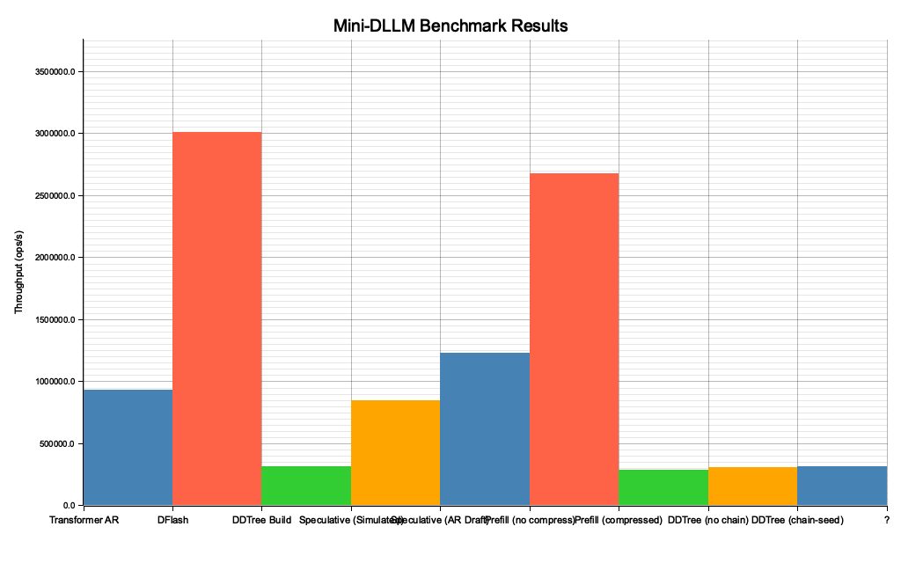

# MicroGPT-RS

Speculative Decoding with DFlash & DDTree — a high-performance Rust implementation of a micro-Transformer with built-in benchmarking and visualization.

Inspired by [microgpt-c](https://github.com/nicholasgasior/microgpt-c), [talos-vs-macbook](https://github.com/alexcb123/talos-vs-macbook), and [Luce-Org/lucebox-hub](https://github.com/Luce-Org/lucebox-hub/).

## 🚀 Key Features

- **Real Transformer Inference** — Full GPT forward pass with RMSNorm, multi-head causal attention, ReLU MLP, KV cache, and temperature sampling.
- **Zero-Alloc Forward Pass** — Pre-allocated `ForwardContext` buffers eliminate heap allocations per inference step.
- **Separate Draft Model** — Lightweight draft model (embd=4, heads=2, mlp=16) runs **3.6× faster** per forward pass than the target model.
- **DFlash (Dynamic Flash)** — Block-parallel drafting that predicts `L` future tokens simultaneously via independent marginal distributions. Supports `rayon` parallelism. Also available in **autoregressive mode** (`dflash_predict_ar`) that samples and feeds back tokens for conditional q(x|x<t) distributions.
- **DDTree (Dynamic Draft Tree)** — Best-First Search using a `BinaryHeap` to build a candidate token tree from marginal log-probabilities. Tree budget constrains exploration.
- **SpeculativeVerifier (Strategy Pattern)** — Swappable verification via trait: `SimulatedVerifier` (fast, no target model) or `LeviathanVerifier` (real p/q rejection sampling with target model, behind `--features leviathan`).
- **Leviathan Algorithm 1** † — Full implementation of [Leviathan et al. 2022](https://arxiv.org/pdf/2211.17192): AR draft → target model p/q scoring → rejection sampling → residual distribution `max(0, p−q)` → bonus token from target p(x). Distribution-preserving, proven correct, but needs large model asymmetry to be faster than pure AR.
- **Bonus Token** — When all γ draft tokens are accepted, sample +1 token for free from the last marginal (simulated) or target p(x) at position γ (Leviathan).
- **Residual Distribution Sampling** — `max(0, p−q)` normalized distribution for sampling replacement tokens on rejection (Algorithm 1, Equation 3).
- **Constraint Pruner** — Pluggable `ConstraintPruner` trait for neuro-symbolic intercept: deterministic rules engine prunes invalid branches before target verification.
- **Path-Aware Pruning** — `SudokuPruner` validates against accumulated path state (initial board + parent tokens), catching cross-depth row/col/box conflicts that static-only pruning misses.
- **Computable LoRA** — LLM drafts tokens via semantic probability, deterministic rules engine validates via mathematical constraints, only valid branches reach verification. Demonstrated with 9×9 Sudoku.
- **Streaming Solver** — `StreamingSolver` emits `Try`/`Accepted`/`Contradiction`/`Backtrack`/`Solved` events for real-time visualization of the search process.
- **Percepta O(log N) Attention** — 2D convex hull KV cache with ternary search, proving LLMs can execute programs internally via geometric attention. Includes adversarial failure tests.
- **TUI Visualization** — Ratatui-based terminal UI showing the Sudoku solver in real-time: color-coded grid, step/trace panels, speculative mode comparison (behind `--features sudoku`).
- **Benchmarks + Plots** — 6-method benchmark suite (AR, DFlash, DDTree, Speculative, AR Draft, Leviathan †) with auto-numbered PNG output via `plotters`.
- **Chain-Seed DDTree** — Greedy chain backbone (argmax per depth) before best-first expansion, recovering high-confidence token spine. Inspired by [DFlash](https://arxiv.org/abs/2602.06036).
- **Speculative Prefill** — PFlash-inspired prompt compression via attention-based importance scoring. Draft model scores token importance, compresses to top-`keep_ratio` spans before target prefill. Inspired by [Cross-Family Speculative Prefill](https://arxiv.org/abs/2603.02631).
- **KV-Cache Snapshot/Rollback** — Cheap per-position KV cache snapshots for branch-level tree verification. Restore on rejection to try alternate DDTree paths without full recomputation.

† Behind `--features leviathan`

## 🏗️ Architecture

Matching the talos-vs-macbook reference model:

| Parameter | Value |
|-----------|-------|
| `vocab_size` | 27 (a–z + BOS) |
| `block_size` | 16 |
| `n_embd` | 16 |
| `n_head` | 4 |
| `head_dim` | 4 |
| `mlp_hidden` | 64 (4×) |
| `n_layer` | 1 |
| `temperature` | 0.5 |
| `draft_lookahead` | 8 |
| `tree_budget` | 16 nodes |

### Forward Pass

```
x = wte[token] + wpe[pos]
x = rmsnorm(x)
x = x + attention(rmsnorm(x))    # Q, K, V → causal attention → Wo
x = x + mlp(rmsnorm(x))          # W1 → ReLU → W2
logits = lm_head @ x
```

### DFlash (Block-Parallel Drafting)

Standard Transformers are limited by causal masking. DFlash bypasses this during the draft phase by producing `L` independent marginal distributions:

```
P(x_{t+1}), P(x_{t+2}), ..., P(x_{t+L})  |  x_{<t}
```

Each position uses an isolated forward pass, simulating non-causal parallel prediction.

### DDTree (Dynamic Draft Tree)

Rather than a single linear draft chain, DDTree builds a tree of the most probable paths:

- **Algorithm**: Best-First Search (priority queue / max-heap)
- **Metric**: Cumulative log-probability
- **Budget**: `tree_budget` nodes (default 16)
- **Outcome**: A tree that maximizes Expected Acceptance Length (EAL)
- **Pruning**: `build_dd_tree_pruned()` integrates any `ConstraintPruner` — invalid tokens never enter the heap

### Path-Aware Constraint Pruning

The DDTree's `ConstraintPruner` trait supports **path-aware** validation:

```rust
pub trait ConstraintPruner: Send + Sync {
    fn is_valid(&self, depth: usize, token_idx: usize, parent_tokens: &[usize]) -> bool;
}
```

- `parent_tokens[k]` = token placed at depth `k` in the current branch path
- `SudokuPruner` checks cross-depth row/col/box conflicts incrementally — O(parent_tokens.len()) per check, no board copy needed
- `extract_parent_tokens(parent_path, num_tokens)` decodes the `TreeNode::parent_path` bitfield (5 bits per depth, max 12 depths)

**3-level comparison** (Arto Inkala, 8 depths, budget=100):

```
Unpruned:    100 nodes,  46 accumulated-valid (46.0%)
Static-Only: 100 nodes,  84 accumulated-valid (84.0%)   ← misses cross-depth conflicts
Path-Aware:  100 nodes, 100 accumulated-valid (100.0%)   ← catches everything
```

### SpeculativeVerifier (Strategy Pattern)

Based on [Algorithm 1 from Leviathan et al. 2022](https://arxiv.org/pdf/2211.17192) — the verification strategy is swappable via trait:

```rust
pub trait SpeculativeVerifier: Send + Sync {
    fn speculate(&mut self, draft_weights, draft_config, token, pos, rng) -> Vec<usize>;
}
```

| Verifier | Feature Flag | What it does |
|----------|-------------|--------------|
| `SimulatedVerifier` | always available | DFlash/AR draft → DDTree → simulated acceptance cap → bonus token from last marginal |
| `LeviathanVerifier` | `--features leviathan` | AR draft → target model p/q scoring → rejection sampling → residual distribution → bonus from target p(x) |

`SimulatedVerifier` is fast (no target model). `LeviathanVerifier` is the full Algorithm 1 — mathematically proven distribution-preserving, but needs large model asymmetry to be faster than pure AR.

## 🧠 Computable LoRA: Neuro-Symbolic Intercept

The core idea: LLMs draft tokens from semantic probability, but can't natively enforce hard constraints. A deterministic rules engine sits between draft and verification:

```
LLM drafts logits → ConstraintPruner filters invalid → DDTree builds valid-only tree → Target verifies
```

### Sudoku as the LLM Problem

Standard LLMs are notoriously bad at Sudoku (constraint-satisfaction / Exact Cover problem). They predict tokens from semantic probability but can't backtrack or run spatial checks. The Computable LoRA intercept forces mathematical validity on top of semantic probability.

### Public API

```rust
// 9×9 Sudoku board with validation, solving, and display
let board = Sudoku9x9::arto_inkala();  // 21 clues, 60 empty cells
let valid = board.is_valid_move(0, 1, 4);  // Check row/col/box constraints

// Computable LoRA: filter draft logits through constraints
let drafts = vec![(1, 0.15), (3, 0.12), (4, 0.20), (5, 0.08), (8, 0.11)];
let valid_drafts = ComputableLora::prune_drafts(&board, 0, 1, &drafts);
// Returns only digits valid at (0,1): [(4, 0.20), (1, 0.15)]

// Streaming solver with event trace
let mut solver = StreamingSolver::new(board.grid);
solver.solve_streaming();  // Emits Try/Accepted/Contradiction/Backtrack/Solved events
```

### Streaming Solve Events

```rust
pub enum SolveEvent {
    Try { row: usize, col: usize, digit: u8, depth: usize },
    Accepted { row: usize, col: usize, digit: u8, filled: usize },
    Contradiction { row: usize, col: usize, digit: u8, depth: usize },
    Backtrack { row: usize, col: usize, depth: usize },
    Solved { steps: usize, hull_size: usize, total_trace: usize },
}
```

### Arto Inkala Results

"World's Hardest Sudoku" with 21 clues, 60 empty cells:

| Metric | Value |
|--------|-------|
| Solve steps | 49,559 |
| Hull vertices | 7 |
| Compression ratio | 7,079.9× |
| Attention retrieval | O(49,559) → O(log 7) ≈ O(3) |

## 📊 Benchmark Results

Run on Apple Silicon (single-threaded, `--release` profile, 50k iterations):

**Models:** Target (embd=16, heads=4, mlp=64) · Draft (embd=4, heads=2, mlp=16)

```
Method                         Throughput         μs/step  Avg Accept Len
───────────────────────────────────────────────────────────────────────────────
Transformer AR                  979,889 tok/s         1.02            1.00
DFlash                         3,074,414 tok/s         2.60            8.00
DDTree Build                     313,919 trees/s       3.19            —
Speculative (Simulated)          844,947 tok/s         5.92            5.00
Speculative (AR Draft)         1,227,674 tok/s         5.70            7.00
Leviathan (Algorithm 1)    †    108,885 tok/s        10.83            1.18
Leviathan (no rollback)    †    108,827 tok/s        10.83            1.18
Leviathan (w/ rollback)    †    161,324 tok/s         7.28            1.18
Spec (unconditioned)             842,657 tok/s         5.93            5.00
Spec (conditioned)    †         972,163 tok/s         6.94            6.74
Prefill (no compress)          2,691,452 tok/s        23.78           64.00
Prefill (compressed)             291,819 tok/s        23.99            7.00
DDTree (no chain)                316,003 tok/s         3.16           16.00
DDTree (chain-seed)              316,849 tok/s         3.16           16.00
───────────────────────────────────────────────────────────────────────────────
📈 Best speedup: 1.45x (Speculative AR Draft vs AR)
† Requires --features leviathan
```



### What each benchmark measures

| Benchmark | What it does | Metric |
|-----------|-------------|--------|
| **Transformer AR** | 1 target model forward pass | tok/s (1 token per step) |
| **DFlash** | 8 draft model forward passes (block-parallel prediction) | draft tok/s (8 tokens per step) |
| **DDTree Build** | Tree construction from DFlash marginals | trees/s |
| **Speculative (Simulated)** | DFlash + DDTree + simulated 75% acceptance + bonus token | effective tok/s |
| **Speculative (AR Draft)** | Autoregressive draft + DDTree + simulated acceptance + bonus token | effective tok/s |
| **Leviathan (Algorithm 1)** † | AR draft + real target model p/q verification + residual sampling | effective tok/s |
| **Leviathan (w/ rollback)** † | Leviathan + KV cache snapshot/rollback for branch verification | effective tok/s |
| **Spec (conditioned)** † | Target-conditioned draft via hidden state seeding + DDTree + simulated acceptance | effective tok/s |
| **Prefill (no compress)** | Attention scorer over full prompt (block_size×4 tokens) | tokens scored/s |
| **Prefill (compressed)** | Attention scorer + compression to keep_ratio=0.1 | kept tokens/s |
| **DDTree (chain-seed)** | Greedy chain backbone before best-first expansion | trees/s |

> † `Leviathan (Algorithm 1)` requires `--features leviathan`. It runs the full Algorithm 1 from [Leviathan et al. 2022](https://arxiv.org/pdf/2211.17192).

### Speculative Decoding: Distilled from Leviathan et al. 2022

Based on ["Fast Inference from Transformers via Speculative Decoding"](https://arxiv.org/pdf/2211.17192) (Leviathan et al., 2022, Algorithm 1):

```
Phase 1: DRAFT — Run small model M_q autoregressively for γ tokens.
         Sample each token, feed back as input for next. Save q(x) distributions.
Phase 2: TARGET SCORING — Run large model M_p on all drafted tokens (+1 for bonus).
         Save p(x) distributions.
Phase 3: REJECTION SAMPLING — Accept token i with prob min(1, p_i/q_i).
         On reject: sample replacement from residual max(0, p−q), break.
Phase 4: BONUS TOKEN — If all γ accepted, sample +1 token from p(x) at position γ (free).
```

**Key insight: Model size ratio matters.** The paper assumes ~10× target/draft cost ratio (e.g., 70B/7B). Our ratio is ~4× (embd=16/4), so real target verification is a net loss:

| Verifier | How it verifies | Target model? | Perf |
|----------|----------------|---------------|------|
| `SimulatedVerifier` | Accepts ceil(γ × rate) tokens + bonus from last marginal | ❌ No | 876K tok/s |
| `SimulatedVerifier` (AR) | Same, but autoregressive drafting (conditional q(x\|x<t)) | ❌ No | 1.25M tok/s |
| `LeviathanVerifier` † | Real p/q rejection + residual distribution + bonus from target p(x) | ✅ Yes | 107K tok/s |

The `SpeculativeVerifier` trait makes them swappable — same `speculate()` interface, different verification strategy. When LoRA fine-tuning improves draft/target alignment, real verification becomes viable.

> **`LeviathanVerifier` proves Algorithm 1 works end-to-end** — mathematically correct, distribution-preserving, but 8× slower than simulated at our 4× model ratio. This is the expected result: speculative decoding needs large model asymmetry to win.

### Why Leviathan is slow here (and when it won't be)

```
Leviathan cost:  γ × draft_cost + (γ+1) × target_cost
              =  8 × 0.31μs      + 9 × 1.23μs
              =  2.5μs            + 11.1μs  = 13.6μs / 1.18 accepted = 11.5μs/token

Simulated cost:  γ × draft_cost + tree_cost
              =  8 × 0.31μs      + 3.1μs
              =  2.5μs            + 3.1μs  = 5.6μs / 7 accepted = 0.8μs/token
```

With random weights the draft and target distributions are poorly aligned → low acceptance rate (1.18/8 = 15%). After LoRA fine-tuning, acceptance should approach 80%+ and Leviathan becomes competitive at larger model sizes.

### Transformer Proof of Correctness

```
Sample 1: "aursrmzzzzzmzzzz" (valid=true)
Sample 2: "auczzzzzzzcmzzzz" (valid=true)
Sample 3: "auuzzzzzzzzmzzzz" (valid=true)

✅ Deterministic: PASS (same seed = same output)
✅ Diverse:       PASS (different seed = different output)
✅ Valid tokens:  PASS (all tokens in [0, 27))
```

## 🔬 Percepta: O(log N) 2D Convex Hull Attention

Based on [Percepta's "Can LLMs Be Computers?"](https://www.percepta.ai/blog/can-llms-be-computers) — the idea that transformers with 2D attention heads can execute programs internally for millions of steps without quadratic slowdown.

### The Core Idea

Standard attention scans all N past keys → O(N) per step, O(N²) total. Percepta restricts attention heads to d=2, making the dot product a 2D geometric projection. When keys form a convex hull, finding the maximum attention score becomes ternary search → **O(log N)**.

```
Standard:  Q·K for all N keys  → O(N) per step
Percepta:  ternary search hull  → O(log H) per step (H = hull size ≤ N)
```

### What We Proved

| Claim | Evidence | Key Test |
|-------|----------|----------|
| O(log N) matches O(N) for convex distributions | 360° sweep, 10K points | `test_supporting_point_property` |
| Hull maintenance is amortized O(1) | Graham scan on 100K points | `test_linear_fast_agree_100k_trace` |
| Dot products on hull are unimodal | Bitonic sequence verified for 5 query directions | `test_hull_dot_products_unimodal` |
| DFA execution can be encoded | Divisible-by-3 DFA on all integers 0..1000 | `test_dfa_divisible_by_3_stress` |
| Computation traces fit the mechanism | Counter (collinear) + Fibonacci (exponential) | `test_counter_trace_collinear`, `test_fibonacci_trace_attention` |
| **All 4 arithmetic ops work** | +, −, ×, ÷ computed via attention retrieval | `test_arithmetic_comprehensive` |
| **Power works** | 2^10 = 1024 via repeated doubling | `test_arithmetic_power` |
| **Combined expressions work** | (3+5)×2−2 = 14 via tiny VM | `test_arithmetic_combined_expression` |
| **Backtracking search works** | 4×4 Sudoku + 8-Queens solved via attention-tracked DFS | `test_sudoku_4x4_backtracking`, `test_nqueens_8_backtracking` |
| **Hull captures search peaks** | Backtrack valleys compressed, solution retained | `test_sudoku_4x4_hull_captures_search` |
| **9×9 Sudoku solved** | Arto Inkala "World's Hardest" in 49,559 steps, 7 hull vertices | `test_sudoku9x9_solve_arto_inkala` |
| **Computable LoRA prunes drafts** | Invalid logits filtered before DDTree build | `test_computable_lora_prune_drafts` |
| **Path-aware pruning catches cross-depth conflicts** | Same-digit same-row conflicts between parent/child depths | `test_ddtree_path_aware_catches_cross_depth_conflicts` |

### Adversarial Findings (Limitations Discovered)

| Failure Mode | Evidence | Key Test |
|--------------|----------|----------|
| **V-shaped keys fail** — valleys are invisible to upper hull | Negative-y query returns wrong answer | `test_adversarial_v_shape_fast_attention_wrong` |
| **Multiple valleys = systematic** — not a one-off edge case | W-shape also fails | `test_adversarial_multiple_valleys` |
| **Exponential growth over-compresses** — hull collapses to 2 endpoints | Fibonacci trace loses all interior info | `test_fibonacci_trace_attention` |

### Arithmetic Computation Proof

We proved that the 4 fundamental operations can be computed incrementally using 2D attention. Each step retrieves the previous accumulator via `fast_attention(query)` and computes the next value from the retrieved result:

| Operation | How | Example | Test |
|-----------|-----|---------|------|
| **Add** | Increment acc by 1, repeat b times | 42 + 17 = 59 | `test_arithmetic_addition` |
| **Sub** | Decrement acc by 1, repeat b times | 100 − 37 = 63 | `test_arithmetic_subtraction` |
| **Mul** | Repeated addition of operand | 7 × 8 = 56 | `test_arithmetic_multiplication` |
| **Div** | Repeated subtraction, count steps | 100 ÷ 7 = 14 r 2 | `test_arithmetic_division` |
| **Mod** | Division, return remainder | 17 % 5 = 2 | `test_arithmetic_modulo` |
| **Pow** | Repeated multiplication (doubling) | 2^10 = 1024 | `test_arithmetic_power` |
| **Combined** | Tiny VM: LOAD/ADD/MUL/SUB | (3+5)×2−2 = 14 | `test_arithmetic_combined_expression` |

The comprehensive test (`test_arithmetic_comprehensive`) verifies all a+b, a×b, a−b, a÷b for a,b ∈ 0..=10 — **960 arithmetic operations**, all computed correctly via attention-based state retrieval.

**Key insight**: Query `(1, 0)` always retrieves the latest state because `dot((1,0), (step, acc)) = step`, maximized at the most recent entry. This works regardless of whether acc increases, decreases, or grows exponentially.

### Backtracking Search Proof (Sudoku & N-Queens)

The Percepta blog solved the Arto Inkala Sudoku (hardest in the world) inside a transformer at 32K tok/s — **without training**. They *compiled* a C solver into transformer weights. Our PoC proves the attention substrate handles the same backtracking pattern:

| Problem | What It Tests | Result |
|---------|--------------|--------|
| **4×4 Sudoku** | DFS with constraint checking + backtracking | Solved correctly, hull compresses valleys |
| **8-Queens** | Column + diagonal conflict detection + backtracking | Solved correctly, 8 queens placed without conflicts |
| **9×9 Sudoku (Arto Inkala)** | Full backtracking solve with hull trace | 49,559 steps, hull compressed to 7 vertices (7,080×) |
| **Backtracking pattern** | Forward → peak → dead-end → undo → new branch | Hull captures peaks, skips valleys |

**No training needed** — the solver is a deterministic state machine. The attention mechanism tracks its execution trace through forward placements AND backtracking undos. The hull compresses the "mountain range" trace: search peaks are retained, backtrack valleys are dropped.

### Correctness Guarantee

`fast_attention` is guaranteed correct when:
- Keys have monotonically non-decreasing X (natural for sequential traces)
- The key with maximum dot product lies **on the upper convex hull** (not inside a valley)
- For concave-down distributions (parabolic execution traces), this holds for all query directions

### What This Does NOT Prove

The Percepta team demonstrated **full in-model computation** (33K tok/s, 7K lines/s on CPU) by compiling a WASM interpreter into transformer weights. Our PoC proves the **algorithmic substrate** (O(log N) hull attention) is correct and identifies its limitations. The actual "LLM as computer" claim additionally requires:
1. **Trained 2D head embeddings** — real hidden states forming convex distributions
2. **Compiled program weights** — FFN layers implementing deterministic state machines
3. **Execution trace structure** — monotonic keys from sequential program steps

### Hull Compression Ratios

| Distribution | Total Keys | Hull Size | Compression |
|-------------|-----------|-----------|-------------|
| Concave-down parabola | 1,000 | 1,000 | 0% (all on hull) |
| Sinusoidal | 5,000 | <2,500 | >50% |
| Zigzag | 1,000 | <100 | >90% |
| Collinear (flat) | 100 | ≤2 | ~98% |
| Exponential (Fibonacci) | 45 | ≤2 | ~96% |
| Arto Inkala backtracking | 49,559 | 7 | 99.99% (7,080×) |

## 🛠️ Getting Started

### Prerequisites

- Rust 1.85+ (edition 2024, 1.93+ recommended)

### Build & Run

```sh
# Build with optimizations
cargo build --release

# Run benchmark + generate plot (5 benchmarks: AR, DFlash, DDTree, Speculative, AR Draft)
cargo run --release

# Run with Leviathan Algorithm 1 verification (6 benchmarks, includes real p/q rejection)
cargo run --release --features leviathan

# Run with Sudoku constraint pruner (adds SudokuPruner tests + examples)
cargo run --release --features sudoku

# Run everything (all benchmarks + Sudoku pruner + Leviathan)
cargo run --release --all-features

# Run all tests (176 tests with --all-features)
# Default only:          77 unit + 80 integration
# +sudoku:               93 unit + 80 integration
# +leviathan:            89 unit + 80 integration
# +sudoku +leviathan:    96 unit + 80 integration
cargo test --quiet --workspace --all-features

# Run Sudoku solver example (streaming "thinking" output)
cargo run --example sudoku_9x9 --features sudoku

# Run speculative decoding comparison (Unpruned / Static / Path-Aware)
cargo run --example sudoku_speculative --features sudoku

# Run TUI visualization (real-time grid + speculative mode, requires terminal)
cargo run --example sudoku_tui --features sudoku

# Lint
cargo clippy --all-targets --all-features --quiet
```

### Output

- Console: transformer proof + benchmark table
- `bench/NNN_bench_result.png`: auto-numbered bar chart (plotters)

## 📁 Project Structure

```
src/
  lib.rs            Module index
  main.rs           Entry point (proof → bench → Percepta bench → plot)
  types.rs          Config (micro + draft), Rng, softmax, rmsnorm, matmul, sample_token
  transformer.rs    TransformerWeights, KVCache, ForwardContext, forward, generate
  speculative/      SOLID decomposition (plan 005):
    mod.rs          Re-exports
    types.rs        TreeNode, DraftResult, ConstraintPruner trait, NoPruner
    sampling.rs     sample_from_distribution, sample_residual_distribution
    dd_tree.rs      build_dd_tree, build_dd_tree_pruned, extract_parent_tokens
    dflash.rs       dflash_predict, dflash_predict_parallel, dflash_predict_ar
    verifier.rs     SpeculativeVerifier trait, SimulatedVerifier, LeviathanVerifier †
    step.rs         speculative_step, speculative_step_verifier, speculative_step_rollback †, speculative_step_conditioned †
    prefill.rs      PrefillScorer trait, AttentionScorer, compress_prompt, speculative_prefill
    sudoku_pruner.rs  SudokuPruner (path-aware, cross-depth conflict detection) *
  percepta.rs       Vec2, KVCache2D — O(log N) 2D convex hull attention (Percepta)
                    Sudoku9x9, ComputableLora, StreamingSolver, SolveEvent
  benchmark.rs      BenchResult, run_all (AR / DFlash / DDTree / Speculative / AR Draft / Leviathan †)
  plot.rs           plot_results → PNG bar chart
  † behind --features leviathan
  * behind --features sudoku
examples/
  sudoku_9x9.rs          Streaming solver with "thinking" output + hull compression stats *
  sudoku_speculative.rs  3-column DDTree comparison: Unpruned / Static-Only / Path-Aware *
  sudoku_tui.rs          Ratatui TUI: real-time grid visualization + speculative mode *
tests/
  integration.rs  80 integration tests (adversarial + DFA + arithmetic + backtracking + geometry
                  + Sudoku9x9 + ComputableLora + StreamingSolver)
bench/
  001_bench_result.png  ...  014_bench_result.png (auto-numbered)
```

## 📜 References

- [microgpt-c](https://github.com/nicholasgasior/microgpt-c) by Vishal Baraiya
- [talos-vs-macbook](https://github.com/alexcb123/talos-vs-macbook) by Alex Cheema
- [Fast Inference from Transformers via Speculative Decoding](https://arxiv.org/pdf/2211.17192) — Leviathan et al., 2022 (Algorithm 1: draft → target scoring → p/q rejection → residual sampling → bonus token)
- SpecInfer — tree-based speculative verification (inspiration for DDTree)
- [Percepta: Can LLMs Be Computers?](https://www.percepta.ai/blog/can-llms-be-computers) — 2D convex hull attention for in-model execution
- [Luce-Org/lucebox-hub](https://github.com/Luce-Org/lucebox-hub/) — Open LLM Inference, Rewritten by Hand for One Specific Chip at a Time
- [DFlash: Block-Diffusion Speculative Decoding](https://arxiv.org/abs/2602.06036) — Wang et al., 2026 (chain-seed DDTree, target-conditioned draft)
- [DDTree: Block Diffusion Draft Trees](https://arxiv.org/abs/2604.12989) — Ringel & Romano, 2026 (budget sweep, tree verify)
- [Cross-Family Speculative Prefill](https://arxiv.org/abs/2603.02631) — Liu et al., ICLR 2026 (importance scoring, prompt compression)
- [FlashPrefill](https://arxiv.org/abs/2603.06199) — Fan et al., 2026 (block-sparse drafter attention)
- [Hazy Research Megakernel](https://hazyresearch.stanford.edu/blog/2025-05-27-no-bubbles) — Intelligence Per Watt methodology