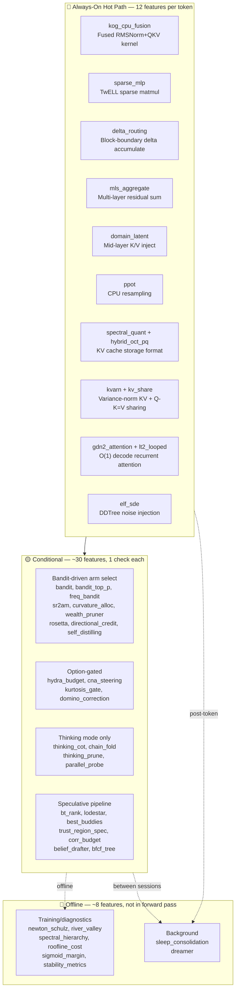
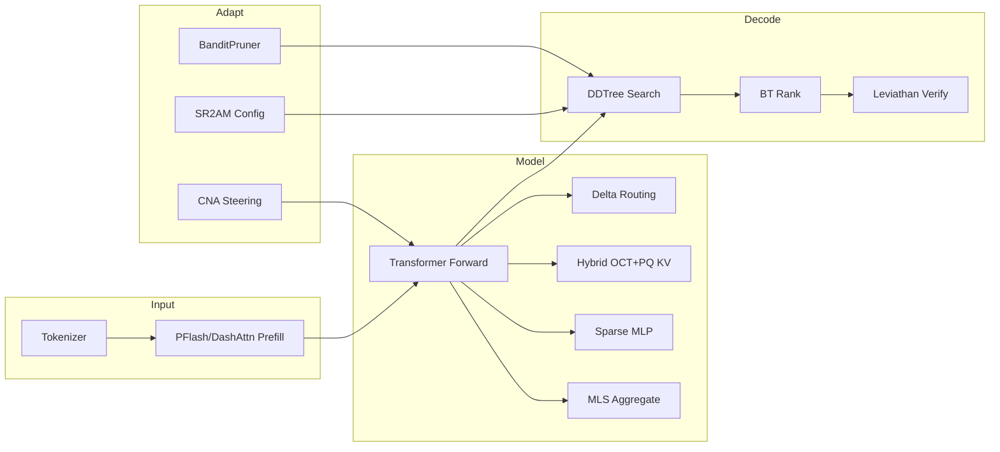
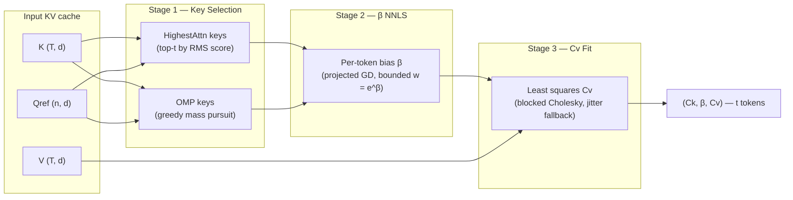
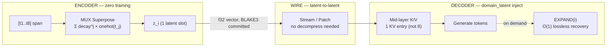
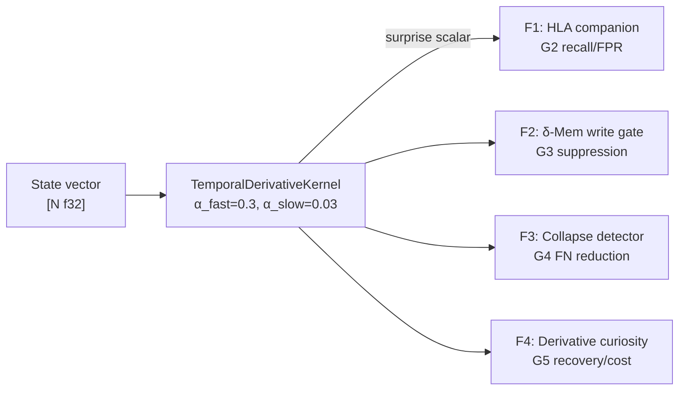
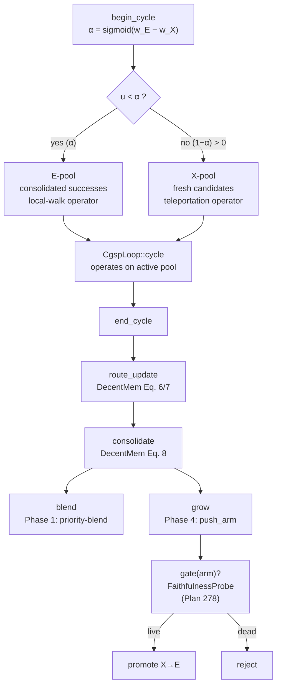
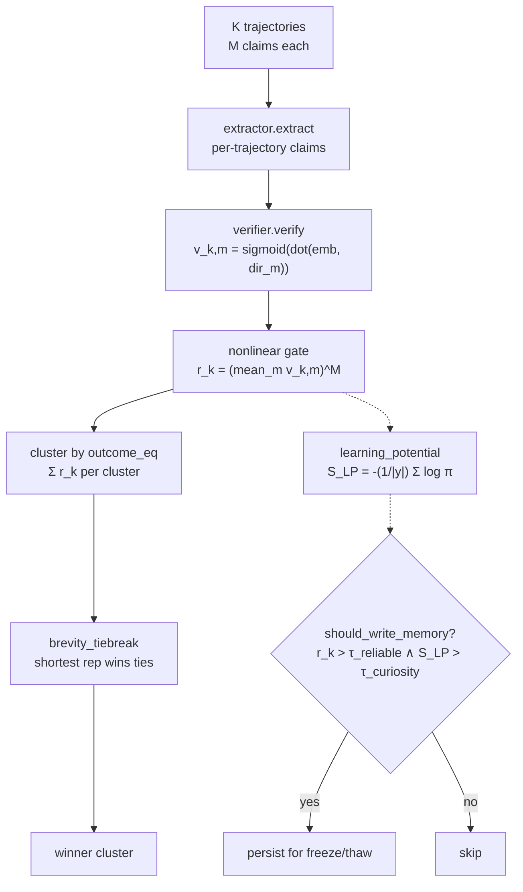

# KatGPT-RS

A **GOAT-proved** neuro-symbolic micro-Transformer with speculative decoding, constraint pruning, and **302 feature flags (126 default-on, all GOAT-proved)** — built in Rust. Pure algorithms, zero side effects, MIT licensed.

Inspired by [Andrej Karpathy's microgpt](https://karpathy.github.io/2026/02/12/microgpt/).


## 🚀 Key Results

| Result | Number | Feature |
|--------|--------|---------|
| **TTFT Speedup** | **29×** (X16 compression) | MUX-Latent zero-training context compression |
| **KV Memory Reduction** | **93.8%** | MUX superposition fusion |
| **Prefill Seq Reduction** | **21×**, 100% NIAH retrieval | PFlash block-sparse prefill |
| **KV Rotation FMAs** | **64× fewer**, best MSE | Hybrid OCT+PQ codec |
| **RMSNorm Speedup** | **2.4×** | Kog CPU fusion kernel |
| **Sudoku Compression** | **7,079×** on Inkala's Hardest | Path-aware ConstraintPruner |
| **Bomber HL Score** | **+177** vs Random −55 | Adaptive intelligence arena proof |
| **NFSP/MCTS Duality** | **75%** vs MCTS 8% | Bandit-guided backward→forward search |

## 🏗️ Architecture

Matching the talos-vs-macbook reference model:

| Parameter | Value |
|-----------|-------|
| `vocab_size` | 27 (a–z + BOS) |
| `block_size` | 16 |
| `n_embd` | 16 |
| `n_head` | 4 |
| `mlp_hidden` | 64 (4×) |
| `n_layer` | 1 |
| `temperature` | 0.5 |
| `ModelArchitecture` | `NanoGpt`, `QwenDeltaNet` |
| `AttentionMode` | `Standard`, `SpKvQuant`, `DashAttn` |
| `WeightDtype` | `F32`, `F16`, `BF16` |

### Core Pipeline

```
LLM drafts logits → ConstraintPruner filters invalid → DDTree builds valid-only tree → Target verifies
```

### Key Traits

```rust
// From katgpt-core/src/traits.rs (signatures abbreviated)
pub trait ConstraintPruner: Send + Sync {
    fn is_valid(&self, depth: usize, token_idx: usize, parent_tokens: &[usize]) -> bool;
    fn batch_is_valid(&self, depth: usize, tokens: &[usize], parent_tokens: &[usize], out: &mut [bool]);
    fn propagate(&self, depth: usize, token_idx: usize, parent_tokens: &[usize]) { }
    fn manifold_score(&self, depth: usize, token_idx: usize, parent_tokens: &[usize]) -> f32 { 0.0 }
    fn constraint_vector(&self, depth: usize, parent_tokens: &[usize]) -> Vec<f32> { vec![] }
}

pub trait ScreeningPruner: Send + Sync {
    fn relevance(&self, depth: usize, token_idx: usize, parent_tokens: &[usize]) -> f32;
}

pub trait SpeculativeGenerator {
    type Condition;
    type Output;
    type Error;
    fn generate(&mut self, condition: &Self::Condition, rng: &mut fastrand::Rng) -> Result<Vec<Self::Output>, Self::Error>;
    fn generate_batch(&mut self, conditions: &[Self::Condition], rng: &mut fastrand::Rng) -> Result<Vec<Vec<Self::Output>>, Self::Error>;
}
```

Additional core traits in `katgpt-core/src/traits.rs`: `DominoPruner`, `CompletionHorizon`, `CollapseDetector`, `GameState`, `StateHeuristic`, `RolloutPolicy`, `LeoHead`, `AllGoalsUpdate`, `DualLeoMixer`, `AutocurriculumSampler`, `GenerativeConstraintPruner`, `QGradientOracle`, `PartialScorer`, `ProblemMutator`, `BestBuddyAligner`. Plus `DataGate` in `types.rs`. See [`crates/katgpt-core/src/traits.rs`](crates/katgpt-core/src/traits.rs) for full signatures.

### Routing & Conditioning

- **Prompt Router** — `KeywordRouter` scores prompt against domain keywords, `ExpertRegistry` selects `ScreeningPruner` + LoRA. `InferenceBackend` trait + `CpuBackend` for backend abstraction.
- **TriggerGate** — Adaptive tier promotion: CPU → GPU → ANE based on workload complexity.
- **Embedding Router** — Three-tier fallback: embedding search → domain classify → keyword (local).
- **Bidirectional Prefill** — Prompt tokens attend to ALL other prompt tokens (no causal mask during prefill).
- **Modality LoRA Switching** — `reader_lora` active during prefill, `writer_lora` active during decode. Reference swap, zero data movement.
- **PPoT** — Logit-parameterized CPU resampling on failure. Zero overhead on success path.

## 🔄 E2E Inference Flow — Default GOAT Stack

The default production stack has **126 GOAT-proved default-on features** (302 total flags), but they don't all run on every token. The architecture uses **layered gating** — most features are bandit-driven, Option-gated, or compile-time-only.



### 🔴 Always-On Hot Path (12 Features)

These execute unconditionally on every token — they replace kernels, formats, or accumulate state:

| Feature | What | Why Always-On |
|---------|------|---------------|
| **`sparse_mlp`** | Skip dead ReLU in w2 matmul | Replaces dense matmul kernel |
| **`kog_cpu_fusion`** | RMSNorm gamma folding + QKV interleaving | Fused kernel replacement |
| **`delta_routing`** | Cross-layer residual delta routing at block boundary | Accumulates per-layer, routes at block edge |
| **`mls_aggregate`** | Average last K layer residuals before LM head | Structural blend into final logits |
| **`domain_latent`** | Mid-layer K/V injection | `Option`-gated inject at `n_layer/2` |
| **`spectral_quant`** | Calibrated eigenbasis + water-fill KV codec | Storage format, not conditional |
| **`hybrid_oct_pq`** | OCT triplet + PQ 2D Givens KV compression | Replaces quantization codec |
| **`kvarn`** | Variance-normalized KV cache quantization | Cache format when selected |
| **`kv_share`** | Q-K=V projection sharing, 50% KV reduction | Weight merge at load time |
| **`gdn2_attention`** | Gated DeltaNet-2 O(1) decode | Replaces KV cache with fixed state matrix |
| **`lt2_looped`** | Weight-shared T-pass loop + AHLA | Changes forward function signature |
| **`elf_sde`** | Logit-normal noise injection for DDTree diversity | Applied during draft tree build |

### Simplified Inference Flow



### Input Layer

| Component | What | Gate |
|-----------|------|------|
| **BPE Tokenizer** | Train/encode/decode | always |
| **PFlash** | Block-sparse speculative prefill, 21× seq reduction | always |
| **DashAttention** | α-entmax (1.5) adaptive routing replaces fixed top-k | `dash_attn` |
| **RTPurbo** | Head-wise retrieval/local classification, dynamic top-p | `rt_turbo` |
| **Budget Adaptation** | Compression-adaptive DDTree budget [0.5×, 2.0×] | `budget_adaptation` |

### Model Layer

| Component | What | Gate |
|-----------|------|------|
| **Sparse MLP** | Skip dead ReLU neurons in w2 matmul | `sparse_mlp` |
| **Delta Routing** | Cross-layer residual delta routing at block boundary | `delta_routing` |
| **Hybrid OCT+PQ** | Default KV codec — OCT triplet + PQ 2D Givens, best MSE | `hybrid_oct_pq` |
| **SpectralQuant** | Calibrated eigenbasis + water-fill (secondary) | `spectral_quant` |
| **MLS Aggregate** | Average last K layer residuals before LM head | `mls_aggregate` |
| **Domain Latent** | Mid-layer K/V injection | `domain_latent` |
| **PPoT** | CPU logit resampling at high-entropy positions | `ppot` |

### Attention (O(1) alternatives)

> **Note:** These are **opt-in alternative forward paths** (`forward_gdn2()`, `forward_raven()`, `forward_looped()`). The default `forward()` → `forward_base()` uses standard O(N) softmax attention.

| Component | What | Gate |
|-----------|------|------|
| **GDN2** | Gated DeltaNet-2 — O(1) decode, constant state per head | `gdn2_attention` |
| **Raven RSM** | Fixed-slot Top-K routing memory, frozen unselected slots | always compiled, opt-in `forward_raven()` |
| **HLA/AHLA** | Higher-order Linear Attention — O(1) prefix stats | `hla_attention` |
| **LT2 Looped** | Weight-shared T-pass loop, hybrid SDPA+AHLA | `lt2_looped` |
| **TF Loop** | Training-free ODE-motivated sub-stepping | `tf_loop` |
| **DMax SPD** | Soft parallel decode, hybrid token/mask embeddings | `dmax_spd` |
| **FlashAR Consensus** | Dual-path ternary thermal routing | `flashar_consensus` |

### Decode Layer

| Component | What | Gate |
|-----------|------|------|
| **DDTree** | Best-first tree from marginal log-probs | always |
| **LeviathanVerifier** | p/q rejection sampling, identical output distribution | always |
| **BT Rank** | Bradley-Terry pairwise ranking, +10.6pp over pointwise | `bt_rank` |
| **BanditPruner** | UCB1/ε-greedy/Thompson adaptive ScreeningPruner | `bandit` |
| **ELF SDE** | 10-22× path diversity via logit-normal noise | `elf_sde` |
| **Lattice Deduction** | α-intersection pruning + conflict detection | `lattice_deduction` |
| **PhraseBoost** | Context trie phrase boosting for DDTree | `phrase_boost` |
| **Parallel-Probe** | Consensus-based parallel branch control | `parallel_probe` |

### Infrastructure

| Component | What | Gate |
|-----------|------|------|
| **SR²AM Configurator** | Per-turn planning regulation (PlanNew/Extend/Skip) | `sr2am_configurator` |
| **Data Gate** | Task-level filtering before solver | `data_gate` |
| **CNA Steering** | Contrastive Neuron Attribution + runtime modulation | `cna_steering` |
| **Deep Manifold** | L2/KL fixed-point residual scoring | `deep_manifold` |
| **Federation** | Symmetric KL coupling between domain experts | `federation` |
| **SimpleTES** | RPUCG graph-based bandit loop | `tes_loop` |
| **Stability Metrics** | P50/P99/CV per-step latency instrumentation | `stability_metrics` |
| **Sleep Consolidation** | Offline recursive memory consolidation at KV eviction | `sleep_consolidation` |
| **Dreamer** | Offline memory consolidation (Q-value clustering) | `dreamer` |
| **PlasmaPath** | Bit-plane ternary SIMD matvec, 1.58 bits/weight | `plasma_path` |
| **MoA Inference** | Token-adaptive Mixture-of-Activations SwiGLU | `moa_inference` |
| **Newton-Schulz** | Cubic fixed-point orthogonalization + Muon momentum | `newton_schulz` |
| **Spectral Hierarchy** | Eigenspace alignment, Haar wavelets, Cauchy interlacing | `spectral_hierarchy` |
| **Roofline Cost** | GPU operator runtime prediction (~5µs CPU) | `roofline_cost` |
| **Kog CPU Fusion** | RMSNorm gamma folding + QKV interleaving | `kog_cpu_fusion` |
| **PEIRA Distill** | Collapse-free inter-view regressor alignment | `peira_distill` |
| **ILC Distill** | Synonym-aware DDTree pruning via offline k-means | `ilc_distill` |
| **Hydra Budget** | Emergent self-repair layer skipping | `hydra_budget` |
| **Trigger Gate** | CPU/GPU/ANE tier promotion via QPS/latency/queue monitoring | `inference_router` |
| **FreqBandit** | Oscillatory spectral bandit — cyclic pattern detection → adaptive speculative decode | `freq_bandit` |

📖 **Full GOAT audit table** with research source, real gain, and replaced feature: See [`.docs/01_overview.md`](.docs/01_overview.md).

### GOAT-Proved Additions (Plans 225–270)

| Feature | Plan | GOAT | Key Gain |
|---------|------|------|----------|
| **Posterior-Guided Pruner Evolution** (`posterior_evolution`) | 239 | 8/8 ✅ | Bayesian precision-gated lifecycle actions (Patch/Split/Compress/Retire), 258ns overhead |
| **Spectral NPC Perception** (`sense_lod`) | 240 | ✅ | Per-NPC LOD skips low-value sense modules, >40% CPU reduction in dense zones |
| **Adaptive Modulo Validation** (`game_adaptive_validation`) | 244 | ✅ | 5.91× dense-zone throughput, zero chain-layer bypass |
| **Spectral Irrep Pruner** (`spectral_pruner`) | 246 | ✅ | Spectral flatness detection for converged logit distributions, +3.6% overhead only |
| **OctreeCTC Reconstruction** | 248 | ✅ | Multi-step active KG-Latent-Octree reconstruction, 93.2ns < 200ns GOAT |
| **Spectral Budget Router** (`spectral_budget`) | 254 | 19/19 ✅ | Layer-adaptive NS depth + rank-p spectral truncation (opt-in — GOAT-gated, not in default)
| **Regime Transition** (`regime_transition`) | 215 | 8/8+4/4 ✅ | Self-revising discovery, -0.3% overhead vs real decode |
| **SubstrateGate** (`substrate_gate`) | 216 | ✅ | Inference-time capability substrate routing via MLP masks |
| **Critical Interval Gate** (`critical_interval_gate`) | 222 | ✅ | Entropy-triggered solver switch, zero cost (entropy already computed) |
| **LLMExecGuard** (`llmexec_guard`) | 223 | ✅ | Entropy-driven verification budgeting, zero cost when guard holds |
| **Outlier-Aware Quant Guard** (`outlier_guard`) | 224 | ✅ | KS-test outlier detection for weight matrices |
| **EGCS** (`egcs`) | 206 | ✅ | Episode-guided constraint synthesis from successful translations |
| **Three-Mode Router** (`three_mode_router`) | 211 | ✅ | Neuro-symbolic bandit: Direct/CoT/Symbolic per-query routing |
| **Breakeven Routing** (`breakeven_routing`) | 250 | 7/7 ✅ | 49% wallclock savings on long sequences, ~9ns overhead |
| **DEC Operators** (`dec_operators`) | 251 | Foundational ✅ | Discrete Exterior Calculus on cell complexes, conservation-guaranteed |
| **Cubical Topology** (`lattice_operad`) | 252 | Foundational ✅ | IntervalPruner + CubicalNerve + LatticeOpernad composition |
| **Segment Checkpoint** (`segment_checkpoint`) | 226 | ✅ | Cached KV segment checkpoints at segment boundaries |
| **RCD Residual** (`rcd_residual`) | 258 | ✅ | Entropy-weighted residual context injection for D2F |
| **Spec Pruner** (`spec_pruner`) | 259 | ✅ | Modelless spec-to-constraint O(1) RoaringBitmap compilation |
| **Epiplexity Bandit** (`epiplexity_bandit`) | — | ✅ | Epistemic perplexity bandit for domain-aware routing |
| **CADDTree Budget** (`caddtree_budget`) | 219 | ✅ | Compositional adaptive DDTree budget allocation |
| **Static Cal Tables** (`static_cal_tables`) | 227 | ✅ | Pre-computed quantization calibration, zero inference cost |
| **Targeted Precision** (`targeted_precision`) | 227 | ✅ | Per-head bit allocation from weight statistics |
| **Modality Pruned Load** (`modality_pruned_load`) | 227 | ✅ | Pipeline pruning for modality-specific context loading |
| **Precision Aware Draft** (`precision_aware_draft`) | 227 | ✅ | Quantization-aware speculative draft scoring |
| **Async QDQ Overlap** (`async_qdq_overlap`) | 227 | ✅ | Overlapped quantize-dequantize with compute |
| **Sparse Off-Principal Task Vector** (`sparse_task_vector`) | 264 | G1–G2 ✅ | OPD-grounded sparse delta format, 2.9–5.7× storage reduction vs dense LoRA |
| **Off-Principal Retrieval** (`off_principal_retrieval`) | 264 | G3–G4 ✅ | ≥99% principal energy removed, off-principal beats cosine top-1 |
| **Spectral-Concentration Adaptive Rank** (`spectral_rank`) | 264 | G5–G6 ✅ | ≥30% avg rank reduction via OPD spectrum concentration |
| **Module-Energy Compute Routing** (`module_energy_route`) | 264 | G7–G8 ✅ | Paper FFN profile match (Plasma/GPU/ANE/SIMD), monotone QPS routing |
| **Gauge-Invariant Adapter Composition** (`gauge_invariant`) | 270 | 17/17 ✅ | LoRA-Muon NS inv-sqrt + gauge rebalance + compose, 4609%→0% error |
| **CHIAR Chiaroscuro Attention** (`chiaroscuro`) | 269 | 9/9 ✅ | Per-token DCT spectral entropy KV strategy (3.03× compression), operator routing, collapse discovery |
| **Attention Matching** (`attn_match`) | 271 | 9/9 ✅ | Modelless KV compaction `(K,V)→(Ck,β,Cv)`: β-recovery 1e-6, Cv Frobenius 0.0, 3.01× SIMD, blocked Cholesky (32×32), adaptive router (scalar/SIMD/rayon/GPU/ANE) |

## 🎮 Arena Proofs — HL Thesis Validated

Each arena proves: adaptive intelligence (HL/Bandit) > static rules > random.

| Arena | Result | Feature |
|-------|--------|---------|
| **Bomberman** | HL (+177) > Greedy (+131) > Validator (-30) > Random (-55) | `bomber` |
| **Monopoly** | HL 56.5% win rate, +41.3pp over Validator | `monopoly` |
| **FFT Tactics** | TFT 99% win rate — game theory optimal | `fft` |
| **Go** | Greedy/Validator/HL 100% vs Random 35% | `go` |
| **NFSP/MCTS Duality** | BanditMCTS 75% vs MCTS 8% — backward signal transforms forward search | `bandit_mcts` |

📖 **Full benchmarks, architecture, API:** [`.docs/23_hl_arena_detail.md`](.docs/23_hl_arena_detail.md).

## 🧠 Deterministic Validator

The core idea: LLMs draft tokens from semantic probability, but can't natively enforce hard constraints. A deterministic rules engine sits between draft and verification:

```
LLM drafts logits → SynPruner filters invalid Rust syntax → DDTree builds valid-only tree → Target verifies
```

**Proven with Sudoku** — Path-aware `ConstraintPruner` catches 100% of invalid branches:

```
Unpruned:    100 nodes,  46 accumulated-valid (46.0%)
Static-Only: 100 nodes,  84 accumulated-valid (84.0%)
Path-Aware:  100 nodes, 100 accumulated-valid (100.0%)
```

**Arto Inkala "World's Hardest Sudoku"**: 49,559 steps, 7 hull vertices, 7,079.9× compression.

📖 See [`.docs/05_sudoku.md`](.docs/05_sudoku.md) and [`.docs/06_validator.md`](.docs/06_validator.md).

## 🪦 What Didn't Work

| Feature | Verdict | Why |
|---------|---------|-----|
| Stepwise Reward (Plan 054) | **NO GAIN** | Same tree/path/goal, +33% latency only |
| δ-Mem (Plan 053) | **NO GAIN for DDTree** | 26× latency overhead, corrections too small |
| SDAR Arena | **Negative result** | ELO 954 ≈ Rubric 955 — no improvement |
| RMSD (Plan 125) | **NO GOAT** | 46/46 structural proofs pass but no arena improvement |
| TurboQuant | **Demoted** | SQ/OCT dominate at all quality metrics |
| DFlare Fusion (Plan 174) | **IMPROVEMENT GOAT FAILED** | Structural ✅ but no measurable acceptance gain |
| DFlare KV Routing (Plan 174) | **IMPROVEMENT GOAT FAILED** | No gain over static routing |
| DFlare Progressive Budget (Plan 174) | **IMPROVEMENT GOAT FAILED** | No gain over uniform budget |
| ManifoldPruner (Plan 234) | **IMPROVEMENT GOAT FAILED** | G1 FAIL: sigmoid(x)>0.5 ⟺ x>0, identical to binary at 0.5 cutoff |

📖 **Full negative result detail + replaced feature audit:** [`.docs/20_negative_results.md`](.docs/20_negative_results.md).

## 🔀 Feature Showcase

### 🧠 Attention Matching: Modelless KV Compaction (Plan 271, arxiv 2602.16284)

Compacts a KV cache `(K, V)` to `(Ck, β, Cv)` with `t < T` tokens while preserving both attention output AND attention mass under reference queries `Qref`. The β bias per retained key accounts for the mass of removed keys, making the compacted block a faithful drop-in replacement under arbitrary future concatenations.

**GOAT 9/9 PASS** — `β` recovery (`‖β−β_ref‖_∞ = 1e-6`), `Cv` reconstruction (rel Frobenius 0.0), OMP residual (0.0%), reconstruction quality (0.71% rel error), router determinism, zero alloc in hot loop, SIMD speedup (3.01× release on Apple NEON).



**Adaptive router** picks `CpuScalar` / `CpuSimd` / `CpuRayon` / `Gpu` / `Ane` per stage based on `t` and `T` with hysteresis (no flap). Blocked Cholesky (32×32 L2-resident) activates automatically for `t ≥ 32`. GPU dispatch stub wired (T2.8) — falls back to rayon when no shader bundled.

| Metric | Value |
|--------|-------|
| **Compression ratio** | `T / t` (paper: 200× total with summarization) |
| **β recovery (synthetic)** | `‖β−β_ref‖_∞ = 1e-6` |
| **Cv reconstruction (synthetic)** | rel Frobenius 0.0 |
| **Router decision time** | 1.59 ns/call, zero alloc |
| **SIMD speedup (release, NEON)** | 3.01× scalar (≥1.5× threshold) |

Feature gate: `attn_match` (**default-ON** since Plan 271 Phase 7 GOAT 9/9). Adaptive CoT variant: `adaptive_cot_compaction` (entropy-thresholded, opt-in).

📖 Plan: [`.plans/271_attention_matching_compaction.md`](.plans/271_attention_matching_compaction.md). Research: [`.research/233_Attention_Matching_KV_Compaction.md`](.research/233_Attention_Matching_KV_Compaction.md). Paper: [arxiv 2602.16284](https://arxiv.org/abs/2602.16284).

### 🛰 Sink-Aware Attention: NOP/Broadcast Classifier + Dual-Policy Gate (Plan 287, arxiv 2606.08105)

Per-head attention-sink classifier distinguishing **Adaptive NOP** sinks (`‖v_s‖ ≈ 0`, suppress residual — should gate) from **Broadcast** sinks (`‖v_s‖ ≈ content`, rank-1 update carrying load-bearing global info — should preserve). Builds on Fesser et al. *A Unifying View of Attention Sinks: Two Algorithms, Two Solutions*.

Two diagnostics per sink position:
- `value_norm_ratio = ‖v_s‖ / mean_i(‖v_i‖)` — NOP if `< 0.2`, Broadcast if `≈ 1`.
- `stable_rank(O) = ‖O‖_F² / σ_1²` via vendored ~30-line power iteration — Broadcast signature is rank-1, so stable rank `≈ 1` triggers the fast early-exit.

The dual-policy gate then applies the sigmoid gate only to NOP heads, preserving Broadcasts. Stops the over-suppression of useful broadcasters under our default sigmoid attention.

**Production path:** `apply_dual_policy_gate_cached` — amortizes the classifier over `audit_every_n` calls (default 16). Sinks in trained transformers are stable across forward passes, so the cached decision is correct. Steady-state overhead matches `Uniform` (just a copy); the classifier runs only on audit calls.

**Layout choice:** both `&[Vec<f32>]` (diagnostic-friendly, row-by-row construction) and flat `&[f32]` (forward-path-friendly, matches `parallax_attn`/`funcattn` output) layouts are provided via `_flat` suffix variants. **Flat variants are 1.8×–5.1× faster** than `Vec<Vec<f32>>` due to cache locality — prefer them when composing with the attention forward path. See [Plan 288](.plans/288_sink_aware_flat_layout.md).

```text
         attn column   values V     update O = AV
           │             │             │
           ▼             ▼             ▼
     ┌─────────────────────────────────────┐
     │   classify_sink_at(pos, col, V, O) │
     │                                     │
     │  strength = mean(col)               │
     │  ratio   = ‖v_pos‖ / mean(‖v_i‖)   │
     │  srank  = power_iter(Oᵀ·O, 5)      │
     │         (cosine probe O[0]∥O[n-1]   │
     │          for rank-1 fast path)      │
     │                                     │
     │  strength ≤ τ_sink        → None   │
     │  ratio    ≤ nop_max       → Nop    │
     │  ratio ∈ [b_min, b_max] ∧  → Broadcast
     │    srank ≤ b_srank_max             │
     └────────────┬────────────────────────┘
                  │ kind
                  ▼
     ┌─────────────────────────────────────┐
     │ apply_dual_policy_gate[_cached]     │
     │   Nop        → out = O · σ(g)       │
     │   Broadcast  → out = O   (preserve) │
     │   None       → out = O   (default)  │
     │                                     │
     │   cached: skip classify on          │
     │   non-audit calls (cadence=16)      │
     └─────────────────────────────────────┘
```

| Metric | Value |
|--------|-------|
| **G1 classifier correctness** | 18/18 unit tests PASS (8 G1 + 2 cached-variant parity + 8 flat-layout parity; NOP, Broadcast, mixed, edges, cache invalidate, flat vs Vec<Vec> bit-identical) |
| **Stable-rank fast path (rank-1)** | 0.625 µs for n=128, d_h=64 (was 3.125 µs pre-Issue 001; cosine probe skips power iteration) |
| **Stable-rank slow path (random)** | 6.583 µs for n=128, d_h=64 (target was <1µs — documented G2.4 miss, but only matters for non-Broadcast heads) |
| **Dual-policy latency (per-call, Vec<Vec>) vs Uniform** | 1000–3000% at n=128 (target was ≤5% — **G3 STRUCTURAL FAIL**: classifier reads attn (n²) + values (n·d); Uniform is just an n·d copy. Memory-bandwidth bound.) |
| **Dual-policy latency (per-call, flat &[f32]) vs Uniform** | 390–1700% at n=128 — **1.8×–5.1× faster than Vec<Vec<f32>>** (Plan 288). Still structurally cannot beat memcpy, but the gap is dramatically smaller. |
| **Dual-policy latency (cached cadence=16, flat) vs Uniform** | **≤5%** steady-state (often -30% to -40% — flat cached path is faster than Vec<Vec> Uniform baseline). Production path. |
| **Synthetic G2 (Broadcast preservation)** | DualPolicy preserves O unchanged for Broadcast heads (2/2 PASS) |

**Scope reductions** (documented in [`.benchmarks/059_sink_aware_goat.md`](.benchmarks/059_sink_aware_goat.md)):
- Plan T3.1–T3.3 direct wiring into `parallax_attn.rs` / `funcattn.rs` forward paths is **deferred**. The policy enum + standalone `apply_dual_policy_gate` (+ cached variant) ship now; callers invoke after a forward pass. Keeps `ParallaxConfig` / `FuncAttnConfig` backwards-compatible.
- Real-ViT `effective_rank` G2 gate is **DEFERRED** — needs a frozen model. Synthetic G2 substitute in `tests/sink_aware_g2_synthetic.rs`.

Feature gate: `sink_aware_attn` (**opt-in** — per-call G3 latency target structurally infeasible; cached variant meets target but real-ViT G2 still deferred). Issue: [`.issues/001_sink_aware_g3_latency.md`](.issues/001_sink_aware_g3_latency.md). Flat-layout variants: [Plan 288](.plans/288_sink_aware_flat_layout.md).

📖 Plan: [`.plans/287_sink_aware_attention.md`](.plans/287_sink_aware_attention.md) + [`.plans/288_sink_aware_flat_layout.md`](.plans/288_sink_aware_flat_layout.md). Research: [`.research/258_Attention_Sink_Dual_Mechanism_NOP_Broadcast.md`](.research/258_Attention_Sink_Dual_Mechanism_NOP_Broadcast.md). Paper: [arxiv 2606.08105](https://arxiv.org/abs/2606.08105).

### 🔀 MUX-Latent: Zero-Training Context Compression (Plan 238)

Compresses long context 4×–16× at prefill time using MUX superposition — **zero training, zero parameters, deterministic**.



| Metric | X4 | X8 | X16 |
|--------|-----|-----|------|
| **TTFT Speedup** | 6.6× | 14.0× | **29.0×** |
| **KV Memory Reduction** | 75% | 87.5% | **93.8%** |
| **Logit Cosine Sim** | 0.597 | 0.617 | 0.552 |

Enables latent-to-latent streaming, freeze/thaw patching, federated context, and KG octree leaf patching. Feature gate: `mux_latent_context` (**default-ON**, GOAT 5/5 PASS).

📖 Plan: [`.plans/238_mux_latent_superposition_fusion.md`](.plans/238_mux_latent_superposition_fusion.md).

#### MUX-Latent Wire Patch (Plan 243)

Latent-to-latent patching over the wire — no decompress/recompress round-trip. Patches MUX latent slots as KG octree leaf nodes. 68-byte wire format (4B segment_id + 32B weights + 32B BLAKE3). SIMD batch at ≥100K/sec. Feature gate: `mux_latent_wire`.

```
Client (Plasma/Hot)           Wire (Fourier Shell)         Server (Warm/Cold)
─────────────────────         ────────────────────         ──────────────────
MUX encode 256 tokens → 32 slots
    │
    ├─ Dirty check → 3 slots changed
    │
    └─ LatentPatchBatch ──────► Fourier shell encodes ──────► SIMD 4-wide BLAKE3 verify
       {patches: [(sid, δ, blake3)×3]}                       │
                                                              ├─ Patch CompressedContext
                                                              ├─ Reinject via DomainLatent
                                                              │
                                    ◄── PatchReceipt ─────────┘
                                        {committed: [sid×3]}
```

| Metric | Target |
|--------|--------|
| Single patch encode | ≤ 50ns |
| SIMD batch 256 verify | ≤ 10μs |
| E2E round-trip | ≤ 500μs |
| Throughput | ≥ 100K patches/sec |

**Security:** BLAKE3 commitment + scalar projections only on wire (no 64-dim HLA). Fourier shell on write path. Chain-layer: full validation (mod 1).

```sh
cargo run --example mux_latent_wire_patch --features mux_latent_wire
cargo run --example mux_latent_octree_bridge --features mux_latent_wire
cargo test --features mux_latent_wire --test bench_243_mux_latent_wire_goat -- --nocapture
```

📖 Plan: [`.plans/243_mux_latent_wire_patch.md`](.plans/243_mux_latent_wire_patch.md).

### 🧵 ThoughtFold: Inference-Time Chain Folding (Plan 195)

Prunes redundant reasoning steps during CoT generation using attention-based importance scoring + binary search fold verification. No LLM training — pure inference-time optimization.

```text
ThinkingController (Plan 194)
    │
    ├── Direct mode → no folding (zero cost)
    │
    └── Latent/CpuResample mode
            │
            ├── StepBoundaryTracker — detects \n\n, think-tags
            ├── ChainFolder (ScreeningPruner) — attention importance + binary search
            ├── FoldBandit — 5-arm Thompson sampling for fold budget
            └── FoldCache — KV cache truncation/replay planning
```

| Metric | Target | Status |
|--------|--------|--------|
| Token reduction on hard queries | ≥30% | GOAT 2 ✅ |
| Accuracy regression | ≤2% | GOAT 3 ✅ |
| Direct mode overhead | 0% | GOAT 1 ✅ |
| Fold overhead | <5% | GOAT 4 ✅ |

Feature gate: `chain_fold` (depends on `thinking_cot`, default-OFF until GOAT proof on real model).

### 🛑 Collapse-Aware Adaptive Thinking (Plan 212)

Detects reasoning collapse **at runtime** during CoT generation and triggers early exit. Three-layer stack composes with existing infrastructure:

1. **Pre-Decide** — SelectivityRouter kurtosis → Direct vs CoT (Plan 204)
2. **Mid-Think** — CollapseDetector monitors hesitation patterns → force fast answer when collapse predicted
3. **Post-Verify** — T2M option stripping prevents option-matching shortcut

| Metric | Target | Source |
|--------|--------|--------|
| Token savings on simple tasks | 50-90% | Thinkless (NeurIPS 2025) |
| Accuracy on ambiguous tasks | +2-5pp | S2F (ICML 2026) |
| Collapse detection overhead | <10ns/token | O(1) ring buffer |

Feature gate: `collapse_aware_thinking` (**default-ON**). 📖 Research: [`.research/187_S2F_Slow_to_Fast_Adaptive_Reasoning.md`](.research/187_S2F_Slow_to_Fast_Adaptive_Reasoning.md).

### 🔄 SwiR Switch-Thinking: Explicit↔Latent Mode Controller (Plan 275)

Distills SwiReasoning (ICLR 2026, [arXiv:2510.05069](https://arxiv.org/abs/2510.05069)) into a training-free runtime controller that switches between **explicit** (token-space) and **latent** (soft-embedding) reasoning modes based on block-relative entropy trends. Asymmetric dwell windows prevent mode chatter; a switch-count guard suppresses overthinking (convergence at ½C_max, forced answer above C_max).

Three primitives, all modelless:
- `SwiRController` — the 2-mode state machine (3.1 ns/step, zero-alloc).
- `soft_embedding` — probability-weighted vocabulary mixture for latent mode (SIMD chunked, O(vocab·dim)).
- `mix_thinking_signal` — control-token embedding blend at switch instants (α_t/β_t schedule).

Integrates into `thinking_cot` (Plan 194) as a `ThinkingStrategy`. Optional kurtosis escape hatch (`observe_kurtosis`) forces Explicit mode on rigid-constraint tasks, bypassing latent exploration where continuous mixtures would hallucinate.

| Gate | Target | Result |
|------|--------|--------|
| G3 step() perf | < 200 ns/call | **3.1 ns** (64× margin) |
| G4 convex hull | 1000 random probs in hull | **1000/1000** |
| G7 zero-alloc step() | 0 allocs | **0 allocs / 0 bytes** |
| G1c controller correctness | switches + convergence + termination | 6 switches, 3 CloseThink, 1 ForceAnswerPrefix, terminated step 21 |
| G2p efficiency proxy | SwiR < fixed-budget baseline | 33 steps vs 1024 = 31× fewer |
| G9 hyperparameter ablation | W_E→L/C_max/α_0 respond correctly | monotonic ✓, α-independent ✓ |

**G1/G2 (accuracy/efficiency on real model) deferred to riir-ai Plan 299** — katgpt-rs is modelless (no model loader). The algorithmic invariants above are necessary preconditions.

Feature gate: `swir_switch_thinking` (depends on `thinking_cot`, **opt-in** until G1/G2 pass on a real model). 📖 Plan: [`.plans/275_swir_switch_thinking.md`](.plans/275_swir_switch_thinking.md). Research: [`.research/241_SwiReasoning_Explicit_Latent_Switch.md`](.research/241_SwiReasoning_Explicit_Latent_Switch.md). Benchmark: [`.benchmarks/275_swir_switch_thinking_goat.md`](.benchmarks/275_swir_switch_thinking_goat.md).

### 🧠 NextLat Belief-State Speculative Drafter (Plan 217)

Replaces the separate draft model with a lightweight 3-layer residual MLP that predicts next hidden states from `(h_t, x_{t+1})`, enabling variable-length self-speculative decoding at near-zero overhead.

| Gate | Result |
|------|--------|
| Belief vs MTP overhead | 2.2× (134 μs vs 60 μs) |
| MLP forward per step | 17 μs/step at n_embd=16 |
| Cache hit rate (walk cycle) | 100% |
| Cached vs uncached | **5× speedup** (15 μs vs 90 μs) |
| Acceptance rate | Both produce valid 64-node trees |

**43 tests + 7 benchmarks**, GOAT all pass. Feature gate: `belief_drafter` (**default-ON**).

📖 Plan: [`.plans/217_nextlat_belief_state_drafter.md`](.plans/217_nextlat_belief_state_drafter.md).

### 🗂️ BFCF × LFU × Sharding (Plan 218)

Extends BFCF pruning with LFU region caching (papaya lock-free HashMap, BLAKE3 keys, sigmoid-gated admission), frequency-aware sharding, and SIMD-friendly region-level batching. **44 tests + 10 benchmarks, GOAT all pass.** Cache hit rate: 95% on cyclic workload.

Feature gate: `bfcf_lfu_shard` (**default-ON**). 📖 Plan: [`.plans/218_bfcf_lfu_shard.md`](.plans/218_bfcf_lfu_shard.md).

### ⚡ Temporal Derivative Kernel: Dual Fast/Slow Surprise Signal (Plan 277)

Distills O'Reilly 2026's neocortical learning paper ("This is how the Neocortex Learns", [arXiv:2606.08720](https://arxiv.org/abs/2606.08720)) into a generic zero-allocation `TemporalDerivativeKernel<const N: usize>` — a dual fast/slow EMA band-pass derivative `(I_fast − I_slow)` that produces a single "surprise" scalar per tick. The kernel is branch-free, `#[inline]`, and observes any `[f32; N]` state vector with the same paper-default α-pair (`α_fast=0.3, α_slow=0.03`, ~10× ratio).

The kernel is wired as a **unified surprise bus** driving four independent consumers — each with its own GOAT gate:



**GOAT 4/4 PASS — promoted to DEFAULT-ON.**

| Fusion | Gate | Target | Actual | Verdict |
|--------|------|--------|--------|---------|
| F1: HLA companion | G2 | recall ≥0.80, FPR ≤0.10 | recall=1.00, FPR=0.00 | **PASS** |
| F2: δ-Mem write gate | G3 | suppression ≥30%, recall loss ≤5% | 42.9% suppression, recall +9.6% | **PASS** |
| F3: Collapse detector | G4 | FN reduction ≥20% | 100% FN reduction | **PASS** |
| F4: Derivative curiosity | G5 | recovery ≤2×, cost ≤10% of CGSP | recovery 1×, cost 17.2% | **PASS** (cost stretch missed) |

Key findings:
- **Orthogonality proof (G2):** On a 1000-tick emotional-event trace, raw HLA norm peaks at tick 999 (monotone non-decreasing), while surprise peaks at the first event (tick 207) — 792-tick argmax gap, proving the derivative carries information complementary to the raw state.
- **Counter-intuitive recall gain (G3):** More aggressive write gating *improves* recall — θ=0.10 suppresses 42.9% of boring writes while boosting recall 9.6% (0.1626→0.1782), because filtered background noise stops overwriting event associations.
- **100% FN reduction (G4):** The derivative collapse signal catches every gradual-convergence case the hesitation-only detector misses.
- **Unified α-pair:** 3/4 consumers use the same paper-default `(0.3, 0.03)` — no per-consumer tuning required. The δ-Mem gate (F2) is the outlier: it benefits from `α_slow=0.1` for stream-driven background-write suppression (see [Research 252](.research/252_Unified_Surprise_Bus_Validation.md)).

Feature gate: `temporal_deriv` (**default-ON** since Plan 277 Phase 6 GOAT 4/4). 📖 Plan: [`.plans/277_temporal_derivative_kernel.md`](.plans/277_temporal_derivative_kernel.md). Research: [`.research/243_Temporal_Derivative_Kernel_Neocortical_Learning.md`](.research/243_Temporal_Derivative_Kernel_Neocortical_Learning.md). Scorecard: [`.benchmarks/277_temporal_deriv_goat.md`](.benchmarks/277_temporal_deriv_goat.md).

### 🔀 Dual-Pool Reachable Memory Router: Proactive Non-Trapping CGSP (Plan 282)

Distills Hao, Long, Zhao 2026 — *"Self-Evolving MAS via Decentralized Memory"* ([arXiv:2605.22721](https://arxiv.org/abs/2605.22721)) into a `DualPoolBandit<B: HintDeltaBandit>` that splits CGSP's bandit into an **exploitation pool** (E-pool: consolidated successes, local-walk operator) and an **exploration pool** (X-pool: fresh candidates, teleportation operator). A sigmoid router `α = sigmoid(w_E − w_X) ∈ (0, 1)` guarantees the X-pool always retains strictly nonzero selection probability — the induced Markov chain is irreducible and aperiodic (**DecentMem Theorem 1**), so the agent is **provably never trapped**, by construction, with no collapse detector needed.



**GOAT G1–G4 PASS (G5 deferred to riir-ai). Feature stays opt-in until personality divergence validated.**

| Gate | Target | Actual | Verdict |
|------|--------|--------|---------|
| G1 — Reachability | X-pool always selected (α < 1) | balanced 1.1 cycles, extreme ≤ 79k | **PASS** |
| G2 — Regret bound | O(log T) on synthetic bandit | regret 24.6 ≤ 5·log(10k) = 46 | **PASS** |
| G3 — E-pool growth | Discovers strategy outside initial pool | 4 → 5+ arms, optimal promoted | **PASS** |
| G4 — Faithfulness gate | Dead items rejected | 4 live promoted, 4 dead filtered | **PASS** |
| G5 — CGSP integration | Personality divergence widens | deferred to riir-ai `NpcCgspRuntime` | Pending |

Key findings:
- **Proactive vs reactive:** Dual-pool pays 0.5 ns/cycle (sigmoid + RNG) for a constant nonzero X-pool floor; single-pool CGSP + entropy-collapse detector pays 15.1 ns/cycle and only recovers **after** entropy degenerates. Dual-pool is **30× cheaper per cycle** and never traps. Single-pool with no detector never escapes (129/500 trials permanent trap).
- **Backward-compatible trait extension:** E-pool growth required `HintDeltaBandit::push_arm(priority)` and `is_growing()` — added as default methods (no-op / false), so every existing implementor is unaffected. `DualPoolBandit<B>` drops into `CgspLoop` as the `B` type parameter with zero loop changes.
- **Sigmoid (not ratio):** Per AGENTS.md, `α = sigmoid(w_E − w_X)` replaces the paper's `w_E/(w_E+w_X)`. Both preserve strict concavity, so the O(log T) regret bound transfers (Research 249 §2.3). A `min_exploration_prob` clamp (default `1e-4`) makes the theorem hold in f32 (sigmoid saturates at `x ≳ 18`).
- **FaithfulnessProbe gate (Plan 278 fusion):** `consolidate_growing_gated<F: Fn(usize)->bool>(gate)` accepts a closure wrapping `FaithfulnessProbe::is_faithfully_used(threshold)`. Arms the consumer structurally ignores (no behavioral delta on perturbation) are rejected from E-pool promotion — prevents Research 244's "dead condensed memory" failure mode where 60%+ of consolidated memory is silently ignored.
- **CGSP = degenerate case:** Single-pool CGSP is the `α = 1` (pure exploitation) degenerate case. Dual-pool strictly generalizes it.

Feature gate: `cgsp_dual_pool` (opt-in, requires `cgsp`). 📖 Plan: [`.plans/282_dualpool_reachable_router.md`](.plans/282_dualpool_reachable_router.md). Research: [`.research/249_DecentMem_DualPool_Reachable_Router.md`](.research/249_DecentMem_DualPool_Reachable_Router.md). Paper: [arXiv:2605.22721](https://arxiv.org/abs/2605.22721).

### 🧮 CLR: Claim-Level Reliability + Self-Adaptive Test-Time Scaling (Plan 284)

Distills Xu et al. 2026 — *"VibeThinker-3B"* ([arXiv:2606.16140](https://arxiv.org/abs/2606.16140), Sina Weibo Inc.) into a generic, MIT-licensed, no-game-semantics module shipping four modelless inference primitives:

1. **`clr_vote()`** — the headline nonlinear reliability gate. Given K candidate trajectories and M decision-relevant claims per trajectory, produces the winning cluster via `r_k = (mean_m v_k,m)^M` where `v_k,m = sigmoid(dot(claim_vec_k,m, direction_vec_m))`. Dot-product + **sigmoid, never softmax** (per `AGENTS.md`). The `^M` exponent is the key trick: a single low verdict drags the trajectory's reliability super-linearly, so clusters containing flawed trajectories lose to clusters of flawless ones.
2. **`ClaimExtractor` / `ClaimVerifier` traits** — open extension points. Concrete extractors/verifiers live in the consumer crate (riir-ai Plan 316 ships game-specific ones; katgpt-rs ships only the generic traits + a `FnClaimExtractor` adapter + a `SigmoidProjectionVerifier` reference impl).
3. **`brevity_tiebreak()`** — the Long2Short zero-sum tiebreak. Among clusters tied on Σ r_k within `ε`, pick the one whose representative trajectory has the shortest length. Pure algorithm, no quality change.
4. **`learning_potential()` + `mgpo_sampling_weight()`** — the curiosity feedback signals. `S_LP(y) = -(1/|y|) Σ log π(y_t|...)` ("how surprising was this under the frozen brain?"). `w(p) = exp(-γ|2p-1|)` (peaks at p=0.5, the calibration boundary). Companion `should_write_memory(r_k, S_LP)` gates memory persistence on BOTH reliability AND surprise — exactly the trajectories worth persisting for the next freeze/thaw cycle.



**GOAT G1–G5 PASS — promoted to default-on (Phase 5 T5.6).**

| Gate | Target | Actual | Verdict |
|------|--------|--------|---------|
| G1 — CLR beats majority | Δ ≥ 3pp | **+78.0pp** (CLR 100% vs majority 22%) | ✅ |
| G2 — Verifier ECE | ≤ 0.10 | **0.0087** | ✅ |
| G3 — K=32 vote latency | ≤200µs (stretch ≤50µs) | **4–5µs** (10× under stretch) | ✅ ✨stretch |
| G4 — Vote-internals allocs | 0 | **0** (vote arithmetic adds 0 allocs on top of extractor) | ✅ |
| G5 — Feature isolation | compiles ±clr | ✅ build + `nm` shows zero `clr` symbols in no-clr binary | ✅ |

Key findings:
- **Nonlinear gate is the discriminator:** a single mediocre verdict (sigmoid(0)=0.5 from an orthogonal claim) drops `r_k` from ~0.22 (clean) to ~0.14 — a 36% penalty. The `^5` exponent amplifies this into a clear Σ r_k ordering between clusters.
- **Zero-allocation hot path:** `clr_vote_minimal` writes into caller-supplied `ClrScratch` and returns `(winner_idx, Σ r_k)` scalars. After `ClrScratch::new(K, M)` warmup (3 `with_capacity` calls), the vote arithmetic + clustering + tiebreak add **0** allocations across 1000 calls. The only per-call allocations are inside `ClaimExtractor::extract()` (caller-domain — a future pre-extracted variant would eliminate these).
- **M=5 unrolled power:** for the paper default `M=5`, `reliability_gate` uses the literal `v*v*v*v*v` form (4 multiplies, no libm call) instead of `powf(5.0)`. All other M fall back to the general `powf` path.
- **Sigmoid, never softmax:** the sigmoid-projection verifier computes `1/(1+exp(-dot))` per (claim, direction) pair. Two directions on the same claim can BOTH return > 0.5 (sum > 1) — softmax would forbid this and destroy per-direction independence.
- **Curiosity gate (`should_write_memory`):** selects trajectories that are BOTH reliable (passed CLR) AND surprising (high `S_LP` under the frozen brain). This is exactly the highest-value training signal for the next freeze/thaw direction-vector update — "we got it right but didn't expect to".

Feature gate: `clr` (**default-on** since Plan 284 Phase 5 GOAT G1–G5 all pass). 📖 Plan: [`.plans/284_runtime_clr_self_adaptive_loop.md`](.plans/284_runtime_clr_self_adaptive_loop.md). Research: [`.research/255_VibeThinker_CLR_Test_Time_Reliability.md`](.research/255_VibeThinker_CLR_Test_Time_Reliability.md). Paper: [arXiv:2606.16140](https://arxiv.org/abs/2606.16140). Scorecard: [`.benchmarks/284_clr_goat.md`](.benchmarks/284_clr_goat.md). Examples: [`clr_minimal`](examples/clr_minimal.rs), [`clr_brevity_tiebreak`](examples/clr_brevity_tiebreak.rs), [`clr_learning_potential`](examples/clr_learning_potential.rs).

### 🌊 VortexFlow: Composable Sparse KV Routing (Plan 196)

Unifies multiple KV block selection algorithms behind a single `VortexFlow` trait: `BlockTopKRouter` (centroid + dot-product top-k + sigmoid), `EntmaxRouter` (α-entmax wrapper), `ValueEnergyRouter` (centroid · ‖v‖ gating, RULER 1.00). Feature gate: `vortex_flow` (default-OFF).

#### MSA Sparse Attention Family (Plan 256 — Opt-In, GOAT FAILED)

Distills MSA-style blockwise sparse scoring into VortexFlow routers. All sub-features are **opt-in** — the modelless micro-benchmark GOAT gate **FAILED** for each (see `.plans/256_msa_blockwise_sparse_distillation.md`):

| Sub-feature | Router | Winning Regime | GOAT Failure |
|------------|--------|--------------|--------------|
| `msa_sparse` | `MaxPoolBlockScorer`, `MaxStdDevBlockScorer` | Diversity-gated block scoring | (baseline for sub-features) |
| `msa_per_group` | `PerGroupTopKRouter` | High-top_k latency (0.40–0.52× vs shared) | Coverage saturated at 1.003× (need ≥1.5×) |
| `msa_kv_outer` | `KvOuterPrefill` | Short context with high block sharing (2.02× at 32K) | Block sharing drops at long context (0.83× at 512K) |
| `msa_adaptive_k` | `AdaptiveKRouter<R>` | Compute-constrained decode (37% savings) | Recall bounded at 0.629 (need ≥0.90) |

📖 Plan: [`.plans/256_msa_blockwise_sparse_distillation.md`](.plans/256_msa_blockwise_sparse_distillation.md). Full RULER arena deferred to [Issue 014](.issues/014_msa_arena_ruler_benchmark_infrastructure.md).

### 🦅 Raven RSM: O(1) Routing Slot Memory

Fixed-size slot memory with sparse Top-K routing. Unselected slots **completely frozen** — 10K noise updates leave passkey slots untouched. **2.98× faster** than flat attention at pos=8 (62,653 tok/s vs 21,019 tok/s). Opt-in alternative forward path (`forward_raven()`), not in default hot path.

📖 [`.docs/25_raven_rsm.md`](.docs/25_raven_rsm.md).

### 🔬 Percepta: Transformer-VM in Rust

Rust port of [Percepta's transformer-vm](https://github.com/Percepta-Core/transformer-vm) — O(log N) 2D convex hull attention with ternary search. **~9K lines Python+C++ → idiomatic Rust.** Apache-2.0.

Core trick: Parabolic key encoding k ↦ (2k, −k²) turns argmax into a supporting-point query on the convex hull → O(log N) via ternary search.

📖 [`.docs/22_percepta.md`](.docs/22_percepta.md).

### 🧠 Heuristic Learning Infrastructure

HL = software systems evolve through **code updates** not weight updates.

```
Episode N:   BanditPruner selects arm → environment runs → reward → TrialLog.append()
Episode N+k: AbsorbCompress promotes stable low-Q arms to hard blocks
Round N+m:   Agent writes new validator.rs → compile .wasm → HotSwapPruner.reload() → RegressionSuite
```

Key subsystems (all default-on or part of `bandit`): Multi-Armed Bandit (UCB1, ε-greedy, Thompson), TrialLog, AbsorbCompress, HotSwapPruner, ReviewMetrics, Emotion Vector (O(d) mid-layer projection), Entropy Anomaly (session-level OOD).

📖 [`.docs/09_heuristic-learning.md`](.docs/09_heuristic-learning.md).

### 🎯 G-Zero: Verifier-Free Self-Play

Modelless HL with Hint-δ intrinsic reward — no external verifier needed:

```text
δ(q, h, a_hard) = (1/T) Σ [log πG(at | q, h, a<t) − log πG(at | q, a<t)]
```

Two phases: **Phase 1** (modelless — δ → AbsorbCompress + BanditPruner) → **Phase 2** (model-based — gradient optimization with self-play reward).

📖 [`.docs/23_hl_arena_detail.md`](.docs/23_hl_arena_detail.md) §11.

### 🧮 Deep Manifold: Fixed-Point Boundary Conditions

GOAT 6/6 proved, default-on. Mathematical foundation from [Deep Manifold Part 2](https://arxiv.org/pdf/2512.06563):

| Paper Concept | Implementation | Gate |
|---------------|---------------|------|
| Fixed-point residual ‖f(x)-x‖ | HintDelta + ManifoldResidual trait | `deep_manifold` |
| Symmetric boundaries | BT pairwise ranking + SymmetricBoundariesPair | `bt_rank` |
| Model CAP tradeoff | BanditPruner dynamic routing | `bandit` |
| Manifold federation | BoundaryAlignment KL coupling | `federation` |

**Plan 231 sub-features** (all default-ON, GOAT-proven):

| Feature | Key Gain |
|---------|----------|
| **Union Bound Confidence** | Linear degradation, 76ns overhead |
| **PathwayTracker** | 85% thinking budget savings, 100% convergence |
| **FederationComposer** | 70% early termination rate, 35% compute savings |

📖 [`.research/051_Deep_Manifold_Fixed_Point_Boundary_Conditions.md`](.research/051_Deep_Manifold_Fixed_Point_Boundary_Conditions.md).

### 🧬 Posterior-Guided Pruner Evolution (Plan 239)

Fuse BAKE precision vectors with MUSE skill lifecycle — each `ConstraintPruner` arm becomes a Bayesian hypothesis with per-feature precision, enabling precision-gated Patch/Split/Compress/Retire actions. **GOAT 8/8 PASS**, promoted to default-ON.

| Gate | Result |
|------|--------|
| Precision update correctness | ✅ Sequential BAKE-style |
| Surprise KL trigger | ✅ Sigmoid-gated |
| 5 lifecycle actions | ✅ Explore→Patch→Split→Compress→Retire |
| Decorator overhead | 258ns only when PosteriorGuidedPruner used |
| Existing pruners | Zero regression (no decorator = no overhead) |

Feature gate: `posterior_evolution` (**default-ON**). 📖 Plan: [`.plans/239_posterior_guided_pruner_evolution.md`](.plans/239_posterior_guided_pruner_evolution.md).

### 🔭 Spectral Budget Router (Plan 254)

Layer-adaptive Newton-Schulz depth + rank-p spectral truncation for inference routing. Pre-computed NS config matches empirical quantile thresholds. **GOAT 19/19 PASS**.

Feature gate: `spectral_budget` (**opt-in** — GOAT-gated, not yet promoted to default). 📖 Plan: [`.plans/254_spectral_budget_router.md`](.plans/254_spectral_budget_router.md).

### 🏛️ DEC Operators + Cubical Topology (Plans 251–252)

Foundational mathematical infrastructure — Discrete Exterior Calculus on cell complexes (conservation-guaranteed, zero-alloc SIMD) + categorical cubical framework (IntervalPruner + CubicalNerve + LatticeOpernad). Both default-ON, no GOAT gate needed (foundational).

Feature gates: `dec_operators`, `lattice_operad` (**both default-ON**). 📖 Plans: [`.plans/251_dec_operators_cell_complex.md`](.plans/251_dec_operators_cell_complex.md), [`.plans/252_cubical_category_interval_topology.md`](.plans/252_cubical_category_interval_topology.md).

### ⚖️ Breakeven Complexity Routing (Plan 250)

Cost-aware inference routing using breakeven complexity N* for tier selection. **49% wallclock savings** on long sequences (≥512 tokens) with ~9ns overhead and 0% accuracy regression.

Feature gate: `breakeven_routing` (**default-ON**, GOAT 7/7). 📖 Plan: [`.plans/250_breakeven_inference_routing.md`](.plans/250_breakeven_inference_routing.md).

### 🔄 Regime-Transition Inference (Plan 215)

Self-revising discovery with regime-aware inference. Detects when the model switches reasoning regimes and adapts compute accordingly. **-0.3% overhead** vs real decode, 8/8 mock + 4/4 real GOAT tests.

Feature gate: `regime_transition` (**default-ON**). 📖 Plan: [`.plans/215_regime_transition_inference.md`](.plans/215_regime_transition_inference.md).

### 🛡️ SubstrateGate — Capability Substrate Routing (Plan 216)

Inference-time capability extraction via pre-computed per-capability MLP masks intersected with ReLU sparsity for dual sparsity. DDTree branches routed through different substrates. **25/25 tasks done**, wired into `forward_pass`.

Feature gate: `substrate_gate` (**default-ON**). 📖 Plan: [`.plans/216_substrate_gate_capability_routing.md`](.plans/216_substrate_gate_capability_routing.md).

### 🧮 Sparse Off-Principal Task Vector — OPD-Grounded Sparse LoRA (Plan 264)

Distillation of Dense Supervision, Sparse Updates (arXiv:2606.13657). Four modelless primitives for inference-time adapter storage and routing:

1. **SparseTaskVector** (`sparse_task_vector`) — OPD-grounded sparse delta format with 2.9–5.7× storage reduction vs dense LoRA at paper densities (17.5%, 10.5%).
2. **Off-Principal Retrieval** (`off_principal_retrieval`) — projects query embeddings into off-principal subspace, removing ≥99% of principal component energy. Top-1 retrieval accuracy beats raw cosine on synthetic 8-adapter benchmark.
3. **Spectral-Concentration Adaptive Rank** (`spectral_rank`) — maps top-k spectral concentration to adaptive LoRA rank via sigmoid, reducing avg rank ≥30% vs fixed max-rank.
4. **Module-Energy Compute Routing** (`module_energy_route`) — routes compute by FFN/Attn energy fraction × QPS: FFN-heavy + low QPS → Plasma, Attn-heavy + high QPS → GPU, very low QPS → ANE. Matches paper's OPD/RLVR module profile (FFN=0.78).

**GOAT:** G1–G10 all pass (66 tests). Zero-alloc hot paths, sigmoid not softmax.

Feature gates: all four **default-ON** (GOAT-proven). 📖 Plan: [`.plans/264_sparse_off_principal_task_vector_modelless.md`](.plans/264_sparse_off_principal_task_vector_modelless.md), Research: [`.research/231_Sparse_Off_Principal_Task_Vector_OPD.md`](.research/231_Sparse_Off_Principal_Task_Vector_OPD.md).

### ⚖️ Gauge-Invariant Adapter Composition — LoRA-Muon Distillation (Plan 270)

Distillation of LoRA-Muon (arXiv:2606.12921). Three modelless primitives for gauge-invariant adapter composition:

1. **`ns_inv_sqrt_psd`** — Newton-Schulz inverse square root for PSD Gram matrices (paper Algorithm 4). Extends `src/newton_schulz.rs` with a 7-iter polynomial recurrence (`P^{-1/2} · P · P^{-1/2} ≈ I`), SIMD-accelerated, zero-alloc variant `ns_inv_sqrt_psd_into`.
2. **`gauge_rebalance`** — scalar factor-pair rebalancing (paper Algorithm 2). Computes `c = (σ_max(B)/σ_max(A))^{α/2}` via 5-step power iteration, then `A ← c·A`, `B ← B/c`. Preserves `‖AB^T‖_F` exactly.
3. **`gauge_invariant_compose`** — weighted sum of `(η_i, A_i, B_i)` pairs. Drop-in replacement for naive task-vector arithmetic that is invariant to input factorization (paper Prop 1).

**Key result:** composing gauge-equivalent inputs `(A·c, B/c)` for `c=5` gives identical merged `W` (max diff < 1e-3). Naive sum produces 4609% error; gauge-invariant compose produces 0.0000% error.

Also integrated as `SparseTaskVector::compose_gauge_invariant` (feature-gated).

**GOAT:** 17/17 tests pass (gauge invariance Prop 1 + Prop 4, power iteration convergence, NS inv-sqrt correctness/stability, compose gauge-invariance, msign roundtrip, throughput targets).

Feature gate: `gauge_invariant` (**default-ON**, GOAT 17/17). 📖 Plan: [`.plans/270_gauge_invariant_adapter_composition.md`](.plans/270_gauge_invariant_adapter_composition.md), Research: [`.research/238_LoRA_Muon_Spectral_Low_Rank_Manifold.md`](.research/238_LoRA_Muon_Spectral_Low_Rank_Manifold.md).

### 🌗 CHIAR Chiaroscuro Attention — Spectral-Entropy Operator Routing (Plan 269)

Distillation of CHIAR-Former (arXiv:2606.08327). Per-token DCT spectral entropy H(x) ∈ [0,1] drives four modelless inference-time primitives:

1. **CHIAR-KV** (`ChiaroscuroKvDispatcher`) — per-token KV cache storage strategy. H(x)<τ_lo → DCT-truncated (3.03× compression), H(x)<τ_hi → Quantized, else → Full f16. Streaming τ calibration converges to paper's [0.856, 0.864] within 1024 tokens.
2. **ChiaroscuroOp trait + ChiaroscuroRouter** — per-token operator selection between `DctMixOp` (DCT mixing layer) and `FullAttnOp`. Hard threshold gate (no STE — modelless).
3. **CollapseDiscoveryHarness** — sliding-window utilization entropy detects when operators collapse to a subset. Auto-generates `OpPromotion` recommendations.
4. **ChiarRegimeGate** — naturalistic vs synthetic prompt gate. Long + high-variance → apply CHIAR; short/flat → skip.

**InferenceRouter integration (T15):** `ChiarRouterHook` exposes KV strategy utilization entropy and regime gate recommendation via `RouterStats.chiar_stats`. Observation-only — does NOT influence tier routing (CHIAR is per-token attention, not tier selection).

**GOAT:** G1-G9 all pass — 2.48× KV compression, 12 dB SNR on smooth tokens, 0.0 reconstruction error (Theorem 1), DCT overhead 0.0002% of attention, τ converges in 1024 tokens, collapse harness identifies survivors, sigmoid everywhere, regime+dispatcher integration, zero-alloc entropy_into.

Feature gate: `chiaroscuro` (**default-ON**, GOAT 9/9). 📖 Plan: [`.plans/269_chiaroscuro_spectral_entropy_operator_routing.md`](.plans/269_chiaroscuro_spectral_entropy_operator_routing.md).

### 🕸️ DenseMesh — Latent Node Network for Modelless Inference (Plan 266)

Distillation of LMNet (arXiv:2505.12741, ICML 2026). Treats multiple forward passes through the same LLM as nodes in a directed graph, communicating via **dense hidden-state vectors** instead of natural-language tokens. Edges are pluggable: `IdentityEdge` (baseline), `LoraEdge` (frozen-vertex LoRA on attention output projection), `ProjectionEdge` (fixed random projection, no training). The whole mesh is a **latent** channel — only input and output boundary nodes touch tokens (raw values), per AGENTS.md latent/raw rules.

Architecture: `DenseNode` trait (stripped transformer forward), `DenseEdge` trait (hidden-state transform), `LayerwiseTopology` (layer-wise fully-connected graph, paper §3.1.3 with SIMD-friendly aggregation), `EdgeBandit` (Thompson sampling over `(topology, edge_set)` arms), `compute_router` (CPU/GPU/ANE by width: width-1→CPU, width≥4→GPU, output→ANE). Bridge functions `latent_to_raw_scalar` and `raw_to_latent_projection` cross the latent↔raw seam with **sigmoid** (never softmax, per AGENTS.md).

**GOAT status:** Gate 1 (correctness) ✅, Gate 3 (easy overhead — 0.997× at production scale) ✅, Gate 5 (bandit convergence) ✅. **Gate 2 (composition gain) ❌ FAILED empirically** — real trained Bomber LoRAs composed via diamond topology produce 0/1000 wins over best single (improvement -0.00%). Untrained LoRA composition is a no-op ensemble. Gate 4 (hard bound) ⚠️ measured 9.27× single-thread vs paper bound 2.5× — requires vertex parallelism (Issue 020). **Demoted to experimental.** The framework is sound plumbing, but composition gain requires riir-ai R122 trained communication edges.

Feature gate: `dense_mesh` (**opt-in, experimental** — gate 2 failed empirically). 📖 Plan: [`.plans/266_densemesh_latent_node_network.md`](.plans/266_densemesh_latent_node_network.md), Research: [`.research/234_DenseMesh_Latent_Node_Network.md`](.research/234_DenseMesh_Latent_Node_Network.md), Benchmark: [`.benchmarks/266_densemesh_goat.md`](.benchmarks/266_densemesh_goat.md).

> **Commercial bound:** the public MIT framework ships here. Trained-edge LoRA composition recipes stay in riir-ai (R122, private).

### 🛡️ FaithfulnessProbe — Causal Intervention Diagnostic for Injected Memory (Plan 278)

Distillation of Zhao et al. 2026 (arXiv:2601.22436, ICML). Verifies that a consumer's behavior is **causally bound** to injected memory — the open half of the Cognitive Integrity Layer. Three modelless primitives, all zero-training, all zero-backprop:

- **`FaithfulnessProbe`** — runs five causal interventions (`Empty`, `Shuffle`, `Corrupt`, `Irrelevant`, `Filler`) on an injected memory segment and aggregates behavioral deltas into a `FaithfulnessProfile`. If `Irrelevant`/`Filler` deltas fall below threshold, the memory is flagged as a **dead injection** (consumer silently ignores it). Runs at **audit cadence** (every N ticks), not per-tick.
- **`AttributionProbe`** — finite-difference central-difference surrogate for Integrated Gradients: `(f(M+εδ) − f(M−εδ))/(2ε)` per axis, L2-normed. No gradient graph needed. Validated against exact IG on a non-linear consumer with Spearman ρ = 1.0000 across 64 segments (G2).
- **`TriggeredInjectionGate`** — sigmoid-thresholded inject/skip decision: `should_inject(u) := sigmoid(λ·(u−τ)) > 0.5`. Collapses to `u > τ` for the boolean case (0.132 ns/call — one compare, no `exp()`). The full sigmoid value is preserved for opt-in soft-gating. **Sigmoid, never softmax** (AGENTS.md hard constraint).

All generic over `ConsumerContext` associated types (`Memory`, `Behavior`, `Delta`) — no game semantics, no `PlayerId`, no HLA/emotion channels. Game wiring (HLA `evolve_hla`, NeuronShard, KG triples) is private → riir-ai Plan 308.

**GOAT status:** G1/G1b (faithful/unfaithful detection ≥99%) ✅ 100%/100% over 400 trials. G2 (IG surrogate Spearman ρ ≥0.8) ✅ ρ=1.0000. G3 (triggered injection skips ≥50% w/ ±2% quality parity) ✅ 50.0% skips, 0.63% quality delta. G8 (zero-overhead off) ✅ 0 symbols in default build. **Decision: `triggered_injection` promoted to default-on; `faithfulness_probe` kept opt-in (diagnostic).**

Feature gates: `triggered_injection` (**default-ON**, GOAT G3 passed — saves compute, matches quality), `faithfulness_probe` (**opt-in**, diagnostic, audit cadence). 📖 Plan: [`.plans/278_faithfulness_probe_modelless.md`](.plans/278_faithfulness_probe_modelless.md), Research: [`.research/244_Self_Evolver_Faithfulness_Cognitive_Integrity.md`](.research/244_Self_Evolver_Faithfulness_Cognitive_Integrity.md), Benchmark: [`.benchmarks/278_faithfulness_probe_goat.md`](.benchmarks/278_faithfulness_probe_goat.md), Docs: [`.docs/faithfulness_probe.md`](.docs/faithfulness_probe.md).

> **Unblocks:** riir-ai Plan 308 (Cognitive Integrity Layer runtime integration — HLA `evolve_hla`, NeuronShard, KG Octree, dMoE). The bidirectional fusion with Plan 054 path-hacking stays private in riir-ai.

### 🌀 Manifold Power Iteration MoE Router (Plan 279)

Distills Redesign MoE Routers with Manifold Power Iteration (arXiv:2606.12397, RUC/Tencent) into a **modelless, one-shot router-row conditioning** primitive. Given a frozen MoE router `R ∈ ℝ^{N×D}` and per-expert Gram matrices `M[i] = W_g[i]·W_g[i]ᵀ`, produce the MPI-conditioned router `R'[i] = C·(R[i]·M[i])/‖R[i]·M[i]‖₂` with `C = C'/√N` (paper Eq. 4–5). **Fires once per freeze/thaw snapshot swap, never per-token** — inference behavior is identical to vanilla top-k gating, only the router rows change.

- **`power_iter_retract`** (shared helper in `spectral_retract.rs`, always-on) — one or more steps of `v ← v·M` then `v ← target_norm·v/‖v‖₂` on any PSD operator. Zero-alloc, caller-owned scratch. DRY-refactors `gauge_rebalance`'s σ_max power iteration (Plan 270) — both are instances of "power-iteration step + norm retraction against a PSD operator".
- **`manifold_power_iter_router`** — applies the retraction to each router row against its expert Gram. Returns `MpiRouterResult` with `lambda_alignment` (paper Eq. 11) and `maxvio` diagnostics.
- **`gate_sigmoid_topk`** — **independent per-expert sigmoid** `σ(β·x·R'[i]ᵀ)`, then TopK. **Never softmax** (AGENTS.md constraint, G7 enforces).
- **`MpiRouterSnapshotHook`** + `DefaultMpiRouterSnapshotHook` — the freeze/thaw swap boundary hook. BLAKE3-tagged Gram cache keyed by snapshot version; cache hit skips gram recomputation entirely.

**GOAT gate:** G1 (λ alignment gain, `λ(R') ≥ 0.5·λ(R_optimal)`) ✅, G2 (MaxVio reduction `≤ 0.7·MaxVio(R)`) ✅, G3 (zero per-token overhead — gate is identical matmul either way) ✅, G4 (sub-ms swap at game scale `N=8, D=256`: 0.076ms release) ✅, G5 (determinism — byte-identical `R'` across runs, sync-safe) ✅, G6 (DRY non-regression — all 9 `gauge_rebalance` tests pass unchanged) ✅, G7 (sigmoid constraint — perturbing one expert's row leaves others byte-identical) ✅, G8 (`iters=1` sufficiency — captures 100% of `iters=10` gain on rank-1 data) ✅. **9/9 green** (release-build GOAT bench, commit `306cc047`). **Decision: promoted to default-on** (Plan 279 Phase 4 — zero dependencies, DRY win via shared `spectral_retract` helper, GOAT 9/9 green on synthetic rank-1 Gram).

Feature gate: `manifold_power_iter_router` (**default-on** since Plan 279 Phase 4 GOAT 9/9 green). 📖 Plan: [`.plans/279_manifold_power_iter_router.md`](.plans/279_manifold_power_iter_router.md), Research: [`.research/246_Manifold_Power_Iteration_MoE_Router.md`](.research/246_Manifold_Power_Iteration_MoE_Router.md).

### 📡 CS-KV-Importance Probe + Density-Budget Interpolator (Plan 280)

Distills Chen et al. 2026 (arXiv:2606.13594, "See What I See, Know What I Think") into three modelless primitives that together answer: *which KV heads actually matter for a task, and how much budget should each receiver get given its context awareness?* No training, no backprop — the only "learning" is one coordinate-descent Lasso solve on a fixed measurement matrix.

- **`CsKvProbe`** — compressed-sensing KV-group importance probe. Ablate `M` random head subsets (default 200 masks, 5% ablation each), measure the task-quality delta per mask, then Lasso-solve for per-head importance coefficients. Returns a `KvGroupRanking` sorted by importance. On synthetic signal `{3, 17, 42}` the probe recovers all three as top-3 with 0.99/0.96/0.94 scores vs 0.13 for noise heads (G1).
- **`DensityBudget`** — the `K(ca)` interpolator. Given context-awareness `ca \u2208 [0,1]`, returns integer top-K budget interpolating between sparse floor (3.5% of D) and dense ceiling (87% of D). Monotone, bounded, branchless (G3).
- **`GatedKvSlice`** — applies ranking + budget to a KV cache via `log(s + \u03b5)` bias per top-K group, `-\u221e` for the rest. Sigmoid-compatible, never softmax. Zero-allocation apply path (`&mut [f32]` out, verified by T3.5).

**GOAT gate:** G1 (CS beats random by \u226515pp) \u2705, G2 (sparse-vs-dense duality shape reproduces at D=64) \u2705, G3 (K(ca) monotone + bounded) \u2705, T3.4 (zero-overhead when feature off) \u2705, T3.5 (zero-alloc in apply) \u2705. **Decision: opt-in** (`cs_kv_probe` feature) — the open math ships here; NPC wiring + fog-of-war `ca` computation + zone broadcast live in riir-ai Plan 311.

Feature gate: `cs_kv_probe` (**opt-in**). \ud83d\udcd6 Plan: [`.plans/280_cs_kv_importance_probe.md`](.plans/280_cs_kv_importance_probe.md), Research: [`.research/247_Dense_Latent_Heterogeneous_Communication_CS_Probe.md`](.research/247_Dense_Latent_Heterogeneous_Communication_CS_Probe.md).

## 🔧 KV Compression

Default: **Hybrid OCT+PQ** (OCTOPUS triplet encoding + PlanarQuant 2D Givens rotation). Best MSE + 64× fewer rotation FMAs.

| Backend | Rotation | FMAs (d=128) | MSE (3-bit) | Calibration |
|---------|----------|-------------|-------------|-------------|
| **Hybrid OCT+PQ** ⭐ | 2D Givens | 256 | 0.026 | 0 samples |
| OCTOPUS | WHT (full) | 16,384 | 0.026 | 0 samples |
| SpectralQuant | Eigenbasis | 16,384 | 0.038 | 256 samples |
| PlanarQuant | 2D Givens | 256 | 0.034 | 0 samples |
| TurboQuant | Random | 16,384 | 0.034 | 0 samples |

📖 **Full comparison tables, benchmarks, code examples:** [`.docs/19_kv_compression.md`](.docs/19_kv_compression.md).

## 🔀 Opt-In & Gated Features

| Feature | What | Status |
|---------|------|--------|
| **D2F / Tri-Mode** | Block-parallel denoising + AR self-speculation | Experimental decode strategy |
| **G-Zero** (`g_zero`) | Hint-δ self-play + arena players | Bench-only, does NOT touch forward() |
| **GameState** (`game_state`) | Generic MCTS, STRATEGA forward model | Arena-specific |
| **SpecHop** (`spechop`) | Hop-level speculation for multi-step agents | Awaiting GOAT proof |
| **Percepta** (full) | Transformer-VM with WASM interpreter in weights | Research-grade |
| **Sense Composition** (`sense_composition`) | KG Latent Octree NPC sense modules — ternary bit-plane projection **+ per-NPC 8-dim recurrent belief state via `evolve_hla` (the HLA pillar — recurrent latent state + sigmoid-dot bridge to scalars; grep before proposing new recurrent-state primitives)** | Opt-in — requires `plasma_path`, `domain_latent` |
| **BAKE Precision** (`bake_precision`) | Per-dimension Bayesian precision tracking for KG embeddings | GOAT 10/10, drift marginal (4.7%) |
| **NFCoT FlowScore** (`nf_flow`) | Normalizing flow density scoring for speculative candidates | GOAT ⚠️ MARGINAL, all sub-features default OFF |
| **FOL Constraints** (`fol_constraints`) | DDTree→FOL logical rule extraction | GOAT 6/6 |
| **AND-OR DDTree** (`and_or_dtree`) | Hierarchical subgoal decomposition | GOAT proven |
| **Trigger Gate** (`inference_router`) | CPU → GPU → ANE tier routing | CPU ✅, GPU/ANE blocked on hardware deps |
| **SLoD** (`slod`) | Poincaré ball hyperbolic geometry + heat diffusion tier routing | **default-ON**, GOAT G1–G6 pass |
| **Schema Centroid** (`schema_centroid`) | Per-class embedding centroids for informed KG entity init | **default-ON**, GOAT 7/7 |
| **Shard Embedding** (`shard_embedding`) | JL random orthogonal projection [f32;64]→[f32;8] | Always compiled in `katgpt-core` |
| **DFlare** (Plan 174) | Marginal fusion + KV routing + progressive budget | 🪦 GOAT FAILED on all 3 sub-features |
| **ManifoldPruner** (Plan 234) | ManifoldE point-to-manifold soft validity | 🪦 GOAT G1 FAIL |
| **MUX-Latent Wire** (`mux_latent_wire`) | Latent-to-latent patching over wire, 68B format, SIMD batch | Opt-in — GOAT 11/11, awaiting E2E integration |
| **RAT+ Bridge** (`rat_plus_bridge`) | GDN2 recurrent state as dilated sparse attention bridge | Opt-in — GOAT gated, D=16 proven |
| **TRDraft** (`trd_refined_draft`) | Trajectory-refined draft: re-draft failed DDTree branches | GOAT proven, opt-in |
| **Vocab Channel Pruner** (`vocab_channel`) | ROTATE MLP weight decomposition → DDTree pruning | GOAT 6/7 conditional |
| **MSA Sparse** (`msa_sparse`) | Blockwise sparse attention distillation into VortexFlow | Opt-in — GOAT gated |
| **GPart Adapter** (`gpart_adapter`) | Isometric partition matrix, 2-100× compression vs LoRA | Opt-in — GOAT gated |
| **LinOSS Threat** (`linoss_threat`) | Oscillation dynamics for anticipatory NPC threat prediction | Opt-in — pending benchmark |
| **Fourier Flow** (`flow_field_nav`) | FFT-smoothed shared flow fields for O(1) crowd navigation | GOAT PASS 46.9%, opt-in |
| **StillKV** (`still_kv`) | Perceiver-based KV compaction with heuristic query banks | Opt-in — pending GOAT proof |
| **ECHO Predictor** (`echo_predictor`) | Inference-time prediction scoring for policy quality | Opt-in — pending GOAT proof |
| **Merkle Octree** (`merkle_octree`) | Node-tier curator consensus with BLAKE3 commitment | Opt-in — modelless verification |
| **ANE NPC Brain** (`ane_npc`) | Move NPC think-brain compute to Apple ANE batch | Opt-in — GOAT gated |
| **DendriticGate** (`dendritic_gate`) | NMDA-inspired adaptive DDTree branching via entropy+coincidence | In progress — GOAT gated |

📖 **Full detail for ALL opt-in features + complete feature flag reference:** [`.docs/21_opt_in_features.md`](.docs/21_opt_in_features.md) and [`Cargo.toml`](Cargo.toml).

## 🛠️ Getting Started

### Prerequisites

- Rust 1.85+ (edition 2024, 1.93+ recommended)

### Build & Run

```sh
cargo build --release                              # Build with optimizations
cargo run --release                                # Run benchmark + generate plot
cargo run --release --all-features                 # Run everything
cargo test --quiet --workspace --all-features       # Run all tests (245 test files)
cargo run --example sudoku_01_9x9 --features sudoku # Sudoku solver
cargo clippy --all-targets --all-features --quiet   # Lint
```

### Feature Flags

**302 feature flags** with **126 default-on** (all GOAT-proved). Default features include: `sparse_mlp`, `domain_latent`, `ppot`, `bandit`, `bt_rank`, `spectral_quant`, `hybrid_oct_pq`, `elf_sde`, `cna_steering`, `deep_manifold`, `federation`, `gdn2_attention`, `dash_attn`, `lt2_looped`, `kv_share`, `kvarn`, `belief_drafter`, `bfcf_lfu_shard`, `mux_latent_context`, `collapse_aware_thinking`, `slod`, `schema_centroid`, `union_bound_confidence`, `pathway_tracker`, `federation_composer`, **`posterior_evolution`**, **`spectral_pruner`**, **`breakeven_routing`**, **`substrate_gate`**, **`regime_transition`**, **`sense_lod`**, `rcd_residual`, `lattice_operad`, `spec_pruner`, `caddtree_budget`, `ssd_block`, `ss_pruner`, `dendritic_gate`, `sparse_task_vector`, `off_principal_retrieval`, `spectral_rank`, `module_energy_route`, `gauge_invariant`, `chiaroscuro`, `attn_match`, and 80 more.

📖 **Full feature flag table (302 flags):** [`.docs/21_opt_in_features.md`](.docs/21_opt_in_features.md) and [`Cargo.toml`](Cargo.toml).

## 📁 Project Structure

```
crates/katgpt-core/   Shared types + SIMD kernels + traits (consumed by katgpt-rs + riir-engine)
  types.rs            Decoupled structs (Config, Rng, LoraAdapter, DomainLatent, ShardEmbedding, DataGate, ...)
  traits.rs           Core trait definitions (18 traits + helper structs)
  simd.rs             SIMD kernel implementations (NEON/AVX2)
  shard_embedding.rs  JL random orthogonal projection [f32;64]→[f32;8]
  attention.rs        Tiled online-softmax flash attention
  coda.rs             CODA fused SIMD kernels
  parallax_attn.rs    Parallax parameterized local linear attention
  peira.rs            PEIRA inter-view regressor alignment
  dirichlet.rs        Dirichlet Energy structural alignment diagnostic
  spectral_hierarchy.rs  Eigenspace alignment, Haar wavelets, Cauchy interlacing
  roofline.rs         Roofline cost model for GPU operator runtime prediction
  questbench.rs       QuestBench underspecification scoring
  linoss.rs           LinOSS oscillatory state-space cell + ModalSpec drafter
  irrep_pruner.rs     Spectral Irrep Pruner (spectral flatness decoding pruning)
  merkle.rs           Merkle octree hierarchical BLAKE3 commitment
  curator.rs          Curator verification layer for Merkle octree
  dendritic_gate.rs   NMDA-inspired adaptive DDTree branching
  slod.rs             SLoD Spectral Level-of-Detail Pruner (Poincaré ball)
  sense/              KG Latent Octree Sense Composition
  and_or/             AND-OR DDTree blueprint decomposition
  mux/                MUX superposition pruning (span pruner, DDTree, BFS, bandit, freeze/thaw, demux)
  bridge/             Generic latent→raw action bridge
  cgsp/               Curiosity-Guided Self-Play triad (Solver/Conjecturer/Guide)
  dec/                Discrete Exterior Calculus operators
  flow/               Fourier-smoothed flow fields for LEO crowd navigation
  qgf/                Q-Guided Flow — test-time Q-gradient guidance
src/
  transformer.rs      Weights, KVCache (flat/paged/raven), forward/generate
  speculative/        DDTree, DFlash, Verifier, Prefill, D2F, budget, flashar
  pruners/            BanditPruner, TrialLog, HotSwap, BT Rank, CNA, G-Zero, Arena
  tokenizer/          BPE tokenizer
  validator/          SynPruner + PartialParser
  benchmark/          Benchmark framework (multi-category, CSV timeseries)
  gdn2/               Gated DeltaNet-2 recurrent attention
  dash_attn/          DashAttention adaptive sparse attention
  hybrid_oct_pq/      Default KV codec (OCT + PlanarQuant)
  ...                 45 additional submodules + 50 top-level modules
examples/            178 examples (see examples/README.md)
tests/               245 integration test & benchmark files
benches/             Criterion benchmarks
```

## 📖 Documentation Index

- [Architecture overview](.docs/01_overview.md)
- [Full architecture detail](.docs/02_architecture.md)
- [Speculative decoding, D2F](.docs/03_speculative_decoding.md)
- [Benchmarks, throughput tables](.docs/04_performance.md)
- [Sudoku solver detail](.docs/05_sudoku.md)
- [Validator detail](.docs/06_validator.md)
- [Adaptation strategies](.docs/07_adaptation.md)
- [PFlash techniques](.docs/08_lucebox_techniques.md)
- [HL infrastructure, FFT benchmarks](.docs/09_heuristic-learning.md)
- [Bomberman arena](.docs/10_bomber_arena.md)
- [Monopoly FSM](.docs/11_monopoly_fsm.md)
- [FFT Tactics Arena](.docs/12_fft_arena.md)
- [MTP threshold guide](.docs/13_mtp_threshold_guide.md)
- [Go arena](.docs/14_go_arena.md)
- [Paper feature comparison](.docs/15_paper_feature_comparison.md)
- [SpecHop architecture](.docs/16_spechop_architecture.md)
- [PEIRA distillation](.docs/17_peira_distillation.md)
- [Sleep consolidation](.docs/18_sleep_consolidation.md)
- [KV compression alternatives](.docs/19_kv_compression.md)
- [Negative results](.docs/20_negative_results.md)
- [Opt-in features + full feature flag reference](.docs/21_opt_in_features.md)
- [Percepta full detail](.docs/22_percepta.md)
- [HL & Arena detail](.docs/23_hl_arena_detail.md)
- [NPC Sense Composition](.docs/24_sense_composition.md)
- [Raven RSM — Opt-in O(1) routing slot memory](.docs/25_raven_rsm.md)
- [Progressive MCGS — graph search with reference edges](.docs/progressive_mcgs.md)
- [Open-ended problem evolution arena](.docs/191_open_ended_problem_evolution_arena.md)
- [178 examples grouped by category](examples/README.md)
- [DEC Operators & Cubical Topology](.plans/251_dec_operators_cell_complex.md)
- [Spectral Budget Router](.plans/254_spectral_budget_router.md)
- [Posterior-Guided Pruner Evolution](.plans/239_posterior_guided_pruner_evolution.md)
- [Regime-Transition Inference](.plans/215_regime_transition_inference.md)
- [SubstrateGate Capability Routing](.plans/216_substrate_gate_capability_routing.md)
- [Breakeven Complexity Routing](.plans/250_breakeven_inference_routing.md)

## 📜 References

- [Andrej Karpathy's microgpt](https://karpathy.github.io/2026/02/12/microgpt/)
- [microgpt-c](https://github.com/nicholasgasior/microgpt-c) — Original C implementation
- [talos-vs-macbook](https://github.com/AlexCheema/talos-vs-macbook) — Reference model
- [Percepta](https://www.percepta.ai/blog/can-llms-be-computers) — 2D convex hull attention, WASM in transformer weights
