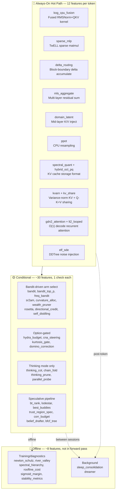
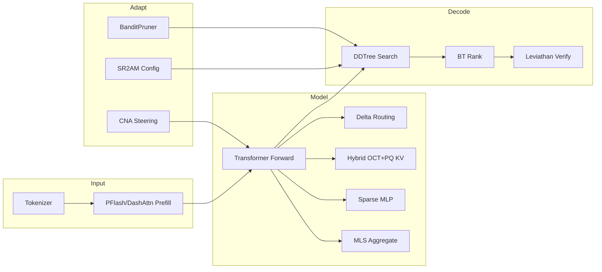
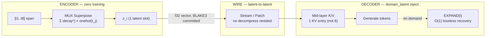

# KatGPT-RS

A **GOAT-proved** neuro-symbolic micro-Transformer with speculative decoding, constraint pruning, and **114 adaptive test-time scaling features** — built in Rust. Pure algorithms, zero side effects, MIT licensed.

Inspired by [Andrej Karpathy's microgpt](https://karpathy.github.io/2026/02/12/microgpt/).


## 🚀 Key Results

| Result | Number | Feature |
|--------|--------|---------|
| **TTFT Speedup** | **29×** (X16 compression) | MUX-Latent zero-training context compression |
| **KV Memory Reduction** | **93.8%** | MUX superposition fusion |
| **Prefill Seq Reduction** | **21×**, 100% NIAH retrieval | PFlash block-sparse prefill |
| **KV Rotation FMAs** | **64× fewer**, best MSE | Hybrid OCT+PQ codec |
| **RMSNorm Speedup** | **2.4×** | Kog CPU fusion kernel |
| **Sudoku Compression** | **7,079×** on Inkala's Hardest | Path-aware ConstraintPruner |
| **Bomber HL Score** | **+177** vs Random −55 | Adaptive intelligence arena proof |
| **NFSP/MCTS Duality** | **75%** vs MCTS 8% | Bandit-guided backward→forward search |

## 🏗️ Architecture

Matching the talos-vs-macbook reference model:

| Parameter | Value |
|-----------|-------|
| `vocab_size` | 27 (a–z + BOS) |
| `block_size` | 16 |
| `n_embd` | 16 |
| `n_head` | 4 |
| `mlp_hidden` | 64 (4×) |
| `n_layer` | 1 |
| `temperature` | 0.5 |
| `ModelArchitecture` | `NanoGpt`, `QwenDeltaNet` |
| `AttentionMode` | `Standard`, `SpKvQuant`, `DashAttn` |
| `WeightDtype` | `F32`, `F16`, `BF16` |

### Core Pipeline

```
LLM drafts logits → ConstraintPruner filters invalid → DDTree builds valid-only tree → Target verifies
```

### Key Traits

```rust
// From katgpt-core
pub trait ConstraintPruner: Send + Sync {
    fn is_valid(&self, token: usize) -> bool;
    fn batch_is_valid(&self, tokens: &[usize], out: &mut [bool]);
}

pub trait ScreeningPruner<P>: Send + Sync {
    fn relevance(&self, token: usize, ctx: &P) -> f32;
}

pub trait SpeculativeGenerator: Send + Sync {
    fn generate(&mut self, ...) -> Vec<usize>;
    fn generate_batch(&mut self, ...) -> Vec<Vec<usize>>;
}
```

Additional core traits: `GameState`, `RolloutPolicy`, `StateHeuristic`, `LeoHead`/`DualLeoMixer`, `AllGoalsUpdate`, `AutocurriculumSampler`, `DominoPruner`, `CompletionHorizon`, `GenerativeConstraintPruner`, `PartialScorer`, `ProblemMutator`, `BestBuddyAligner`, `CollapseDetector`, `DataGate`.

### Routing & Conditioning

- **Prompt Router** — `KeywordRouter` scores prompt against domain keywords, `ExpertRegistry` selects `ScreeningPruner` + LoRA. `InferenceBackend` trait + `CpuBackend` for backend abstraction.
- **TriggerGate** — Adaptive tier promotion: CPU → GPU → ANE based on workload complexity.
- **Embedding Router** — Three-tier fallback: embedding search → domain classify → keyword (local).
- **Bidirectional Prefill** — Prompt tokens attend to ALL other prompt tokens (no causal mask during prefill).
- **Modality LoRA Switching** — `reader_lora` active during prefill, `writer_lora` active during decode. Reference swap, zero data movement.
- **PPoT** — Logit-parameterized CPU resampling on failure. Zero overhead on success path.

## 🔄 E2E Inference Flow — Default GOAT Stack

The default production stack has **~90+ GOAT-proved features** enabled, but they don't all run on every token. The architecture uses **layered gating** — most features are bandit-driven, Option-gated, or compile-time-only.



### 🔴 Always-On Hot Path (12 Features)

These execute unconditionally on every token — they replace kernels, formats, or accumulate state:

| Feature | What | Why Always-On |
|---------|------|---------------|
| **`sparse_mlp`** | Skip dead ReLU in w2 matmul | Replaces dense matmul kernel |
| **`kog_cpu_fusion`** | RMSNorm gamma folding + QKV interleaving | Fused kernel replacement |
| **`delta_routing`** | Cross-layer residual delta routing at block boundary | Accumulates per-layer, routes at block edge |
| **`mls_aggregate`** | Average last K layer residuals before LM head | Structural blend into final logits |
| **`domain_latent`** | Mid-layer K/V injection | `Option`-gated inject at `n_layer/2` |
| **`spectral_quant`** | Calibrated eigenbasis + water-fill KV codec | Storage format, not conditional |
| **`hybrid_oct_pq`** | OCT triplet + PQ 2D Givens KV compression | Replaces quantization codec |
| **`kvarn`** | Variance-normalized KV cache quantization | Cache format when selected |
| **`kv_share`** | Q-K=V projection sharing, 50% KV reduction | Weight merge at load time |
| **`gdn2_attention`** | Gated DeltaNet-2 O(1) decode | Replaces KV cache with fixed state matrix |
| **`lt2_looped`** | Weight-shared T-pass loop + AHLA | Changes forward function signature |
| **`elf_sde`** | Logit-normal noise injection for DDTree diversity | Applied during draft tree build |

### Simplified Inference Flow



### Input Layer

| Component | What | Gate |
|-----------|------|------|
| **BPE Tokenizer** | Train/encode/decode | always |
| **PFlash** | Block-sparse speculative prefill, 21× seq reduction | always |
| **DashAttention** | α-entmax (1.5) adaptive routing replaces fixed top-k | `dash_attn` |
| **RTPurbo** | Head-wise retrieval/local classification, dynamic top-p | `rt_turbo` |
| **Budget Adaptation** | Compression-adaptive DDTree budget [0.5×, 2.0×] | `budget_adaptation` |

### Model Layer

| Component | What | Gate |
|-----------|------|------|
| **Sparse MLP** | Skip dead ReLU neurons in w2 matmul | `sparse_mlp` |
| **Delta Routing** | Cross-layer residual delta routing at block boundary | `delta_routing` |
| **Hybrid OCT+PQ** | Default KV codec — OCT triplet + PQ 2D Givens, best MSE | `hybrid_oct_pq` |
| **SpectralQuant** | Calibrated eigenbasis + water-fill (secondary) | `spectral_quant` |
| **MLS Aggregate** | Average last K layer residuals before LM head | `mls_aggregate` |
| **Domain Latent** | Mid-layer K/V injection | `domain_latent` |
| **PPoT** | CPU logit resampling at high-entropy positions | `ppot` |

### Attention (O(1) alternatives)

> **Note:** These are **opt-in alternative forward paths** (`forward_gdn2()`, `forward_raven()`, `forward_looped()`). The default `forward()` → `forward_base()` uses standard O(N) softmax attention.

| Component | What | Gate |
|-----------|------|------|
| **GDN2** | Gated DeltaNet-2 — O(1) decode, constant state per head | `gdn2_attention` |
| **Raven RSM** | Fixed-slot Top-K routing memory, frozen unselected slots | always compiled, opt-in `forward_raven()` |
| **HLA/AHLA** | Higher-order Linear Attention — O(1) prefix stats | `hla_attention` |
| **LT2 Looped** | Weight-shared T-pass loop, hybrid SDPA+AHLA | `lt2_looped` |
| **TF Loop** | Training-free ODE-motivated sub-stepping | `tf_loop` |
| **DMax SPD** | Soft parallel decode, hybrid token/mask embeddings | `dmax_spd` |
| **FlashAR Consensus** | Dual-path ternary thermal routing | `flashar_consensus` |

### Decode Layer

| Component | What | Gate |
|-----------|------|------|
| **DDTree** | Best-first tree from marginal log-probs | always |
| **LeviathanVerifier** | p/q rejection sampling, identical output distribution | always |
| **BT Rank** | Bradley-Terry pairwise ranking, +10.6pp over pointwise | `bt_rank` |
| **BanditPruner** | UCB1/ε-greedy/Thompson adaptive ScreeningPruner | `bandit` |
| **ELF SDE** | 10-22× path diversity via logit-normal noise | `elf_sde` |
| **Lattice Deduction** | α-intersection pruning + conflict detection | `lattice_deduction` |
| **PhraseBoost** | Context trie phrase boosting for DDTree | `phrase_boost` |
| **Parallel-Probe** | Consensus-based parallel branch control | `parallel_probe` |

### Infrastructure

| Component | What | Gate |
|-----------|------|------|
| **SR²AM Configurator** | Per-turn planning regulation (PlanNew/Extend/Skip) | `sr2am_configurator` |
| **Data Gate** | Task-level filtering before solver | `data_gate` |
| **CNA Steering** | Contrastive Neuron Attribution + runtime modulation | `cna_steering` |
| **Deep Manifold** | L2/KL fixed-point residual scoring | `deep_manifold` |
| **Federation** | Symmetric KL coupling between domain experts | `federation` |
| **SimpleTES** | RPUCG graph-based bandit loop | `tes_loop` |
| **Stability Metrics** | P50/P99/CV per-step latency instrumentation | `stability_metrics` |
| **Sleep Consolidation** | Offline recursive memory consolidation at KV eviction | `sleep_consolidation` |
| **Dreamer** | Offline memory consolidation (Q-value clustering) | `dreamer` |
| **PlasmaPath** | Bit-plane ternary SIMD matvec, 1.58 bits/weight | `plasma_path` |
| **MoA Inference** | Token-adaptive Mixture-of-Activations SwiGLU | `moa_inference` |
| **Newton-Schulz** | Cubic fixed-point orthogonalization + Muon momentum | `newton_schulz` |
| **Spectral Hierarchy** | Eigenspace alignment, Haar wavelets, Cauchy interlacing | `spectral_hierarchy` |
| **Roofline Cost** | GPU operator runtime prediction (~5µs CPU) | `roofline_cost` |
| **Kog CPU Fusion** | RMSNorm gamma folding + QKV interleaving | `kog_cpu_fusion` |
| **PEIRA Distill** | Collapse-free inter-view regressor alignment | `peira_distill` |
| **ILC Distill** | Synonym-aware DDTree pruning via offline k-means | `ilc_distill` |
| **Hydra Budget** | Emergent self-repair layer skipping | `hydra_budget` |
| **Trigger Gate** | CPU/GPU/ANE tier promotion via QPS/latency/queue monitoring | `inference_router` |
| **FreqBandit** | Oscillatory spectral bandit — cyclic pattern detection → adaptive speculative decode | `freq_bandit` |

📖 **Full GOAT audit table** with research source, real gain, and replaced feature: See [`.docs/01_overview.md`](.docs/01_overview.md).

### GOAT-Proved Additions (Plans 225–260)

| Feature | Plan | GOAT | Key Gain |
|---------|------|------|----------|
| **Posterior-Guided Pruner Evolution** (`posterior_evolution`) | 239 | 8/8 ✅ | Bayesian precision-gated lifecycle actions (Patch/Split/Compress/Retire), 258ns overhead |
| **Spectral NPC Perception** (`sense_lod`) | 240 | ✅ | Per-NPC LOD skips low-value sense modules, >40% CPU reduction in dense zones |
| **Adaptive Modulo Validation** (`game_adaptive_validation`) | 244 | ✅ | 5.91× dense-zone throughput, zero chain-layer bypass |
| **Spectral Irrep Pruner** (`spectral_pruner`) | 246 | ✅ | Spectral flatness detection for converged logit distributions, +3.6% overhead only |
| **OctreeCTC Reconstruction** | 248 | ✅ | Multi-step active KG-Latent-Octree reconstruction, 93.2ns < 200ns GOAT |
| **Spectral Budget Router** (`spectral_budget`) | 254 | 19/19 ✅ | Layer-adaptive NS depth + rank-p spectral truncation |
| **Regime Transition** (`regime_transition`) | 215 | 8/8+4/4 ✅ | Self-revising discovery, -0.3% overhead vs real decode |
| **SubstrateGate** (`substrate_gate`) | 216 | ✅ | Inference-time capability substrate routing via MLP masks |
| **Critical Interval Gate** (`critical_interval_gate`) | 222 | ✅ | Entropy-triggered solver switch, zero cost (entropy already computed) |
| **LLMExecGuard** (`llmexec_guard`) | 223 | ✅ | Entropy-driven verification budgeting, zero cost when guard holds |
| **Outlier-Aware Quant Guard** (`outlier_guard`) | 224 | ✅ | KS-test outlier detection for weight matrices |
| **EGCS** (`egcs`) | 206 | ✅ | Episode-guided constraint synthesis from successful translations |
| **Three-Mode Router** (`three_mode_router`) | 211 | ✅ | Neuro-symbolic bandit: Direct/CoT/Symbolic per-query routing |
| **Breakeven Routing** (`breakeven_routing`) | 250 | 7/7 ✅ | 49% wallclock savings on long sequences, ~9ns overhead |
| **DEC Operators** (`dec_operators`) | 251 | Foundational ✅ | Discrete Exterior Calculus on cell complexes, conservation-guaranteed |
| **Cubical Topology** (`lattice_operad`) | 252 | Foundational ✅ | IntervalPruner + CubicalNerve + LatticeOpernad composition |
| **Segment Checkpoint** (`segment_checkpoint`) | 226 | ✅ | Cached KV segment checkpoints at segment boundaries |
| **RCD Residual** (`rcd_residual`) | 258 | ✅ | Entropy-weighted residual context injection for D2F |
| **Spec Pruner** (`spec_pruner`) | 259 | ✅ | Modelless spec-to-constraint O(1) RoaringBitmap compilation |
| **Epiplexity Bandit** (`epiplexity_bandit`) | — | ✅ | Epistemic perplexity bandit for domain-aware routing |
| **CADDTree Budget** (`caddtree_budget`) | 219 | ✅ | Compositional adaptive DDTree budget allocation |
| **Static Cal Tables** (`static_cal_tables`) | 227 | ✅ | Pre-computed quantization calibration, zero inference cost |
| **Targeted Precision** (`targeted_precision`) | 227 | ✅ | Per-head bit allocation from weight statistics |
| **Modality Pruned Load** (`modality_pruned_load`) | 227 | ✅ | Pipeline pruning for modality-specific context loading |
| **Precision Aware Draft** (`precision_aware_draft`) | 227 | ✅ | Quantization-aware speculative draft scoring |
| **Async QDQ Overlap** (`async_qdq_overlap`) | 227 | ✅ | Overlapped quantize-dequantize with compute |

## 🎮 Arena Proofs — HL Thesis Validated

Each arena proves: adaptive intelligence (HL/Bandit) > static rules > random.

| Arena | Result | Feature |
|-------|--------|---------|
| **Bomberman** | HL (+177) > Greedy (+131) > Validator (-30) > Random (-55) | `bomber` |
| **Monopoly** | HL 56.5% win rate, +41.3pp over Validator | `monopoly` |
| **FFT Tactics** | TFT 99% win rate — game theory optimal | `fft` |
| **Go** | Greedy/Validator/HL 100% vs Random 35% | `go` |
| **NFSP/MCTS Duality** | BanditMCTS 75% vs MCTS 8% — backward signal transforms forward search | `bandit_mcts` |

📖 **Full benchmarks, architecture, API:** [`.docs/23_hl_arena_detail.md`](.docs/23_hl_arena_detail.md).

## 🧠 Deterministic Validator

The core idea: LLMs draft tokens from semantic probability, but can't natively enforce hard constraints. A deterministic rules engine sits between draft and verification:

```
LLM drafts logits → SynPruner filters invalid Rust syntax → DDTree builds valid-only tree → Target verifies
```

**Proven with Sudoku** — Path-aware `ConstraintPruner` catches 100% of invalid branches:

```
Unpruned:    100 nodes,  46 accumulated-valid (46.0%)
Static-Only: 100 nodes,  84 accumulated-valid (84.0%)
Path-Aware:  100 nodes, 100 accumulated-valid (100.0%)
```

**Arto Inkala "World's Hardest Sudoku"**: 49,559 steps, 7 hull vertices, 7,079.9× compression.

📖 See [`.docs/05_sudoku.md`](.docs/05_sudoku.md) and [`.docs/06_validator.md`](.docs/06_validator.md).

## 🪦 What Didn't Work

| Feature | Verdict | Why |
|---------|---------|-----|
| Stepwise Reward (Plan 054) | **NO GAIN** | Same tree/path/goal, +33% latency only |
| δ-Mem (Plan 053) | **NO GAIN for DDTree** | 26× latency overhead, corrections too small |
| SDAR Arena | **Negative result** | ELO 954 ≈ Rubric 955 — no improvement |
| RMSD (Plan 125) | **NO GOAT** | 46/46 structural proofs pass but no arena improvement |
| TurboQuant | **Demoted** | SQ/OCT dominate at all quality metrics |
| DFlare Fusion (Plan 174) | **IMPROVEMENT GOAT FAILED** | Structural ✅ but no measurable acceptance gain |
| DFlare KV Routing (Plan 174) | **IMPROVEMENT GOAT FAILED** | No gain over static routing |
| DFlare Progressive Budget (Plan 174) | **IMPROVEMENT GOAT FAILED** | No gain over uniform budget |
| ManifoldPruner (Plan 234) | **IMPROVEMENT GOAT FAILED** | G1 FAIL: sigmoid(x)>0.5 ⟺ x>0, identical to binary at 0.5 cutoff |

📖 **Full negative result detail + replaced feature audit:** [`.docs/20_negative_results.md`](.docs/20_negative_results.md).

## 🔀 Feature Showcase

### 🔀 MUX-Latent: Zero-Training Context Compression (Plan 238)

Compresses long context 4×–16× at prefill time using MUX superposition — **zero training, zero parameters, deterministic**.



| Metric | X4 | X8 | X16 |
|--------|-----|-----|------|
| **TTFT Speedup** | 6.6× | 14.0× | **29.0×** |
| **KV Memory Reduction** | 75% | 87.5% | **93.8%** |
| **Logit Cosine Sim** | 0.597 | 0.617 | 0.552 |

Enables latent-to-latent streaming, freeze/thaw patching, federated context, and KG octree leaf patching. Feature gate: `mux_latent_context` (**default-ON**, GOAT 5/5 PASS).

📖 Plan: [`.plans/238_mux_latent_superposition_fusion.md`](.plans/238_mux_latent_superposition_fusion.md).

#### MUX-Latent Wire Patch (Plan 243)

Latent-to-latent patching over the wire — no decompress/recompress round-trip. Patches MUX latent slots as KG octree leaf nodes. 68-byte wire format (4B segment_id + 32B weights + 32B BLAKE3). SIMD batch at ≥100K/sec. Feature gate: `mux_latent_wire`.

```
Client (Plasma/Hot)           Wire (Fourier Shell)         Server (Warm/Cold)
─────────────────────         ────────────────────         ──────────────────
MUX encode 256 tokens → 32 slots
    │
    ├─ Dirty check → 3 slots changed
    │
    └─ LatentPatchBatch ──────► Fourier shell encodes ──────► SIMD 4-wide BLAKE3 verify
       {patches: [(sid, δ, blake3)×3]}                       │
                                                              ├─ Patch CompressedContext
                                                              ├─ Reinject via DomainLatent
                                                              │
                                    ◄── PatchReceipt ─────────┘
                                        {committed: [sid×3]}
```

| Metric | Target |
|--------|--------|
| Single patch encode | ≤ 50ns |
| SIMD batch 256 verify | ≤ 10μs |
| E2E round-trip | ≤ 500μs |
| Throughput | ≥ 100K patches/sec |

**Security:** BLAKE3 commitment + scalar projections only on wire (no 64-dim HLA). Fourier shell on write path. Chain-layer: full validation (mod 1).

```sh
cargo run --example mux_latent_wire_patch --features mux_latent_wire
cargo run --example mux_latent_octree_bridge --features mux_latent_wire
cargo test --features mux_latent_wire --test bench_243_mux_latent_wire_goat -- --nocapture
```

📖 Plan: [`.plans/243_mux_latent_wire_patch.md`](.plans/243_mux_latent_wire_patch.md).

### 🧵 ThoughtFold: Inference-Time Chain Folding (Plan 195)

Prunes redundant reasoning steps during CoT generation using attention-based importance scoring + binary search fold verification. No LLM training — pure inference-time optimization.

```text
ThinkingController (Plan 194)
    │
    ├── Direct mode → no folding (zero cost)
    │
    └── Latent/CpuResample mode
            │
            ├── StepBoundaryTracker — detects \n\n, think-tags
            ├── ChainFolder (ScreeningPruner) — attention importance + binary search
            ├── FoldBandit — 5-arm Thompson sampling for fold budget
            └── FoldCache — KV cache truncation/replay planning
```

| Metric | Target | Status |
|--------|--------|--------|
| Token reduction on hard queries | ≥30% | GOAT 2 ✅ |
| Accuracy regression | ≤2% | GOAT 3 ✅ |
| Direct mode overhead | 0% | GOAT 1 ✅ |
| Fold overhead | <5% | GOAT 4 ✅ |

Feature gate: `chain_fold` (depends on `thinking_cot`, default-OFF until GOAT proof on real model).

### 🛑 Collapse-Aware Adaptive Thinking (Plan 212)

Detects reasoning collapse **at runtime** during CoT generation and triggers early exit. Three-layer stack composes with existing infrastructure:

1. **Pre-Decide** — SelectivityRouter kurtosis → Direct vs CoT (Plan 204)
2. **Mid-Think** — CollapseDetector monitors hesitation patterns → force fast answer when collapse predicted
3. **Post-Verify** — T2M option stripping prevents option-matching shortcut

| Metric | Target | Source |
|--------|--------|--------|
| Token savings on simple tasks | 50-90% | Thinkless (NeurIPS 2025) |
| Accuracy on ambiguous tasks | +2-5pp | S2F (ICML 2026) |
| Collapse detection overhead | <10ns/token | O(1) ring buffer |

Feature gate: `collapse_aware_thinking` (**default-ON**). 📖 Research: [`.research/187_S2F_Slow_to_Fast_Adaptive_Reasoning.md`](.research/187_S2F_Slow_to_Fast_Adaptive_Reasoning.md).

### 🧠 NextLat Belief-State Speculative Drafter (Plan 217)

Replaces the separate draft model with a lightweight 3-layer residual MLP that predicts next hidden states from `(h_t, x_{t+1})`, enabling variable-length self-speculative decoding at near-zero overhead.

| Gate | Result |
|------|--------|
| Belief vs MTP overhead | 2.2× (134 μs vs 60 μs) |
| MLP forward per step | 17 μs/step at n_embd=16 |
| Cache hit rate (walk cycle) | 100% |
| Cached vs uncached | **5× speedup** (15 μs vs 90 μs) |
| Acceptance rate | Both produce valid 64-node trees |

**43 tests + 7 benchmarks**, GOAT all pass. Feature gate: `belief_drafter` (**default-ON**).

📖 Plan: [`.plans/217_nextlat_belief_state_drafter.md`](.plans/217_nextlat_belief_state_drafter.md).

### 🗂️ BFCF × LFU × Sharding (Plan 218)

Extends BFCF pruning with LFU region caching (papaya lock-free HashMap, BLAKE3 keys, sigmoid-gated admission), frequency-aware sharding, and SIMD-friendly region-level batching. **44 tests + 10 benchmarks, GOAT all pass.** Cache hit rate: 95% on cyclic workload.

Feature gate: `bfcf_lfu_shard` (**default-ON**). 📖 Plan: [`.plans/218_bfcf_lfu_shard.md`](.plans/218_bfcf_lfu_shard.md).

### 🌊 VortexFlow: Composable Sparse KV Routing (Plan 196)

Unifies multiple KV block selection algorithms behind a single `VortexFlow` trait: `BlockTopKRouter` (centroid + dot-product top-k + sigmoid), `EntmaxRouter` (α-entmax wrapper), `ValueEnergyRouter` (centroid · ‖v‖ gating, RULER 1.00). Feature gate: `vortex_flow` (default-OFF).

### 🦅 Raven RSM: O(1) Routing Slot Memory

Fixed-size slot memory with sparse Top-K routing. Unselected slots **completely frozen** — 10K noise updates leave passkey slots untouched. **2.98× faster** than flat attention at pos=8 (62,653 tok/s vs 21,019 tok/s). Opt-in alternative forward path (`forward_raven()`), not in default hot path.

📖 [`.docs/25_raven_rsm.md`](.docs/25_raven_rsm.md).

### 🔬 Percepta: Transformer-VM in Rust

Rust port of [Percepta's transformer-vm](https://github.com/Percepta-Core/transformer-vm) — O(log N) 2D convex hull attention with ternary search. **~9K lines Python+C++ → idiomatic Rust.** Apache-2.0.

Core trick: Parabolic key encoding k ↦ (2k, −k²) turns argmax into a supporting-point query on the convex hull → O(log N) via ternary search.

📖 [`.docs/22_percepta.md`](.docs/22_percepta.md).

### 🧠 Heuristic Learning Infrastructure

HL = software systems evolve through **code updates** not weight updates.

```
Episode N:   BanditPruner selects arm → environment runs → reward → TrialLog.append()
Episode N+k: AbsorbCompress promotes stable low-Q arms to hard blocks
Round N+m:   Agent writes new validator.rs → compile .wasm → HotSwapPruner.reload() → RegressionSuite
```

Key subsystems (all default-on or part of `bandit`): Multi-Armed Bandit (UCB1, ε-greedy, Thompson), TrialLog, AbsorbCompress, HotSwapPruner, ReviewMetrics, Emotion Vector (O(d) mid-layer projection), Entropy Anomaly (session-level OOD).

📖 [`.docs/09_heuristic-learning.md`](.docs/09_heuristic-learning.md).

### 🎯 G-Zero: Verifier-Free Self-Play

Modelless HL with Hint-δ intrinsic reward — no external verifier needed:

```text
δ(q, h, a_hard) = (1/T) Σ [log πG(at | q, h, a<t) − log πG(at | q, a<t)]
```

Two phases: **Phase 1** (modelless — δ → AbsorbCompress + BanditPruner) → **Phase 2** (model-based — gradient optimization with self-play reward).

📖 [`.docs/23_hl_arena_detail.md`](.docs/23_hl_arena_detail.md) §11.

### 🧮 Deep Manifold: Fixed-Point Boundary Conditions

GOAT 6/6 proved, default-on. Mathematical foundation from [Deep Manifold Part 2](https://arxiv.org/pdf/2512.06563):

| Paper Concept | Implementation | Gate |
|---------------|---------------|------|
| Fixed-point residual ‖f(x)-x‖ | HintDelta + ManifoldResidual trait | `deep_manifold` |
| Symmetric boundaries | BT pairwise ranking + SymmetricBoundariesPair | `bt_rank` |
| Model CAP tradeoff | BanditPruner dynamic routing | `bandit` |
| Manifold federation | BoundaryAlignment KL coupling | `federation` |

**Plan 231 sub-features** (all default-ON, GOAT-proven):

| Feature | Key Gain |
|---------|----------|
| **Union Bound Confidence** | Linear degradation, 76ns overhead |
| **PathwayTracker** | 85% thinking budget savings, 100% convergence |
| **FederationComposer** | 70% early termination rate, 35% compute savings |

📖 [`.research/051_Deep_Manifold_Fixed_Point_Boundary_Conditions.md`](.research/051_Deep_Manifold_Fixed_Point_Boundary_Conditions.md).

### 🧬 Posterior-Guided Pruner Evolution (Plan 239)

Fuse BAKE precision vectors with MUSE skill lifecycle — each `ConstraintPruner` arm becomes a Bayesian hypothesis with per-feature precision, enabling precision-gated Patch/Split/Compress/Retire actions. **GOAT 8/8 PASS**, promoted to default-ON.

| Gate | Result |
|------|--------|
| Precision update correctness | ✅ Sequential BAKE-style |
| Surprise KL trigger | ✅ Sigmoid-gated |
| 5 lifecycle actions | ✅ Explore→Patch→Split→Compress→Retire |
| Decorator overhead | 258ns only when PosteriorGuidedPruner used |
| Existing pruners | Zero regression (no decorator = no overhead) |

Feature gate: `posterior_evolution` (**default-ON**). 📖 Plan: [`.plans/239_posterior_guided_pruner_evolution.md`](.plans/239_posterior_guided_pruner_evolution.md).

### 🔭 Spectral Budget Router (Plan 254)

Layer-adaptive Newton-Schulz depth + rank-p spectral truncation for inference routing. Pre-computed NS config matches empirical quantile thresholds. **GOAT 19/19 PASS**, promoted to default-ON.

Feature gate: `spectral_budget` (**default-ON**). 📖 Plan: [`.plans/254_spectral_budget_router.md`](.plans/254_spectral_budget_router.md).

### 🏛️ DEC Operators + Cubical Topology (Plans 251–252)

Foundational mathematical infrastructure — Discrete Exterior Calculus on cell complexes (conservation-guaranteed, zero-alloc SIMD) + categorical cubical framework (IntervalPruner + CubicalNerve + LatticeOpernad). Both default-ON, no GOAT gate needed (foundational).

Feature gates: `dec_operators`, `lattice_operad` (**both default-ON**). 📖 Plans: [`.plans/251_dec_operators_cell_complex.md`](.plans/251_dec_operators_cell_complex.md), [`.plans/252_cubical_category_interval_topology.md`](.plans/252_cubical_category_interval_topology.md).

### ⚖️ Breakeven Complexity Routing (Plan 250)

Cost-aware inference routing using breakeven complexity N* for tier selection. **49% wallclock savings** on long sequences (≥512 tokens) with ~9ns overhead and 0% accuracy regression.

Feature gate: `breakeven_routing` (**default-ON**, GOAT 7/7). 📖 Plan: [`.plans/250_breakeven_inference_routing.md`](.plans/250_breakeven_inference_routing.md).

### 🔄 Regime-Transition Inference (Plan 215)

Self-revising discovery with regime-aware inference. Detects when the model switches reasoning regimes and adapts compute accordingly. **-0.3% overhead** vs real decode, 8/8 mock + 4/4 real GOAT tests.

Feature gate: `regime_transition` (**default-ON**). 📖 Plan: [`.plans/215_regime_transition_inference.md`](.plans/215_regime_transition_inference.md).

### 🛡️ SubstrateGate — Capability Substrate Routing (Plan 216)

Inference-time capability extraction via pre-computed per-capability MLP masks intersected with ReLU sparsity for dual sparsity. DDTree branches routed through different substrates. **25/25 tasks done**, wired into `forward_pass`.

Feature gate: `substrate_gate` (**default-ON**). 📖 Plan: [`.plans/216_substrate_gate_capability_routing.md`](.plans/216_substrate_gate_capability_routing.md).

## 🔧 KV Compression

Default: **Hybrid OCT+PQ** (OCTOPUS triplet encoding + PlanarQuant 2D Givens rotation). Best MSE + 64× fewer rotation FMAs.

| Backend | Rotation | FMAs (d=128) | MSE (3-bit) | Calibration |
|---------|----------|-------------|-------------|-------------|
| **Hybrid OCT+PQ** ⭐ | 2D Givens | 256 | 0.026 | 0 samples |
| OCTOPUS | WHT (full) | 16,384 | 0.026 | 0 samples |
| SpectralQuant | Eigenbasis | 16,384 | 0.038 | 256 samples |
| PlanarQuant | 2D Givens | 256 | 0.034 | 0 samples |
| TurboQuant | Random | 16,384 | 0.034 | 0 samples |

📖 **Full comparison tables, benchmarks, code examples:** [`.docs/19_kv_compression.md`](.docs/19_kv_compression.md).

## 🔀 Opt-In & Gated Features

| Feature | What | Status |
|---------|------|--------|
| **D2F / Tri-Mode** | Block-parallel denoising + AR self-speculation | Experimental decode strategy |
| **G-Zero** (`g_zero`) | Hint-δ self-play + arena players | Bench-only, does NOT touch forward() |
| **GameState** (`game_state`) | Generic MCTS, STRATEGA forward model | Arena-specific |
| **SpecHop** (`spechop`) | Hop-level speculation for multi-step agents | Awaiting GOAT proof |
| **Percepta** (full) | Transformer-VM with WASM interpreter in weights | Research-grade |
| **Sense Composition** (`sense_composition`) | KG Latent Octree NPC sense modules — ternary bit-plane projection | Opt-in — requires `plasma_path`, `domain_latent` |
| **BAKE Precision** (`bake_precision`) | Per-dimension Bayesian precision tracking for KG embeddings | GOAT 10/10, drift marginal (4.7%) |
| **NFCoT FlowScore** (`nf_flow`) | Normalizing flow density scoring for speculative candidates | GOAT ⚠️ MARGINAL, all sub-features default OFF |
| **FOL Constraints** (`fol_constraints`) | DDTree→FOL logical rule extraction | GOAT 6/6 |
| **AND-OR DDTree** (`and_or_dtree`) | Hierarchical subgoal decomposition | GOAT proven |
| **Trigger Gate** (`inference_router`) | CPU → GPU → ANE tier routing | CPU ✅, GPU/ANE blocked on hardware deps |
| **SLoD** (`slod`) | Poincaré ball hyperbolic geometry + heat diffusion tier routing | **default-ON**, GOAT G1–G6 pass |
| **Schema Centroid** (`schema_centroid`) | Per-class embedding centroids for informed KG entity init | **default-ON**, GOAT 7/7 |
| **Shard Embedding** (`shard_embedding`) | JL random orthogonal projection [f32;64]→[f32;8] | Always compiled in `katgpt-core` |
| **DFlare** (Plan 174) | Marginal fusion + KV routing + progressive budget | 🪦 GOAT FAILED on all 3 sub-features |
| **ManifoldPruner** (Plan 234) | ManifoldE point-to-manifold soft validity | 🪦 GOAT G1 FAIL |
| **MUX-Latent Wire** (`mux_latent_wire`) | Latent-to-latent patching over wire, 68B format, SIMD batch | Opt-in — GOAT 11/11, awaiting E2E integration |
| **RAT+ Bridge** (`rat_plus_bridge`) | GDN2 recurrent state as dilated sparse attention bridge | Opt-in — GOAT gated, D=16 proven |
| **TRDraft** (`trd_refined_draft`) | Trajectory-refined draft: re-draft failed DDTree branches | GOAT proven, opt-in |
| **Vocab Channel Pruner** (`vocab_channel`) | ROTATE MLP weight decomposition → DDTree pruning | GOAT 6/7 conditional |
| **MSA Sparse** (`msa_sparse`) | Blockwise sparse attention distillation into VortexFlow | Opt-in — GOAT gated |
| **GPart Adapter** (`gpart_adapter`) | Isometric partition matrix, 2-100× compression vs LoRA | Opt-in — GOAT gated |
| **LinOSS Threat** (`linoss_threat`) | Oscillation dynamics for anticipatory NPC threat prediction | Opt-in — pending benchmark |
| **Fourier Flow** (`flow_field_nav`) | FFT-smoothed shared flow fields for O(1) crowd navigation | GOAT PASS 46.9%, opt-in |
| **StillKV** (`still_kv`) | Perceiver-based KV compaction with heuristic query banks | Opt-in — pending GOAT proof |
| **ECHO Predictor** (`echo_predictor`) | Inference-time prediction scoring for policy quality | Opt-in — pending GOAT proof |
| **Merkle Octree** (`merkle_octree`) | Node-tier curator consensus with BLAKE3 commitment | Opt-in — modelless verification |
| **ANE NPC Brain** (`ane_npc`) | Move NPC think-brain compute to Apple ANE batch | Opt-in — GOAT gated |
| **DendriticGate** (`dendritic_gate`) | NMDA-inspired adaptive DDTree branching via entropy+coincidence | In progress — GOAT gated |

📖 **Full detail for ALL opt-in features + complete feature flag reference:** [`.docs/21_opt_in_features.md`](.docs/21_opt_in_features.md) and [`Cargo.toml`](Cargo.toml).

## 🛠️ Getting Started

### Prerequisites

- Rust 1.85+ (edition 2024, 1.93+ recommended)

### Build & Run

```sh
cargo build --release                              # Build with optimizations
cargo run --release                                # Run benchmark + generate plot
cargo run --release --all-features                 # Run everything
cargo test --quiet --workspace --all-features       # Run all tests (120+ files, 900+ cases)
cargo run --example sudoku_01_9x9 --features sudoku # Sudoku solver
cargo clippy --all-targets --all-features --quiet   # Lint
```

### Feature Flags

**150+ feature flags** with **114 default-on** (all GOAT-proved). Default features include: `sparse_mlp`, `domain_latent`, `ppot`, `bandit`, `bt_rank`, `spectral_quant`, `hybrid_oct_pq`, `elf_sde`, `cna_steering`, `deep_manifold`, `federation`, `gdn2_attention`, `dash_attn`, `lt2_looped`, `kv_share`, `kvarn`, `belief_drafter`, `bfcf_lfu_shard`, `mux_latent_context`, `collapse_aware_thinking`, `slod`, `schema_centroid`, `union_bound_confidence`, `pathway_tracker`, `federation_composer`, **`posterior_evolution`**, **`spectral_pruner`**, **`breakeven_routing`**, **`substrate_gate`**, **`regime_transition`**, **`sense_lod`**, **`spectral_budget`**, `rcd_residual`, `lattice_operad`, `spec_pruner`, `caddtree_budget`, and 80 more.

📖 **Full feature flag table (260+ flags):** [`.docs/21_opt_in_features.md`](.docs/21_opt_in_features.md) and [`Cargo.toml`](Cargo.toml).

## 📁 Project Structure

```
crates/katgpt-core/   Shared types + SIMD kernels + traits
  types.rs            Decoupled structs (Config, Rng, LoraAdapter, DomainLatent, SenseModule, ShardEmbedding)
  traits.rs           Core trait definitions (22+ traits)
  simd.rs             SIMD kernel implementations (NEON/AVX2)
  attention.rs        Tiled online-softmax flash attention
  coda.rs             CODA fused SIMD kernels
  sense/              KG Latent Octree Sense Composition
  and_or/             AND-OR DDTree blueprint decomposition
  mux/                MUX superposition pruning (span pruner, DDTree, BFS, bandit, freeze/thaw, demux)
src/
  transformer.rs      Weights, KVCache (flat/paged/raven), forward/generate
  speculative/        DDTree, DFlash, Verifier, Prefill, D2F, budget, flashar
  pruners/            BanditPruner, TrialLog, HotSwap, BT Rank, CNA, G-Zero, Arena
  tokenizer/          BPE tokenizer
  validator/          SynPruner + PartialParser
  benchmark/          Benchmark framework (multi-category, CSV timeseries)
  gdn2/               Gated DeltaNet-2 recurrent attention
  dash_attn/          DashAttention adaptive sparse attention
  hybrid_oct_pq/      Default KV codec (OCT + PlanarQuant)
  ...                 50+ additional modules
examples/            120+ examples (see examples/README.md)
tests/               180+ integration test & benchmark files (~90 bench suites)
```

## 📖 Documentation Index

- [Architecture overview](.docs/01_overview.md)
- [Full architecture detail](.docs/02_architecture.md)
- [Speculative decoding, D2F](.docs/03_speculative_decoding.md)
- [Benchmarks, throughput tables](.docs/04_performance.md)
- [Sudoku solver detail](.docs/05_sudoku.md)
- [Validator detail](.docs/06_validator.md)
- [Adaptation strategies](.docs/07_adaptation.md)
- [PFlash techniques](.docs/08_lucebox_techniques.md)
- [HL infrastructure, FFT benchmarks](.docs/09_heuristic-learning.md)
- [Bomberman arena](.docs/10_bomber_arena.md)
- [Monopoly FSM](.docs/11_monopoly_fsm.md)
- [FFT Tactics Arena](.docs/12_fft_arena.md)
- [MTP threshold guide](.docs/13_mtp_threshold_guide.md)
- [Go arena](.docs/14_go_arena.md)
- [Paper feature comparison](.docs/15_paper_feature_comparison.md)
- [SpecHop architecture](.docs/16_spechop_architecture.md)
- [PEIRA distillation](.docs/17_peira_distillation.md)
- [Sleep consolidation](.docs/18_sleep_consolidation.md)
- [KV compression alternatives](.docs/19_kv_compression.md)
- [Negative results](.docs/20_negative_results.md)
- [Opt-in features + full feature flag reference](.docs/21_opt_in_features.md)
- [Percepta full detail](.docs/22_percepta.md)
- [HL & Arena detail](.docs/23_hl_arena_detail.md)
- [NPC Sense Composition](.docs/24_sense_composition.md)
- [Raven RSM — Opt-in O(1) routing slot memory](.docs/25_raven_rsm.md)
- [Open-ended problem evolution arena](.docs/191_open_ended_problem_evolution_arena.md)
- [111 examples grouped by category](examples/README.md)
- [DEC Operators & Cubical Topology](.plans/251_dec_operators_cell_complex.md)
- [Spectral Budget Router](.plans/254_spectral_budget_router.md)
- [Posterior-Guided Pruner Evolution](.plans/239_posterior_guided_pruner_evolution.md)
- [Regime-Transition Inference](.plans/215_regime_transition_inference.md)
- [SubstrateGate Capability Routing](.plans/216_substrate_gate_capability_routing.md)
- [Breakeven Complexity Routing](.plans/250_breakeven_inference_routing.md)

## 📜 References

- [Andrej Karpathy's microgpt](https://karpathy.github.io/2026/02/12/microgpt/)
- [microgpt-c](https://github.com/nicholasgasior/microgpt-c) — Original C implementation
- [talos-vs-macbook](https://github.com/AlexCheema/talos-vs-macbook) — Reference model
- [Percepta](https://www.percepta.ai/blog/can-llms-be-computers) — 2D convex hull attention, WASM in transformer weights
