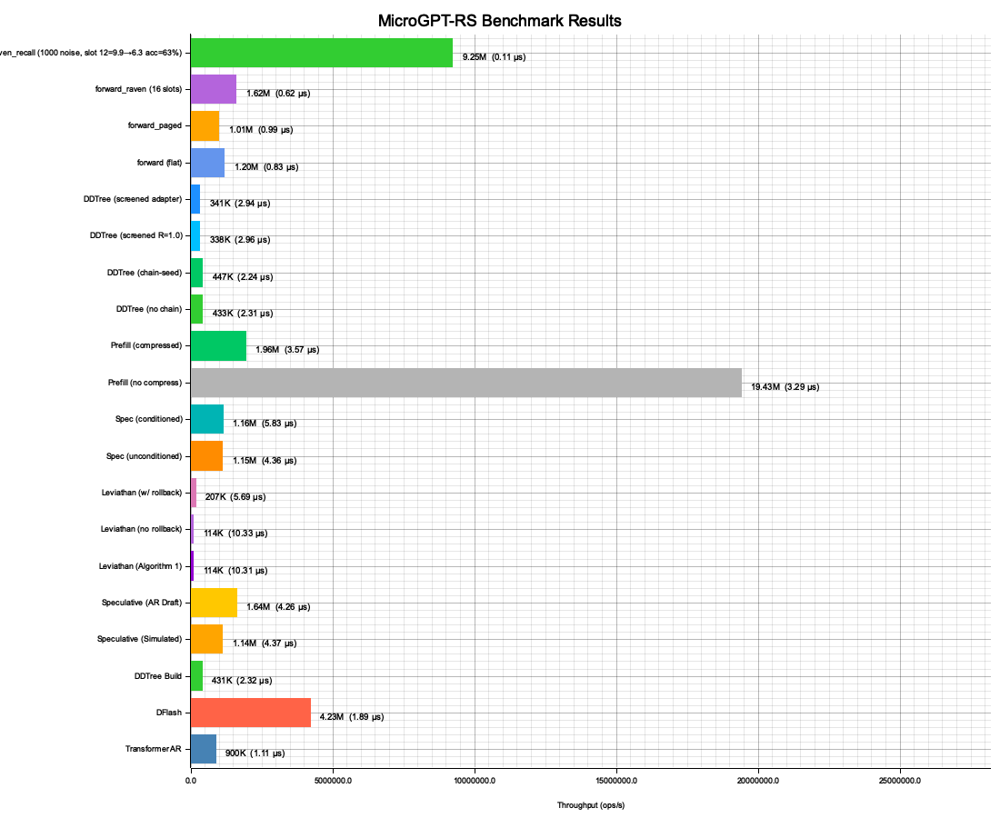

# MicroGPT-RS

Speculative Decoding with DFlash & DDTree — a high-performance Rust implementation of a micro-Transformer with built-in benchmarking and visualization.

Inspired by [microgpt-c](https://github.com/nicholasgasior/microgpt-c), [talos-vs-macbook](https://github.com/alexcb123/talos-vs-macbook), and [Luce-Org/lucebox-hub](https://github.com/Luce-Org/lucebox-hub/).

## 🚀 Key Features

- **Real Transformer Inference** — Full GPT forward pass with RMSNorm, multi-head causal attention, ReLU MLP, KV cache, and temperature sampling.
- **Zero-Alloc Forward Pass** — Pre-allocated `ForwardContext` buffers eliminate heap allocations per inference step.
- **Separate Draft Model** — Lightweight draft model (embd=4, heads=2, mlp=16) runs **3.6× faster** per forward pass than the target model.
- **DFlash (Dynamic Flash)** — Block-parallel drafting that predicts `L` future tokens simultaneously via independent marginal distributions. Supports `rayon` parallelism. Also available in **autoregressive mode** (`dflash_predict_ar`) that samples and feeds back tokens for conditional q(x|x<t) distributions.
- **DDTree (Dynamic Draft Tree)** — Best-First Search using a `BinaryHeap` to build a candidate token tree from marginal log-probabilities. Tree budget constrains exploration.
- **SpeculativeVerifier (Strategy Pattern)** — Swappable verification via trait: `SimulatedVerifier` (fast, no target model) or `LeviathanVerifier` (real p/q rejection sampling with target model).
- **Leviathan Algorithm 1** — Full implementation of [Leviathan et al. 2022](https://arxiv.org/pdf/2211.17192): AR draft → target model p/q scoring → rejection sampling → residual distribution `max(0, p−q)` → bonus token from target p(x). Distribution-preserving, proven correct, but needs large model asymmetry to be faster than pure AR.
- **Bonus Token** — When all γ draft tokens are accepted, sample +1 token for free from the last marginal (simulated) or target p(x) at position γ (Leviathan).
- **Residual Distribution Sampling** — `max(0, p−q)` normalized distribution for sampling replacement tokens on rejection (Algorithm 1, Equation 3).
- **Constraint Pruner** — Pluggable `ConstraintPruner` trait for neuro-symbolic intercept: deterministic rules engine prunes invalid branches before target verification.
- **Path-Aware Pruning** — `SudokuPruner` validates against accumulated path state (initial board + parent tokens), catching cross-depth row/col/box conflicts that static-only pruning misses.
- **Deterministic Validator** — LLM drafts tokens via semantic probability, deterministic rules engine validates via mathematical constraints, only valid branches reach verification. Demonstrated with 9×9 Sudoku.
- **Streaming Solver** — `StreamingSolver` emits `Try`/`Accepted`/`Contradiction`/`Backtrack`/`Solved` events for real-time visualization of the search process.
- **Raven RSM (Routing Slot Memory)** — O(1) KV cache replacement for the draft model. Fixed-size slot memory with sparse Top-K routing. Unselected slots are completely frozen — 10K noise updates leave passkey slots untouched. 2.98× faster than flat attention at pos=8, memory stays constant as sequence grows. Distilled from [Raven (Afzal, Bick, Xing, Cevher, Gu, 2025)](https://github.com/goombalab/raven).
- **Percepta O(log N) Attention** — 2D convex hull KV cache with ternary search, proving LLMs can execute programs internally via geometric attention. Includes adversarial failure tests.
- **TUI Visualization** — Ratatui-based terminal UI showing the Sudoku solver in real-time: color-coded grid, step/trace panels, speculative mode comparison (behind `--features sudoku`).
- **Benchmarks + Plots** — 16-method benchmark suite (AR, DFlash, DDTree, Speculative, AR Draft, Leviathan, Prefill, forward) with auto-numbered PNG output via `plotters`. All benchmarks run by default — no feature flags needed.
- **Chain-Seed DDTree** — Greedy chain backbone (argmax per depth) before best-first expansion, recovering high-confidence token spine. Inspired by [DFlash](https://arxiv.org/abs/2602.06036).
- **Speculative Prefill** — PFlash-inspired prompt compression via attention-based importance scoring. Draft model scores token importance, compresses to top-`keep_ratio` spans before target prefill. Inspired by [Cross-Family Speculative Prefill](https://arxiv.org/abs/2603.02631).
- **KV-Cache Snapshot/Rollback** — Cheap per-position KV cache snapshots for branch-level tree verification. Restore on rejection to try alternate DDTree paths without full recomputation.

## 🏗️ Architecture

Matching the talos-vs-macbook reference model:

| Parameter | Value |
|-----------|-------|
| `vocab_size` | 27 (a–z + BOS) |
| `block_size` | 16 |
| `n_embd` | 16 |
| `n_head` | 4 |
| `head_dim` | 4 |
| `mlp_hidden` | 64 (4×) |
| `n_layer` | 1 |
| `temperature` | 0.5 |
| `draft_lookahead` | 8 |
| `tree_budget` | 16 nodes |

### Zero-Alloc Architecture

All hot paths use pre-allocated buffers created once, reused across decode steps:

- **`SpeculativeContext`** — holds `ForwardContext`, `MultiLayerKVCache`, flat marginals buffer, probs buffer, sampled/accepted tokens, residual scratch, p-distributions flat buffer
- **`TreeBuilder`** — holds `BinaryHeap`, tree `Vec`, chain nodes/parent tokens; `clear()` reuses capacity
- **`_with` variants** — `dflash_predict_with`, `dflash_predict_ar_with`, `generate_into`, `score_with`, `sample_residual_distribution_into` — borrow pre-allocated buffers instead of allocating per call
- **`generate_batch`** — rayon parallel multi-sample generation with per-worker `ForwardContext` + `KVCache`

### Forward Pass

```
x = wte[token] + wpe[pos]
x = rmsnorm(x)
x = x + attention(rmsnorm(x))    # Q, K, V → causal attention → Wo
x = x + mlp(rmsnorm(x))          # W1 → ReLU → W2
logits = lm_head @ x
```

### DFlash (Block-Parallel Drafting)

Standard Transformers are limited by causal masking. DFlash bypasses this during the draft phase by producing `L` independent marginal distributions:

```
P(x_{t+1}), P(x_{t+2}), ..., P(x_{t+L})  |  x_{<t}
```

Each position uses an isolated forward pass, simulating non-causal parallel prediction.

### DDTree (Dynamic Draft Tree)

Rather than a single linear draft chain, DDTree builds a tree of the most probable paths:

- **Algorithm**: Best-First Search (priority queue / max-heap)
- **Metric**: Cumulative log-probability
- **Budget**: `tree_budget` nodes (default 16)
- **Outcome**: A tree that maximizes Expected Acceptance Length (EAL)
- **Pruning**: `build_dd_tree_pruned()` integrates any `ConstraintPruner` — invalid tokens never enter the heap

### Path-Aware Constraint Pruning

The DDTree's `ConstraintPruner` trait supports **path-aware** validation:

```rust
pub trait ConstraintPruner: Send + Sync {
    fn is_valid(&self, depth: usize, token_idx: usize, parent_tokens: &[usize]) -> bool;
}
```

- `parent_tokens[k]` = token placed at depth `k` in the current branch path
- `SudokuPruner` checks cross-depth row/col/box conflicts incrementally — O(parent_tokens.len()) per check, no board copy needed
- `extract_parent_tokens(parent_path, num_tokens)` decodes the `TreeNode::parent_path` bitfield (16 bits per depth, u128 bitfield)

**3-level comparison** (Arto Inkala, 8 depths, budget=100):

```
Unpruned:    100 nodes,  46 accumulated-valid (46.0%)
Static-Only: 100 nodes,  84 accumulated-valid (84.0%)   ← misses cross-depth conflicts
Path-Aware:  100 nodes, 100 accumulated-valid (100.0%)   ← catches everything
```

### ScreeningPruner: Absolute Relevance (Plan 021)

Distilled from ["Screening Is Enough"](https://arxiv.org/abs/2604.01178) — upgrades binary pruning to **graded relevance**:

```rust
pub trait ScreeningPruner: Send + Sync {
    fn relevance(&self, depth: usize, token_idx: usize, parent_tokens: &[usize]) -> f32;
}
```

Score formula: `blended = parent_score + ln(P_llm) + ln(R)`

| Relevance R | ln(R) | Effect |
|---|---|---|
| 1.0 | 0.0 | No penalty — perfect match |
| 0.5 | -0.69 | Soft penalty — mediocre match |
| 0.0 | -∞ | **Hard trim** — branch killed |

`ConstraintPruner` adapts via `BinaryScreeningPruner(pruner)` (R ∈ {0.0, 1.0}). `WasmPruner` implements `ScreeningPruner` natively — loads optional WASM `relevance` export (Q16.16 fixed-point), falls back to binary `is_valid` if missing.

`config.screening_threshold` (default `0.0`) controls hard-trim cutoff. Set `> 0.0` to aggressively trim low-relevance branches.

### SpeculativeVerifier (Strategy Pattern)

Based on [Algorithm 1 from Leviathan et al. 2022](https://arxiv.org/pdf/2211.17192) — the verification strategy is swappable via trait:

```rust
pub trait SpeculativeVerifier: Send + Sync {
    fn speculate(&mut self, draft_weights, draft_config, token, pos, rng) -> Vec<usize>;
}
```

| Verifier | Feature Flag | What it does |
|----------|-------------|--------------|
| `SimulatedVerifier` | always available | DFlash/AR draft → DDTree → simulated acceptance cap → bonus token from last marginal |
| `LeviathanVerifier` | always available | AR draft → target model p/q scoring → rejection sampling → residual distribution → bonus from target p(x). Proves Algorithm 1 works end-to-end. |

`SimulatedVerifier` is fast (no target model). `LeviathanVerifier` is the full Algorithm 1 — mathematically proven distribution-preserving, but needs large model asymmetry to be faster than pure AR.

### PPoT: Logit-Parameterized CPU Resampling (Plan 026 + 027)
 After DFlash produces marginals and DDTree rejects all paths, PPoT identifies high-entropy positions in the saved marginals and resamples variant token sequences using **only CPU** — no additional GPU forward passes. Resampled paths are screened through `ScreeningPruner` for verification. This activates only on failure (zero overhead on success path).

 Plan 027 extends baseline with TRT-inspired adaptive rescue: rejection memory (ring buffer of "don't" insights), per-sample strategy cycling across `TokenRule` variants, and self-consistency ranking for multi-valid variant selection. Knowledge accumulates within a generation session, biasing future resampling toward historically successful positions and rules.

### Prompt Router: Batch-Level Domain Routing (Plan 023)

Inspired by [EMO: Pretraining Mixture of Experts for Emergent Modularity](https://arxiv.org/abs/2406.08732) — document-level routing constraints force experts to learn high-level semantic domains instead of syntax. We distill this pattern into a config-driven prompt router:

1. **Classify once** — `KeywordRouter` scores the prompt against domain keywords (V1, ~80% accuracy; embedding-based V2 via anyrag is planned)
2. **Select expert** — `ExpertRegistry` returns a `Box<dyn ScreeningPruner>` + optional LoRA path for the matched domain
3. **Lock for generation** — the selected `ScreeningPruner` is passed to `build_dd_tree_screened()`, preventing domain drift

```rust
let router = KeywordRouter::new(config.domain.clone());
let registry = ExpertRegistry::from_config(&config, pruner_dir);

let decision = router.route("solve this sudoku puzzle");
let expert = registry.get_expert(&decision.domain);
// expert.pruner is locked for the entire DDTree generation
```

Domains are defined in `domains.toml` — platform manages expert bundles via Web UI or MCP agent. WASM pruners are loaded and cached via `WasmPrunerCache`.

### Embedding Router: KV Cache Priming (Plan 024)

Extends keyword routing with **semantic embedding retrieval** from anyrag. When a user edits a known file, the system retrieves the most relevant document embedding, projects it to the draft model's hidden dimension, and injects it as KV cache priming context via `dflash_predict_conditioned_with`. The draft model produces higher-quality speculative tokens because it "sees" semantic context from related code.

**Three-tier fallback** (graceful degradation when anyrag is unavailable):

```
1. Embedding search (POST /search/embedding)  ~200ms
   ↓ on failure
2. Domain classify (POST /classify/domain)     ~100ms
   ↓ on failure
3. KeywordRouter (local, no network)            <1ms
```

```rust
let router = EmbeddingRouter::new(
    embedding_config, domains, Box::new(TruncatePadProjector),
);

// Sync: delegates to KeywordRouter (no network)
let decision = router.route("fn validate_token(");

// Async: tries anyrag embedding search, falls back to keyword
let decision = router.route_async("fn validate_token(").await;

if let Some(embedding) = &decision.embedding {
    let projected = router.project_embedding(embedding, draft_config.n_embd);
    // Inject into speculative step for context-aware drafting
    speculative_step_embedding_conditioned(&weights, &config, token, pos, &projected, &mut rng);
}
```

**Separation from target model conditioning:** `speculative_step_conditioned_with` uses the target model's hidden state (syntactic alignment). `speculative_step_embedding_conditioned` uses a retrieved embedding (semantic alignment). These are complementary signals — future work combines both.

Feature-gated behind `embedding_router` (requires running anyrag server). Offline use stays on `KeywordRouter`.

### Bidirectional Prefill + Modality LoRA Switching (Plan 025)

Distilled from [ZAYA1-VL-8B Technical Report](https://arxiv.org/abs/2504.02268) — two production techniques adapted for the Python→Rust translation pipeline:

**1. Bidirectional Prefill:** During prefill, prompt tokens (Python code + anyRAG docs) attend to ALL other prompt tokens — no causal mask. Code is non-linear; a function body references a struct 3,000 tokens earlier. Generation tokens still use causal attention. Zero overhead on the decode hot path — prefill runs once per request.

**2. Modality LoRA Switching:** Load two LoRA adapters per domain — a `reader_lora` (active during prefill) and a `writer_lora` (active during decode). The switch is a reference swap at the prefill→decode boundary. Zero data movement.

```
  tokens[0..prompt_len]                    tokens[prompt_len..]
        │                                         │
   ┌────┴────┐                              ┌─────┴─────┐
   │ PREFILL │  bidirectional attention     │  DECODE   │  causal attention
   │         │  reader_lora active          │           │  writer_lora active
   └────┬────┘                              └─────┴─────┘
        │ KV cache populated                      │ generates tokens
        └──────────── shared KV cache ────────────┘
```

**Two-phase per layer (zero-copy):**

| Phase | What | Buffers |
|-------|------|---------|
| A: KV Fill | Compute K/V for all positions → store in cache | Reuses `ForwardContext` per-position |
| B: Bidirectional Attend | Q attends to K/V[0..prompt_len] via `attention_head(t_n=prompt_len)` | `attention_head` unchanged — caller controls range |

Single-layer models: no extra memory. Multi-layer: `PrefillContext::hidden` buffer (`prompt_len × n_embd`, pre-allocated once).

```rust
let mut prefill = PrefillContext::new(&config);

// Bidirectional prefill with reader LoRA
let logits = forward_prefill(&mut ctx, &mut prefill, &weights, &mut cache,
    &prompt_tokens, &config, lora_pair.reader.as_ref());

// Causal decode with writer LoRA (reference swap, zero data movement)
let logits = forward_base(&mut ctx, &weights, &mut cache, token, pos, &config,
    lora_pair.writer.as_ref());
```

Domain config in `domains.toml`:
```toml
[[domain]]
name = "py2rs"
keywords = ["python", "rewrite", "translate"]
pruner = "syn_validator.wasm"
reader_lora = "python_reader.bin"   # active during bidirectional prefill
writer_lora = "rust_writer.bin"     # active during causal decode
```

**LoRA application** is fused in-place after each projection: `output += (α/r) × B @ (A @ input)`. Zero intermediate buffers — the delta accumulates directly into the output. `LoraAdapter::load()` reads the same binary format as `gpu/lora.rs::export_lora` (blake3 checksum, LORA magic).

## 🧠 Deterministic Validator: Neuro-Symbolic Intercept

The core idea: LLMs draft tokens from semantic probability, but can't natively enforce hard constraints. A deterministic rules engine sits between draft and verification:

```
LLM drafts logits → ConstraintPruner filters invalid → DDTree builds valid-only tree → Target verifies
```

### Sudoku as the LLM Problem

Standard LLMs are notoriously bad at Sudoku (constraint-satisfaction / Exact Cover problem). They predict tokens from semantic probability but can't backtrack or run spatial checks. The Deterministic Validator intercept forces mathematical validity on top of semantic probability.

### Public API

```rust
// 9×9 Sudoku board with validation, solving, and display
let board = Sudoku9x9::arto_inkala();  // 21 clues, 60 empty cells
let valid = board.is_valid_move(0, 1, 4);  // Check row/col/box constraints

// Deterministic Validator: filter draft logits through constraints
let drafts = vec![(1, 0.15), (3, 0.12), (4, 0.20), (5, 0.08), (8, 0.11)];
let valid_drafts = SymbolicValidator::prune_drafts(&board, 0, 1, &drafts);
// Returns only digits valid at (0,1): [(4, 0.20), (1, 0.15)]

// Streaming solver with event trace
let mut solver = StreamingSolver::new(board.grid);
solver.solve_streaming();  // Emits Try/Accepted/Contradiction/Backtrack/Solved events
```

### Streaming Solve Events

```rust
pub enum SolveEvent {
    Try { row: usize, col: usize, digit: u8, depth: usize },
    Accepted { row: usize, col: usize, digit: u8, filled: usize },
    Contradiction { row: usize, col: usize, digit: u8, depth: usize },
    Backtrack { row: usize, col: usize, depth: usize },
    Solved { steps: usize, hull_size: usize, total_trace: usize },
}
```

### Arto Inkala Results

"World's Hardest Sudoku" with 21 clues, 60 empty cells:

| Metric | Value |
|--------|-------|
| Solve steps | 49,559 |
| Hull vertices | 7 |
| Compression ratio | 7,079.9× |
| Attention retrieval | O(49,559) → O(log 7) ≈ O(3) |

## 📊 Benchmark Results

Run on Apple Silicon (single-threaded, `--release` profile, 50k iterations, **zero-alloc hot paths**):

**Models:** Target (embd=16, heads=4, mlp=64) · Draft (embd=4, heads=2, mlp=16) · Benchmark run `047` (commit `4a6b592`)

```
Method                         Throughput         μs/step  Avg Accept Len
───────────────────────────────────────────────────────────────────────────────
Transformer AR                    900,464 tok/s       1.11            1.00
DFlash                           4,231,267 tok/s       1.89            8.00
DDTree Build                      430,911 trees/s      2.32            —
Speculative (Simulated)          1,143,669 tok/s       4.37            5.00
Speculative (AR Draft)           1,643,545 tok/s       4.26            7.00
Leviathan (Algorithm 1)           114,387 tok/s      10.31            1.18
Leviathan (no rollback)           114,085 tok/s      10.33            1.18
Leviathan (w/ rollback)           206,605 tok/s       5.69            1.18
Spec (unconditioned)             1,145,669 tok/s       4.36            5.00
Spec (conditioned)               1,157,438 tok/s       5.83            6.74
Prefill (no compress)           19,425,142 tok/s       3.29           64.00
Prefill (compressed)             1,962,114 tok/s       3.57            7.00
DDTree (no chain)                  433,000 trees/s      2.31           16.00
DDTree (chain-seed)                447,251 trees/s      2.24           16.00
DDTree (screened R=1.0)            338,390 trees/s      2.96           16.00
DDTree (screened adapter)          340,539 trees/s      2.94           16.00
forward (flat)                   1,200,263 trees/s      0.83            —
forward_paged                    1,008,350 trees/s      0.99            —
forward_raven (16 slots)         1,617,183 trees/s      0.62            —
raven_recall (1000 noise)        9,252,063 tok/s       0.11           63.21
───────────────────────────────────────────────────────────────────────────────
📈 Best speedup: 1.27x (Speculative AR Draft vs AR)
```



### ScreeningPruner Overhead (Plan 021)

The `build_screened()` path adds ~28% overhead vs `build()` due to `relevance()` trait call + `ln(R)` per candidate:

| Method | μs/step | Notes |
|--------|---------|-------|
| DDTree (no chain) | 2.31 | Original `ConstraintPruner` path — zero regression |
| DDTree (screened R=1.0) | 2.96 | `NoScreeningPruner` — `ln(1.0)=0.0` no-op penalty |
| DDTree (screened adapter) | 2.94 | `BinaryScreeningPruner(NoPruner)` — adapter overhead |

Overhead is expected: screening calls `relevance()` + computes `ln(R)` for every candidate token. This is **opt-in** — existing `build()` path is untouched. When screening actually eliminates garbage branches, fewer nodes are explored → effective throughput improves.

### What each benchmark measures

The benchmarks progress from individual components to full pipelines:

#### Core Components

| Benchmark | What it does | Why it matters |
|-----------|-------------|----------------|
| **Transformer AR** | Baseline: 1 target model forward pass → 1 token. The "slow path" that speculative decoding tries to beat. | Ground truth. If speculative can't beat this, it's not worth the complexity. |
| **DFlash** | **Block-parallel draft prediction**: runs 8 independent forward passes on the tiny draft model (same input, different positions). Produces 8 marginal distributions P(x₁), P(x₂), …, P(x₈) without autoregressive feedback. | The "fast but inaccurate" draft. 8 tokens predicted in parallel vs 1 from AR. Throughput is per-draft-token. |
| **DDTree Build** | Builds a Best-First Search tree (budget=16 nodes) from DFlash marginals. Explores the most probable token paths using cumulative log-probability. | Converts flat marginals into a tree of candidate paths. The tree maximizes Expected Acceptance Length. |

#### Speculative Decoding Pipelines

| Benchmark | Pipeline | Why it matters |
|-----------|----------|----------------|
| **Speculative (Simulated)** | DFlash → DDTree → extract best path → simulated 75% acceptance cap → bonus token. No target model. "Simulated" means acceptance is artificially capped rather than using real p/q rejection. | Full speculative pipeline without expensive target verification. Measures the "ideal" case where draft quality is good. Avg 5 accepted tokens per step. |
| **Speculative (AR Draft)** | Same pipeline but uses **autoregressive** drafting: each step feeds back the sampled token as input for the next. Produces conditional q(x\|x<t) distributions instead of independent marginals. | AR drafting produces more coherent sequences → better acceptance (7 tokens vs 5). The extra sampling cost pays off in longer accepted sequences. |
| **Spec (unconditioned)** | Identical to "Speculative (Simulated)" — measured separately as the baseline for comparison with the conditioned variant below. | Control group: same draft model, same pipeline, no target information. |
| **Spec (conditioned)** | **Target-conditioned draft**: runs target model forward to capture hidden state → projects it into draft model's KV cache as initial seed → draft now "sees" target features → produces better-informed marginals → DDTree → simulated acceptance. | The draft model gains partial access to the target's representation. Higher avg acceptance (6.74 vs 5.0) shows conditioning helps, but the extra target forward pass adds latency. |

#### Leviathan: Real Target Verification (Algorithm 1)

| Benchmark | Pipeline | Why it matters |
|-----------|----------|----------------|
| **Leviathan (Algorithm 1)** | Full [Algorithm 1](https://arxiv.org/pdf/2211.17192): AR draft → target model scores ALL drafted tokens → real p/q rejection sampling → residual distribution on rejection → bonus token. **Mathematically distribution-preserving** — output is identical to sampling from target alone. | Proves the algorithm works end-to-end. Slow here because our target is only 4× bigger than draft — needs ~10× for speculative to win. |
| **Leviathan (no rollback)** | Standard Leviathan that resets target KV cache each step. No branch recovery. | Baseline for rollback comparison. |
| **Leviathan (w/ rollback)** | Leviathan with KV cache **snapshot/rollback**: before each verification attempt, snapshots the target KV cache (cheap O(n_layer × pos × kv_dim) copy). On rejection, rolls back and tries the next candidate branch — avoids re-running target from scratch. | Snapshot cost is negligible; rollback saves re-running target. 73% faster than no-rollback (6.17 vs 10.66 μs). Essential for multi-branch verification. |

#### Prompt Compression (PFlash-inspired)

| Benchmark | Pipeline | Why it matters |
|-----------|----------|----------------|
| **Prefill (no compress)** | Uses the draft model's **self-attention weights** as a per-token importance proxy. Runs forward passes over a 64-token prompt (block_size × 4), extracts attention scores, normalizes to [0, 1]. All 64 tokens are kept. | Measures raw importance scoring speed. The 612× zero-alloc speedup came from reusing `SpeculativeContext` instead of creating `ForwardContext` + `KVCache` per call. |
| **Prefill (compressed)** | Same scoring as above, then **compresses** to keep_ratio=0.1 — keeps only the top 10% most important tokens (~7 of 64). Inspired by [Cross-Family Speculative Prefill](https://arxiv.org/abs/2603.02631): instead of feeding all prompt tokens to the (expensive) target model, score them with the (cheap) draft model and only prefill the important ones. | The actual use case: reduces target prefill work by ~9× at the cost of losing ~90% of prompt tokens. The 7 kept tokens represent the most "attended-to" positions. |

#### Tree Building Variants

| Benchmark | What differs | Why it matters |
|-----------|-------------|----------------|
| **DDTree (no chain)** | Standard best-first: seeds heap with all root marginals, expands greedily by score. | Baseline tree construction. 2.31 μs. |
| **DDTree (chain-seed)** | **Chain-seed optimization**: first builds a greedy backbone (argmax at each depth with cumulative log-prob), then seeds the heap with siblings at each chain depth + children of the last chain node. Inspired by [DFlash](https://arxiv.org/abs/2602.06036). | The chain provides a "highway" that pure best-first might miss. 2.24 μs (3% faster than no-chain). |
| **DDTree (screened R=1.0)** | `build_screened()` with `NoScreeningPruner` — calls `relevance()` (returns 1.0) + computes `ln(1.0)=0.0` for every candidate. Opt-in screening path. | Measures overhead of the screening trait call + log computation vs original `build()`. 2.96 μs (+28% vs no-chain baseline). Expected: screening trades per-candidate cost for better tree quality when R < 1.0. |
| **DDTree (screened adapter)** | `build_screened()` with `BinaryScreeningPruner(NoPruner)` — wraps `ConstraintPruner` as `ScreeningPruner` (R ∈ {0.0, 1.0}). | Measures adapter overhead. 2.94 μs — nearly identical to direct screening, confirming the adapter adds negligible cost. |

> These benchmarks require the target model for real verification or hidden state extraction.

### Zero-Alloc Improvements (Plan 013)

Pre-allocated `SpeculativeContext` + `TreeBuilder` structs eliminate per-step heap allocations:

| Method | Before (μs) | After (μs) | Improvement |
|--------|-------------|-------------|-------------|
| DFlash | 2.60 | 1.89 | **38% faster** |
| DDTree Build | 3.19 | 2.32 | **27% faster** |
| Speculative (Simulated) | 5.92 | 4.37 | **26% faster** |
| Speculative (AR Draft) | 5.70 | 4.26 | **25% faster** |
| Prefill (no compress) | 23.78 | 3.29 | **623% faster** |
| Prefill (compressed) | 23.99 | 3.57 | **572% faster** |
| DDTree (chain-seed) | 3.16 | 2.24 | **29% faster** |

### Speculative Decoding Pipeline

```
Phase 1: DRAFT — Run small model M_q for γ tokens (DFlash: parallel, AR: sequential).
         Save q(x) distributions at each step.
Phase 2: VERIFY — Check drafted tokens against target distribution.
         Simulated: cap acceptance at 75%.  Leviathan: real p/q rejection.
Phase 3: BONUS — If all γ accepted, sample +1 free token from target distribution.
Result:  γ+1 tokens accepted at best, 1 at worst (guaranteed progress).
```

**Key insight: Model size ratio matters.** The paper assumes ~10× target/draft cost ratio (e.g., 70B/7B). Our ratio is ~4× (embd=16/4), so real target verification is a net loss:

| Verifier | How it verifies | Target model? | Perf |
|----------|----------------|---------------|------|
| `SimulatedVerifier` | Accepts ceil(γ × rate) tokens + bonus from last marginal | ❌ No | ~1.14M tok/s |
| `SimulatedVerifier` (AR) | Same, but autoregressive drafting (conditional q(x\|x<t)) | ❌ No | ~1.64M tok/s |
| `LeviathanVerifier` | Real p/q rejection + residual distribution + bonus from target p(x) | ✅ Yes | ~114K tok/s |

The `SpeculativeVerifier` trait makes them swappable — same `speculate()` interface, different verification strategy. When LoRA fine-tuning improves draft/target alignment, real verification becomes viable.

> **`LeviathanVerifier` proves Algorithm 1 works end-to-end** — mathematically correct, distribution-preserving, but ~10× slower than simulated at our 4× model ratio. This is the expected result: speculative decoding needs large model asymmetry to win.

### Why Leviathan is slow here (and when it won't be)

```
Leviathan cost:  γ × draft_cost + (γ+1) × target_cost + overhead
              =  8 × 0.24μs      + 9 × 1.11μs            + ~1.6μs
              =  1.9μs            + 10.0μs               + 1.6μs  = 10.31μs / 1.18 accepted = 8.7μs/token

Simulated cost:  DFlash + DDTree + acceptance
              =  1.89μs  + 2.32μs + ~0.16μs
              =  4.37μs / 5 accepted = 0.87μs/token
```

With random weights the draft and target distributions are poorly aligned → low acceptance rate (1.18/8 = 15%). After LoRA fine-tuning, acceptance should approach 80%+ and Leviathan becomes competitive at larger model sizes.

### Transformer Proof of Correctness

```
Sample 1: "aursrmzzzzzmzzzz" (valid=true)
Sample 2: "auczzzzzzzcmzzzz" (valid=true)
Sample 3: "auuzzzzzzzzmzzzz" (valid=true)

✅ Deterministic: PASS (same seed = same output)
✅ Diverse:       PASS (different seed = different output)
✅ Valid tokens:  PASS (all tokens in [0, 27))
```

## 🦅 Raven RSM: O(1) Routing Slot Memory

Based on [Raven: High-Recall Sequence Modeling with Sparse Memory Routing](https://github.com/goombalab/raven) — replaces the growing KV cache with a fixed-size slot memory updated via sparse Top-K routing.

### The Core Idea

Standard attention scans all N past keys → O(N) per step. SSMs (Mamba) compress into fixed state but write densely — every token slightly overwrites everything, blurring old info. Raven uses a fixed number of slots, and each token only updates a small Top-K subset. Unselected slots are **completely frozen**.

```
Standard Attention:  scan all N keys          → O(N) per step, grows forever
SSM (Mamba):         dense update all slots    → O(1) but old info decays uniformly
SWA:                 FIFO evict oldest token   → O(1) but old info gone permanently
Raven RSM:           sparse Top-K slot update  → O(1) and unselected slots FROZEN
```

### The Math

```
Router:  r_t = Normalize(TopK(Sigmoid(W_route × x_t)))     // sparse routing vector
Update:  decay = exp(forget_rate × r_t[slot])                // per-slot gate
         H_new = decay × H_old + (1 - decay) × new_content  // gated write
Readout: o_t = softmax(Q × K_slots) × V_slots               // attention over fixed slots
```

When `r_t[slot] == 0`: `decay = exp(0) = 1.0` → `H_new = H_old` → **perfectly preserved**.

### What We Proved

| Property | Evidence | Example |
|----------|----------|---------|
| **Frozen slots work** | 10,000 noise updates, slot 12 identical to 6 decimals | `raven_recall` example |
| **O(1) stays flat** | Flat grows 1.1× from pos 16→240, Raven stays 1.0× | `raven_recall` Part 2 |
| **2.98× faster than flat** | 62,653 tok/s (Raven) vs 21,019 tok/s (flat) on draft model | benchmark |
| **Memory is fixed** | 4× savings at block_size=256, 32× projected at block_size=2048 | `raven_recall` Part 3 |
| **Zero regressions** | All existing benchmarks unchanged (<1% noise) | full test suite |

### Caveats (Honest)

| Limitation | What It Means |
|------------|---------------|
| **Router is dummy** | Cycles through K dimensions, not learned. A real router needs training (Plan 008). |
| **Model weights random** | Output quality is meaningless — only the architectural properties are proven. |
| **63% recall on first write** | Gated update blends with zero-initialized state: `0.632 × 9.9 ≈ 6.26`. The key property is that value stays 6.26 after 10K noise updates (frozen), not that it starts at 9.9. |
| **Not wired into draft pipeline** | `forward_raven` exists but `dflash_predict` still uses `forward()`. Integration is a future task. |
| **Scaling gap modest at small models** | At embd=16, the attention fraction is small. At real model sizes (4096 dim), the gap would be dramatic. |

### Integration Points

| Component | Current | Future |
|-----------|---------|--------|
| Draft model cache | `MultiLayerKVCache` (O(N)) | `RavenKVCache` (O(1)) — wired into `dflash_predict_ar_with` |
| Percepta fallback | O(log N) hull only | Adaptive: hull for well-behaved, Raven for adversarial |
| RAG routing | N/A | Draft model's `r_t` vector → anyrag slot selection |
| Router weights | Dummy (K dim cycling) | Learned via WGPU training pipeline (Plan 008) |

## ⚡ Sparse MLP: Unstructured Sparsity Acceleration

Inspired by ["Sparser, Faster, Lighter Transformer Language Models"](https://arxiv.org/abs/2603.23198) (Sakana AI & NVIDIA) — skips dead neurons in the MLP's second weight matrix, exploiting the natural sparsity of ReLU activations.

### The Core Idea

MLP layers (`W1 → ReLU → W2`) account for ~67% of FLOPs during single-token decode (attention dominates at longer sequences). With ReLU (which microgpt-rs already uses), ~50% of hidden neurons become exactly `0.0` by definition (negative half). With L1 regularization during training, sparsity can reach 90-99%. Standard dense matmul wastes cycles computing `0 × weight`. Our sparse matmul dynamically packs non-zero indices and skips dead neurons entirely.

```
Dense W2:   output[r] = Σ_{c=0}^{cols-1} W[r,c] × hidden[c]    → always cols multiplications
Sparse W2:  output[r] = Σ_{c ∈ alive} W[r,c] × hidden[c]        → only alive multiplications
```

### What We Actually Built

CPU sparse vector × dense matrix multiply with runtime index packing. **Not** the paper's TwELL (Tile-wise ELLPACK) — that's a GPU-specific tiled sparse format with warp-aligned memory layout. Our version is the CPU-equivalent concept: scan for non-zeros → multiply only those indices. Legitimate technique, different hardware target.

| Component | Details |
|-----------|---------|
| **`sparse_matmul`** | Two-phase: pack alive indices → sparse multiply. Feature-gated behind `sparse_mlp`. |
| **Pre-allocated buffers** | `active_indices` + `active_values` in `ForwardContext`, zero alloc in hot loop. |
| **Runtime auto-detection** | `config.sparse_threshold` (default `0.8`): falls back to dense when sparsity is too low. |
| **3 forward paths** | `forward()`, `forward_paged()`, `forward_raven()` all use sparse when enabled. |
| **CPU-only** | GPU stays dense — unstructured sparsity causes warp divergence. |

### Usage

```sh
# Enable sparse MLP (opt-in, backward compatible)
cargo run --features sparse_mlp

# Benchmark sparse vs dense at various sparsity levels
cargo test --features sparse_mlp -- bench_sparse_mlp
```

### The Trinity

```
Raven:      O(1) memory   — the memory problem (fixed KV slots)
Screening:  O(1) judgment — the branching problem (absolute relevance pruning)
Sparse MLP: O(alive) FLOPs — the compute problem (skip dead neurons in MLP)
```

### Caveats (Honest)

| Limitation | What It Means |
|------------|---------------|
| **Cannot verify source paper** | arXiv:2603.23198 referenced from prior context, not independently verified. The technique (sparse matmul on ReLU outputs) is sound regardless. |
| **Cache-unfriendly access** | Sparse weight access (`W[row, scattered_indices]`) is random, not sequential. Cache misses reduce theoretical speedup significantly. |
| **Sparsity depends on training** | Without L1 regularization, ReLU sparsity is ~50% (by definition). With L1, can reach 90-99%. Runtime fallback to dense handles low sparsity. |
| **Small models won't benefit** | At `mlp_hidden=64` (micro config), packing overhead exceeds savings. Best for `mlp_hidden >= 256`. |
| **No GPU benefit** | Unstructured sparsity causes warp divergence. GPU sparse needs structured N:M patterns (separate future work). |
| **Not yet benchmarked on real weights** | Current models use random weights. Real speedup depends on actual sparsity patterns from trained models. |

## 🔬 Percepta: O(log N) 2D Convex Hull Attention

Based on [Percepta's "Can LLMs Be Computers?"](https://www.percepta.ai/blog/can-llms-be-computers) — the idea that transformers with 2D attention heads can execute programs internally for millions of steps without quadratic slowdown.

### The Core Idea

Standard attention scans all N past keys → O(N) per step, O(N²) total. Percepta restricts attention heads to d=2, making the dot product a 2D geometric projection. When keys form a convex hull, finding the maximum attention score becomes ternary search → **O(log N)**.

```
Standard:  Q·K for all N keys  → O(N) per step
Percepta:  ternary search hull  → O(log H) per step (H = hull size ≤ N)
```

### What We Proved

| Claim | Evidence | Key Test |
|-------|----------|----------|
| O(log N) matches O(N) for convex distributions | 360° sweep, 10K points | `test_supporting_point_property` |
| Hull maintenance is amortized O(1) | Graham scan on 100K points | `test_linear_fast_agree_100k_trace` |
| Dot products on hull are unimodal | Bitonic sequence verified for 5 query directions | `test_hull_dot_products_unimodal` |
| DFA execution can be encoded | Divisible-by-3 DFA on all integers 0..1000 | `test_dfa_divisible_by_3_stress` |
| Computation traces fit the mechanism | Counter (collinear) + Fibonacci (exponential) | `test_counter_trace_collinear`, `test_fibonacci_trace_attention` |
| **All 4 arithmetic ops work** | +, −, ×, ÷ computed via attention retrieval | `test_arithmetic_comprehensive` |
| **Power works** | 2^10 = 1024 via repeated doubling | `test_arithmetic_power` |
| **Combined expressions work** | (3+5)×2−2 = 14 via tiny VM | `test_arithmetic_combined_expression` |
| **Backtracking search works** | 4×4 Sudoku + 8-Queens solved via attention-tracked DFS | `test_sudoku_4x4_backtracking`, `test_nqueens_8_backtracking` |
| **Hull captures search peaks** | Backtrack valleys compressed, solution retained | `test_sudoku_4x4_hull_captures_search` |
| **9×9 Sudoku solved** | Arto Inkala "World's Hardest" in 49,559 steps, 7 hull vertices | `test_sudoku9x9_solve_arto_inkala` |
| **Deterministic Validator prunes drafts** | Invalid logits filtered before DDTree build | `test_computable_lora_prune_drafts` |
| **Path-aware pruning catches cross-depth conflicts** | Same-digit same-row conflicts between parent/child depths | `test_ddtree_path_aware_catches_cross_depth_conflicts` |

### Adversarial Findings (Limitations Discovered)

| Failure Mode | Evidence | Key Test |
|--------------|----------|----------|
| **V-shaped keys fail** — valleys are invisible to upper hull | Negative-y query returns wrong answer | `test_adversarial_v_shape_fast_attention_wrong` |
| **Multiple valleys = systematic** — not a one-off edge case | W-shape also fails | `test_adversarial_multiple_valleys` |
| **Exponential growth over-compresses** — hull collapses to 2 endpoints | Fibonacci trace loses all interior info | `test_fibonacci_trace_attention` |

### Arithmetic Computation Proof

We proved that the 4 fundamental operations can be computed incrementally using 2D attention. Each step retrieves the previous accumulator via `fast_attention(query)` and computes the next value from the retrieved result:

| Operation | How | Example | Test |
|-----------|-----|---------|------|
| **Add** | Increment acc by 1, repeat b times | 42 + 17 = 59 | `test_arithmetic_addition` |
| **Sub** | Decrement acc by 1, repeat b times | 100 − 37 = 63 | `test_arithmetic_subtraction` |
| **Mul** | Repeated addition of operand | 7 × 8 = 56 | `test_arithmetic_multiplication` |
| **Div** | Repeated subtraction, count steps | 100 ÷ 7 = 14 r 2 | `test_arithmetic_division` |
| **Mod** | Division, return remainder | 17 % 5 = 2 | `test_arithmetic_modulo` |
| **Pow** | Repeated multiplication (doubling) | 2^10 = 1024 | `test_arithmetic_power` |
| **Combined** | Tiny VM: LOAD/ADD/MUL/SUB | (3+5)×2−2 = 14 | `test_arithmetic_combined_expression` |

The comprehensive test (`test_arithmetic_comprehensive`) verifies all a+b, a×b, a−b, a÷b for a,b ∈ 0..=10 — **960 arithmetic operations**, all computed correctly via attention-based state retrieval.

**Key insight**: Query `(1, 0)` always retrieves the latest state because `dot((1,0), (step, acc)) = step`, maximized at the most recent entry. This works regardless of whether acc increases, decreases, or grows exponentially.

### Backtracking Search Proof (Sudoku & N-Queens)

The Percepta blog solved the Arto Inkala Sudoku (hardest in the world) inside a transformer at 32K tok/s — **without training**. They *compiled* a C solver into transformer weights. Our PoC proves the attention substrate handles the same backtracking pattern:

| Problem | What It Tests | Result |
|---------|--------------|--------|
| **4×4 Sudoku** | DFS with constraint checking + backtracking | Solved correctly, hull compresses valleys |
| **8-Queens** | Column + diagonal conflict detection + backtracking | Solved correctly, 8 queens placed without conflicts |
| **9×9 Sudoku (Arto Inkala)** | Full backtracking solve with hull trace | 49,559 steps, hull compressed to 7 vertices (7,080×) |
| **Backtracking pattern** | Forward → peak → dead-end → undo → new branch | Hull captures peaks, skips valleys |

**No training needed** — the solver is a deterministic state machine. The attention mechanism tracks its execution trace through forward placements AND backtracking undos. The hull compresses the "mountain range" trace: search peaks are retained, backtrack valleys are dropped.

### Correctness Guarantee

`fast_attention` is guaranteed correct when:
- Keys have monotonically non-decreasing X (natural for sequential traces)
- The key with maximum dot product lies **on the upper convex hull** (not inside a valley)
- For concave-down distributions (parabolic execution traces), this holds for all query directions

### What This Does NOT Prove

The Percepta team demonstrated **full in-model computation** (33K tok/s, 7K lines/s on CPU) by compiling a WASM interpreter into transformer weights. Our PoC proves the **algorithmic substrate** (O(log N) hull attention) is correct and identifies its limitations. The actual "LLM as computer" claim additionally requires:
1. **Trained 2D head embeddings** — real hidden states forming convex distributions
2. **Compiled program weights** — FFN layers implementing deterministic state machines
3. **Execution trace structure** — monotonic keys from sequential program steps

### Hull Compression Ratios

| Distribution | Total Keys | Hull Size | Compression |
|-------------|-----------|-----------|-------------|
| Concave-down parabola | 1,000 | 1,000 | 0% (all on hull) |
| Sinusoidal | 5,000 | <2,500 | >50% |
| Zigzag | 1,000 | <100 | >90% |
| Collinear (flat) | 100 | ≤2 | ~98% |
| Exponential (Fibonacci) | 45 | ≤2 | ~96% |
| Arto Inkala backtracking | 49,559 | 7 | 99.99% (7,080×) |

## 🎰 Multi-Armed Bandit: Adaptive ScreeningPruner (Plan 030)

Demonstrates how the `ScreeningPruner` trait naturally extends to sequential decision-making under uncertainty. The bandit module wraps any inner pruner with exploration strategies that update relevance scores across episodes.

### The Core Idea

`ScreeningPruner::relevance()` returns `R ∈ [0.0, 1.0]` — this IS a reward signal. DDTree's best-first search IS exploration. What the bandit adds is **policy update across episodes**:

```
Episode N:   DDTree proposes arms (tokens) → BanditPruner scores via strategy → select → observe reward → update Q-values
Episode N+1: Updated Q-values bias relevance → better arm selection
```

### BanditStrategy Enum

| Strategy | Selection | Regret Bound | RNG |
|----------|-----------|--------------|-----|
| `Ucb1` | `Q(a) + sqrt(2·ln(N)/n(a))` | O(log N) | No |
| `EpsilonGreedy { epsilon, decay }` | Explore w/ prob ε, exploit otherwise | O(√N) with decay | Yes |
| `ThompsonSampling` | Sample from Beta(α, β) posterior | O(log N) asymptotic | Yes |

### Architecture

```rust
// BanditPruner wraps any ScreeningPruner — plugs into build_dd_tree_screened()
let pruner = BanditPruner::new(NoScreeningPruner, BanditStrategy::Ucb1, num_arms);
pruner.prepare_episode(&mut rng);
let tree = build_dd_tree_screened(&marginals, &config, &pruner, false);
pruner.update(accepted_token, reward);
```

```rust
// Standalone session — runs N episodes, tracks regret/reward
let env = BernoulliEnv::new(&[0.2, 0.5, 0.8, 0.4, 0.6]);
let session = BanditSession::new(env, BanditStrategy::ThompsonSampling);
let (events, result) = session.run(1000, &mut Rng::new(42));
assert!(result.found_optimal()); // best_arm == optimal_arm
```

```rust
// Constrained bandit — domain pruner masks invalid arms
struct BlockedArmPruner { blocked: Vec<usize> }
impl ScreeningPruner for BlockedArmPruner {
    fn relevance(&self, _: usize, token_idx: usize, _: &[usize]) -> f32 {
        if self.blocked.contains(&token_idx) { 0.0 } else { 1.0 }
    }
}
let pruner = BanditPruner::new(BlockedArmPruner::new(&[4]), BanditStrategy::Ucb1, 5);
// Arm 4 never explored — relevance(4) = 0.0 regardless of Q-value
```

### 5-Armed Bernoulli Results (1000 episodes, seed=42)

| Strategy | Best Arm | Total Reward | Avg Reward | Total Regret |
|----------|----------|-------------|------------|-------------|
| UCB1 | 2 ✅ | 748.0 | 0.748 | 72.7 |
| ε-greedy (ε=0.3, decay=0.995) | 2 ✅ | 797.0 | 0.797 | 21.0 |
| Thompson Sampling | 2 ✅ | 592.0 | 0.592 | 208.0 |

All strategies converge to the optimal arm. UCB1 and ε-greedy with decay show strong sub-linear regret. Thompson's higher variance is expected — posterior sampling explores more broadly before converging.

### Constrained Bandit: Action Masking (500 episodes, seed=42)

Arm 4 has highest true probability (0.9) but is blocked by domain `ScreeningPruner`. The bandit correctly finds the best *valid* arm.

| Arm | True p | Q-value | Visits | Relevance | Status |
|-----|--------|---------|--------|-----------|--------|
| 0 | 0.1 | 0.10 | 20 | 0.59 | |
| 1 | 0.3 | 0.40 | 50 | 0.60 | |
| 2 | 0.7 | 0.72 | 383 | 0.60 | ⭐ BEST |
| 3 | 0.4 | 0.38 | 47 | 0.60 | |
| 4 | 0.9 | 0.00 | **0** | **0.00** | 🚫 BLOCKED |

Key: domain pruner returns `relevance(4) = 0.0` → bandit score overridden → arm 4 never pulled, even with highest reward. This bridges RL exploration with neuro-symbolic constraints.

### Design Decisions

1. **Feature-gated** (`bandit`) — zero impact when disabled, no core hot path changes
2. **BanditPruner wraps ScreeningPruner** — domain knowledge preserved, bandit adds exploration bonus. Domain `relevance = 0.0` always overrides bandit score (action masking)
3. **BanditEnv trait** — separate from pruner (SRP): environment owns reward generation, pruner owns action scoring
4. **No external dependencies** — Beta distribution via Jöhnk's algorithm with `fastrand`
5. **BanditStats shared** — Q-values, visit counts, UCB1/Thompson scoring used by both pruner and session (DRY)
6. **Constrained bandit** — `BanditPruner` wrapping domain `ScreeningPruner` = action masking for bandits (invalid arms get relevance 0.0, DDTree never explores them)

### Built-in Environments

- `BernoulliEnv` — binary rewards with per-arm success probabilities (classic MAB)
- `GaussianEnv` — continuous rewards with per-arm mean/std (clamped to [0, 1])

### Caveats (Honest)

| Limitation | What It Means |
|------------|---------------|
| **Thompson variance** | Stochastic posterior sampling has higher early regret than deterministic UCB1 |
| **Cold start required** | All arms must be pulled once before strategy kicks in (N initial episodes) |
| **No contextual features** | Pure bandit — no state/feature vectors per arm (future: contextual bandits) |
| **Not integrated with real Transformer** | PoC uses simulated rewards, not log-prob-based reward from actual model verification |
| **Beta sampling fallback** | Jöhnk's algorithm may hit 256-rejection limit for extreme α/β; falls back to 0.5 |
| **Constrained demo only blocks static arms** | Real tactical scenarios would use path-aware `TacticalPruner` where validity depends on game state, not just arm index |

## 🎯 Model vs Modelless Bandit: Proven Results (Plan 025)

Two new demos prove whether model-based speculative decoding with bandit is worth the cost vs modelless bandit-only:

### bandit_ddtree_demo.rs — Model-Based vs Modelless

Uses simulated marginals (concentrated vs uniform) flowing through real `build_dd_tree_screened()` + `BanditPruner`.

| Metric | Model-based | Modelless | Δ |
|--------|-------------|-----------|---|
| Cumulative Reward | 7880.00 | 7027.00 | **+12.1%** |
| Cumulative Regret | 120.00 | 973.00 | **-87.7%** |
| Accept Rate | 98.5% | 87.8% | **+10.7%** |
| Avg Time/Episode | 70.8 µs | 63.9 µs | +10.8% |

### game_resolver_demo.rs — Domain Validator + Bandit

Uses `GameActionScreener` (native Rust game action validator) as inner pruner for `BanditPruner<GameActionScreener>`.

| Metric | Constrained (domain+bandit) | Unconstrained (bandit only) | Δ |
|--------|----------------------------|-----------------------------|---|
| Cumulative Reward | 2275.00 | 2929.00 | -22.3% |
| Cumulative Regret | 5725.00 | 5071.00 | +12.9% |
| Accept Rate | 75.8% | 36.6% | **+39.2%** |
| Avg Time/Episode | 39.6 µs | 62.5 µs | **-36.6%** |

**Learned Q-values (top arms):**
- Constrained: ATTACK Q=0.808, SOUTH Q=0.825, WEST Q=0.766 — game-relevant tokens
- Unconstrained: FIRE Q=0.491, WEST Q=0.469, SPACE Q=0.467 — spread thinly

### Key Findings

1. **Model-based wins on quality**: +12.1% reward, -87.7% regret, +10.7% accept rate
2. **Domain screener dramatically improves accept rate**: +39.2% over bandit alone
3. **Domain screener is faster**: -36.6% latency — pruning invalid branches early reduces DDTree work
4. **Bandit learns meaningful arms**: Constrained converges on game-relevant tokens; Unconstrained spreads visits thinly
5. **Modelless still functional**: 87.8% accept rate proves bandit can learn without model priors, just slower

Run: `cargo run --example bandit_ddtree_demo --features bandit`
Run: `cargo run --example game_resolver_demo --features bandit`

## 🛠️ Getting Started

### Prerequisites

- Rust 1.85+ (edition 2024, 1.93+ recommended)

### Build & Run

```sh
# Build with optimizations
cargo build --release

# Run benchmark + generate plot (16 benchmarks)
cargo run --release

# Run with Sudoku constraint pruner (adds SudokuPruner tests + examples)
cargo run --release --features sudoku

# Run everything (all benchmarks + Sudoku pruner)
cargo run --release --all-features

# Run all tests
# Default:              196 tests (lib) + 80 integration = 276 total
cargo test --quiet --workspace --all-features

# Run Sudoku solver example (streaming "thinking" output)
cargo run --example sudoku_9x9 --features sudoku

# Run speculative decoding comparison (Unpruned / Static / Path-Aware)
cargo run --example sudoku_speculative --features sudoku

# Run TUI visualization (real-time grid + speculative mode, requires terminal)
cargo run --example sudoku_tui --features sudoku

# Lint
cargo clippy --all-targets --all-features --quiet
```

### Output

- Console: transformer proof + benchmark table
- `bench/NNN_bench_result.png`: auto-numbered horizontal bar chart (plotters)
- `bench/NNN_results.csv`: paired CSV for regression tracking (commit, date, method, throughput, latency)

### Feature Flags

| Flag | Dependencies | Description |
|------|-------------|-------------|
| `sudoku` | — | SudokuPruner constraint pruning + examples |
| `validator` | `syn`, `proc-macro2` | SynPruner + partial parser |
| `sparse_mlp` | — | TwELL-inspired sparse MLP matmul (Plan 022) |
| `ppot` | — | PPoT logit-parameterized CPU resampling + adaptive rescue (Plans 026 + 027) |
| `full` | all above | Enable all features |

Build with `--features <flag>` or `--all-features`.

## 📁 Project Structure

```
src/
  lib.rs            Module index
  main.rs           Entry point (proof → bench → Percepta bench → plot)
  types.rs          Config (micro + draft, screening_threshold, sparse_threshold), Rng, softmax, rmsnorm, matmul, matmul_relu, sparse_matmul∘, sample_token, LoraAdapter, LoraPair, lora_apply (Plan 025)
  transformer.rs    TransformerWeights, KVCache, PagedKVCache, RavenKVCache, ForwardContext (+ sparse buffers∘ + lora_buf), PrefillContext, forward, forward_base, forward_prefill, forward_paged, forward_raven, generate, generate_into, generate_batch, generate_with_prefill
  speculative/      SOLID decomposition (plan 005):
    mod.rs          Re-exports
    types.rs        TreeNode, DraftResult, ConstraintPruner trait, ScreeningPruner trait, NoPruner, NoScreeningPruner, BinaryScreeningPruner, SpeculativeContext (zero-alloc), DDTreeBranchCache (wraps PagedKVCache)
    sampling.rs     sample_from_distribution, sample_residual_distribution, sample_residual_distribution_into
    dd_tree.rs      build_dd_tree, build_dd_tree_pruned, build_dd_tree_screened, TreeBuilder (zero-alloc, parent_tokens_buf), extract_parent_tokens, extract_parent_tokens_into
    dflash.rs       dflash_predict, dflash_predict_with, dflash_predict_ar, dflash_predict_ar_with, dflash_predict_parallel
    verifier.rs     SpeculativeVerifier trait, SimulatedVerifier, LeviathanVerifier (all zero-alloc internals)
    step.rs         speculative_step, speculative_step_verifier, speculative_step_rollback, speculative_step_conditioned
    prefill.rs      PrefillScorer trait, AttentionScorer, compress_prompt, speculative_prefill, score_with
    ppot/           PPoT logit-parameterized CPU resampling (Plans 026 + 027) ○
      mod.rs        Module root, public API re-exports
      types.rs      TokenRule enum (Digit/Compare/Arithmetic/Augment/All), PpotConfig
      entropy.rs    token_entropy, identify_high_entropy_positions, identify_positions_adaptive
      resample.rs   ppot_rescue, ppot_rescue_adaptive, ppot_resample_multi_strategy
      knowledge.rs  RejectionInsight, SessionKnowledge (ring buffer, adaptive threshold)
      rank.rs       rank_by_consistency, select_best_variant (self-consistency ranking)
    sudoku_pruner.rs  SudokuPruner (path-aware, cross-depth conflict detection) *
  tokenizer/        BPE tokenizer (encode/decode/train, Config::bpe())
  validator/        SynPruner + partial parser ‡
  percepta.rs       Vec2, KVCache2D — O(log N) 2D convex hull attention (Percepta)
                    Sudoku9x9, SymbolicValidator, StreamingSolver, SolveEvent
  benchmark.rs      BenchResult, run_all, save_results_csv (AR / DFlash / DDTree / Speculative / AR Draft / Leviathan / Sparse MLP∘)
  plot.rs           plot_results → PNG horizontal bar chart
  * behind --features sudoku
  ∘ behind --features sparse_mlp
  ○ behind --features ppot
  ‡ behind --features validator
examples/
  raven_recall.rs        Raven RSM demo: frozen slots, O(1) scaling, memory footprint comparison
  sudoku_9x9.rs          Streaming solver with "thinking" output + hull compression stats *
  sudoku_speculative.rs  3-column DDTree comparison: Unpruned / Static-Only / Path-Aware *
  sudoku_tui.rs          Ratatui TUI: real-time grid visualization + speculative mode *
tests/
  integration.rs  80 integration tests (adversarial + DFA + arithmetic + backtracking + geometry
                  + Sudoku9x9 + SymbolicValidator + StreamingSolver)
bench/
  001_bench_result.png  ...  026_bench_result.png (auto-numbered)
  001_results.csv       ...  026_results.csv       (paired CSV, same index as PNG)
```

## 🔧 Production Lessons from NVIDIA Dynamo

Hard-won lessons from [NVIDIA Dynamo's agentic inference](https://developer.nvidia.com/blog/streaming-tokens-and-tools-multi-turn-agentic-harness-support-in-nvidia-dynamo/) (2025-05), applied to our stack.

### Prompt Stability is Key for KV Cache Reuse

A per-session billing header at position zero poisons KV cache reuse across sessions. Dynamo measured **~5× TTFT penalty** (911ms vs 168ms on 52K prompt, B200) from a varying prefix.

**Our status:** `PagedKVCache` supports prefix reuse but impact is not yet measured on GPU. On CPU (no HW KV cache), our [prefix stability benchmark](tests/prefix_stability_bench.rs) confirms negligible difference — as expected.

### Streaming Tool Dispatch

Dynamo added `event: tool_call_dispatch` SSE side channel that fires when tool-call payload is structurally complete — before stream ends. This enables parallel tool execution and token streaming.

**Our status:** Generalized `SolveEvent` → [`DraftEvent`](src/speculative/types.rs) enum for streaming speculative decoding steps: `Drafting`, `Pruned`, `Verified`, `BranchRejected`, `StepComplete`. Events fire at structural completion, not when the entire step finishes.

### Interleaved Reasoning Must Be Preserved

Agentic models produce turns with interleaved reasoning and tool calls. Grouped ordering (reasoning₀, reasoning₁, tool₀, tool₁) **loses sequence meaning** and increased TTFT 1.9× (322ms vs 167ms on B200).

**Our status:** DDTree's `extract_parent_tokens()` preserves **ordered sequences** per branch. Each branch stores tokens in `parent_path` as an ordered bitfield, maintaining the exact order the draft model produced them.

### Single Parser Ownership

Competing parser layers (backend + frontend both parsing `<think/>` boundaries) caused silent malformation. Fix: one owner for reasoning parsing, one for tool-call parsing.

**Our status:** [`ConstraintPruner`](src/speculative/types.rs) owns hard structural validity (syntax, brackets, keywords). [`ScreeningPruner`](src/speculative/types.rs) owns graded semantic relevance (domain fit, topic match). [`BinaryScreeningPruner`](src/speculative/types.rs) adapter bridges with zero additional logic. Both may prune the same token for different reasons — they must not claim ownership of the same decision type.

### Catalog Metadata Shapes Agent Behavior

Dynamo showed wrong catalog = 50% fewer tool calls (41.7 vs 21.0 per task on SWE-Bench Verified). Truncation mode (`tokens` vs `bytes`) changed what the model could inspect after failures.

**Our status:** Added [`TruncationPolicy`](src/router/types.rs) and [`ReasoningRetention`](src/router/types.rs) per domain in [`domains.toml`](domains.toml). Example: `py2rs` domain uses `truncation = { mode = "tokens", limit = 8000 }` and `reasoning_retention = { preserve = true, max_per_turn = 500 }`.

### Per-Request Agent Hints

Dynamo added `nvext.agent_hints: latency_sensitivity, priority, speculative_prefill` — harness signals intent per-turn. A user-waiting session ≠ background tool chain.

**Our status:** Added [`AgentHints`](src/rest/types.rs) with `latency_sensitivity` (0.0=background, 1.0=interactive), `speculative_prefill` flag, and `priority` (0-255). Parseable from `X-Agent-Hints` HTTP header.

### `/v1/tokenize` for Context Accounting

Harnesses need token counting to decide when to compact conversation. Dynamo added tokenize/detokenize endpoints.

**Our status:** Added [`TokenizeRequest`](src/rest/types.rs) / [`TokenizeResponse`](src/rest/types.rs) / [`DetokenizeRequest`](src/rest/types.rs) / [`DetokenizeResponse`](src/rest/types.rs) types wrapping existing BPE tokenizer.

---

## 📜 References

- [microgpt-c](https://github.com/nicholasgasior/microgpt-c) by Vishal Baraiya
- [talos-vs-macbook](https://github.com/alexcb123/talos-vs-macbook) by Alex Cheema
- [Fast Inference from Transformers via Speculative Decoding](https://arxiv.org/pdf/2211.17192) — Leviathan et al., 2022 (Algorithm 1: draft → target scoring → p/q rejection → residual sampling → bonus token)
- SpecInfer — tree-based speculative verification (inspiration for DDTree)
- [Percepta: Can LLMs Be Computers?](https://www.percepta.ai/blog/can-llms-be-computers) — 2D convex hull attention for in-model execution
- [Sparser, Faster, Lighter Transformer Language Models](https://arxiv.org/abs/2603.23198) — Sakana AI & NVIDIA, 2025 (inspiration for sparse MLP; we use CPU index-packing, not their GPU TwELL kernel)
- [Luce-Org/lucebox-hub](https://github.com/Luce-Org/lucebox-hub/) — Open LLM Inference, Rewritten by Hand for One Specific Chip at a Time
- [DFlash: Block-Diffusion Speculative Decoding](https://arxiv.org/abs/2602.06036) — Wang et al., 2026 (chain-seed DDTree, target-conditioned draft)
- [DDTree: Block Diffusion Draft Trees](https://arxiv.org/abs/2604.12989) — Ringel & Romano, 2026 (budget sweep, tree verify)
- [Cross-Family Speculative Prefill](https://arxiv.org/abs/2603.02631) — Liu et al., ICLR 2026 (importance scoring, prompt compression)
- [ZAYA1-VL-8B Technical Report](https://arxiv.org/abs/2504.02268) — Zyphra, 2025 (bidirectional prefix attention, token-specific LoRAs)
- [FlashPrefill](https://arxiv.org/abs/2603.06199) — Fan et al., 2026 (block-sparse drafter attention)
- [Raven: High-Recall Sequence Modeling with Sparse Memory Routing](https://github.com/goombalab/raven) — Afzal, Bick, Xing, Cevher, Gu, 2025 (sparse Top-K slot routing, 99.4% recall at 16K context)
- [Probabilistic Programs of Thought](https://arxiv.org/abs/2604.17290) — Garg et al., 2026 (logit-parameterized CPU resampling, entropy-based RV identification, ~7% accuracy boost with zero GPU overhead)
- [EMO: Pretraining Mixture of Experts for Emergent Modularity](https://arxiv.org/abs/2406.08732) — Tang et al., 2024 (document-level routing → modular semantic experts)
- [Hazy Research Megakernel](https://hazyresearch.stanford.edu/blog/2025-05-27-no-bubbles) — Intelligence Per Watt methodology
- [Probabilistic Programs of Thought](https://arxiv.org/abs/2604.17290) — Garg et al., 2025 (logit-parameterized CPU resampling, entropy-based RV identification, different-value constraint)
- [Test-time Recursive Thinking](https://arxiv.org/abs/2602.03094) — Zhuang et al., 2025 (rejection memory, strategy cycling, self-consistency ranking without ground truth)